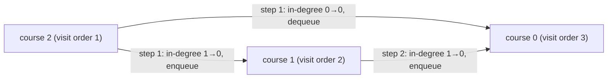

| | |
|---|---|
| **Solved on** | 2026-09-13 |
| **DSA Category** | Graphs |

## 1. Your Solution Assessment

**Correctness:** The implementation uses Kahn's algorithm (BFS-based topological sort). It builds an adjacency list from prerequisite edges, computes in-degrees for every course, seeds a queue with all zero-in-degree courses, then repeatedly polls a course, counts it as completed, and decrements the in-degree of its dependents — enqueueing any that drop to zero. If the number of processed courses equals `numCourses`, no cycle blocks completion. This correctly handles all the required cases: simple chains, converging prerequisites, disconnected components, self-loops (a course pointing to itself never reaches in-degree 0 unless processed, and a self-loop keeps its own in-degree at 1 forever), and courses with zero prerequisites (all seeded immediately). All 11 tests pass, including the boundary case of `numCourses = 2000`.

**Code quality:** Clear separation of concerns — `buildGraph` and `getInDegrees` are extracted as private helpers with single responsibilities, and `canFinish` reads as a straightforward orchestration of the three phases (seed, process, verify). Variable names (`inDegrees`, `netCourses`, `neighbor`) are descriptive. One nitpick: `netCourses` is a slightly unusual name for "courses successfully processed" — `completedCourses` would read more clearly at the call site.

**Time complexity:** O(V + E), where V = `numCourses` and E = `prerequisites.length`. Building the graph and in-degree array is O(E), seeding the queue is O(V), and the BFS loop visits every vertex once and every edge once.

**Space complexity:** O(V + E) — the adjacency list stores E entries across V keys, and the in-degree array and queue are each O(V).

**Algorithm trace** (Example 4 from `README.md`: `numCourses = 3, prerequisites = [[0,1],[0,2],[1,2]]`, expected `true`)

Graph built (edge `[a, b]` → arrow `b → a`): `2 → 0`, `2 → 1`, `1 → 0`. Initial in-degrees: `course0=2, course1=1, course2=0`. Queue seeds with course `2` (only zero in-degree course).



- Step 1: dequeue `2` → `netCourses = 1`. Decrement `0` (2→1, no enqueue) and `1` (1→0, enqueue). Queue: `[1]`.
- Step 2: dequeue `1` → `netCourses = 2`. Decrement `0` (1→0, enqueue). Queue: `[0]`.
- Step 3: dequeue `0` → `netCourses = 3`. No outgoing edges. Queue: `[]`.

`netCourses (3) == numCourses (3)` → return `true`. ✓

## 2. Optimal Approach

Kahn's algorithm is already the optimal approach for this problem — the user's solution matches it. The idea: a valid course order exists if and only if the prerequisite graph is a DAG (no cycle). Process courses in BFS order starting from those with no prerequisites (in-degree 0); each time a course is "completed," remove its outgoing edges by decrementing the in-degree of its dependents. If every course eventually reaches in-degree 0 and gets processed, there's no cycle blocking any of them; if some courses never reach in-degree 0 (because they're stuck waiting on each other in a cycle), they're never processed and the final count falls short.

**Time complexity:** O(V + E) — each vertex is enqueued/dequeued once, each edge is traversed exactly once when decrementing in-degrees.

**Space complexity:** O(V + E) — adjacency list plus in-degree array and queue.

```java
public boolean canFinish(int numCourses, int[][] prerequisites) {
    Map<Integer, List<Integer>> graph = new HashMap<>();
    int[] inDegree = new int[numCourses];

    for (int[] edge : prerequisites) {
        int course = edge[0], prereq = edge[1];
        graph.computeIfAbsent(prereq, k -> new ArrayList<>()).add(course);
        inDegree[course]++;
    }

    Deque<Integer> queue = new ArrayDeque<>();
    for (int course = 0; course < numCourses; course++) {
        if (inDegree[course] == 0) queue.offer(course);
    }

    int completed = 0;
    while (!queue.isEmpty()) {
        int course = queue.poll();
        completed++;

        for (int next : graph.getOrDefault(course, List.of())) {
            if (--inDegree[next] == 0) queue.offer(next);
        }
    }

    return completed == numCourses;
}
```

**Algorithm trace:** Identical to the trace above — this is the same algorithm the user implemented.

## 3. Alternative Approaches

### DFS with three-color cycle detection

Model each course as a node in a directed graph (edge `b → a` for prerequisite `[a, b]`). Run DFS from every unvisited node, marking nodes `visiting` (on the current recursion stack) and `visited` (fully processed, safe). If DFS reaches a node already marked `visiting`, a cycle exists. This is the approach hinted at in this problem's `README.md` and is what an earlier attempt at this exercise used.

**Time complexity:** O(V + E) — every node and edge is visited once across all DFS calls.

**Space complexity:** O(V + E) — adjacency list plus the recursion call stack, which can grow to O(V) in the worst case (a single long chain).

**When to use:** Equally valid to Kahn's algorithm — some interviewers may prefer seeing explicit cycle detection via DFS since it generalizes more directly to "find the cycle" or "find all cycles" follow-ups. The main tradeoff is recursion depth risk on very large inputs (stack overflow), whereas Kahn's algorithm is iterative and avoids that risk.

```java
public boolean canFinish(int numCourses, int[][] prerequisites) {
    Map<Integer, List<Integer>> graph = new HashMap<>();
    for (int[] edge : prerequisites) {
        graph.computeIfAbsent(edge[1], k -> new ArrayList<>()).add(edge[0]);
    }

    int[] state = new int[numCourses]; // 0 = unvisited, 1 = visiting, 2 = visited

    for (int course = 0; course < numCourses; course++) {
        if (state[course] == 0 && hasCycle(graph, state, course)) {
            return false;
        }
    }

    return true;
}

private boolean hasCycle(Map<Integer, List<Integer>> graph, int[] state, int course) {
    state[course] = 1;

    for (int next : graph.getOrDefault(course, List.of())) {
        if (state[next] == 1) return true;
        if (state[next] == 0 && hasCycle(graph, state, next)) return true;
    }

    state[course] = 2;
    return false;
}
```

**Algorithm trace** (Example 2: `numCourses = 2, prerequisites = [[1,0],[0,1]]`, expected `false`)

Graph: `0 → 1`, `1 → 0`.

| Depth | Call | State before | Returns |
|---|---|---|---|
| 0 | `hasCycle(0)` | `state[0]=1` | checks neighbor `1` |
| 1 | `hasCycle(1)` | `state[1]=1` | checks neighbor `0`, `state[0]==1` → cycle found |
| 1 | `hasCycle(1)` returns | — | `true` |
| 0 | `hasCycle(0)` returns | — | `true` |
→ `canFinish` returns `false`. ✓

### Brute force: try all orderings

Generate every permutation of the `numCourses` courses and check whether any one respects all prerequisite constraints (for every edge `[a, b]`, `b` appears before `a` in the permutation).

**Time complexity:** O(V! × E) — factorial orderings, each checked against every edge.

**Space complexity:** O(V) for each permutation being built.

**When to use:** Never in practice — only mentioned as the naive baseline. It's intractable beyond a handful of courses (`numCourses` up to 2000 per this problem's constraints makes this approach unusable), but it's a useful way to explain *why* graph-based cycle detection is needed if the interviewer asks you to start from first principles.
