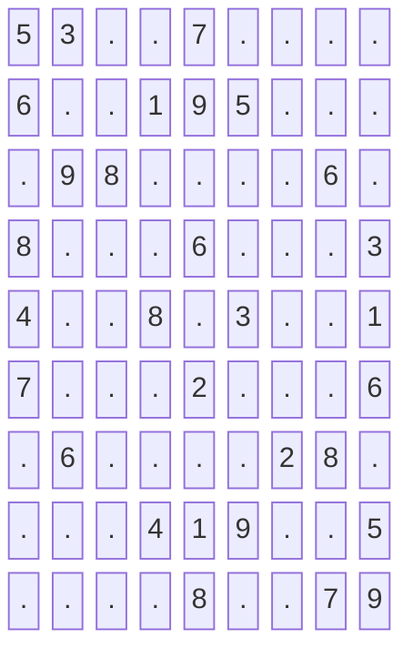

# Valid Sudoku

**Date added:** 2026-08-06

## Problem Description

Determine if a 9 x 9 Sudoku board is valid. Only the filled cells need to be validated according to the following rules: each row must contain the digits 1-9 without repetition, each column must contain the digits 1-9 without repetition, and each of the nine 3 x 3 sub-boxes of the grid must contain the digits 1-9 without repetition. A Sudoku board (partially filled) could be valid but is not necessarily solvable, and only the filled cells need to be validated according to the mentioned rules.

**Source:** https://leetcode.com/problems/valid-sudoku

## Examples

**Example 1**



```
Input: board =
[["5","3",".",".","7",".",".",".","."]
,["6",".",".","1","9","5",".",".","."]
,[".","9","8",".",".",".",".","6","."]
,["8",".",".",".","6",".",".",".","3"]
,["4",".",".","8",".","3",".",".","1"]
,["7",".",".",".","2",".",".",".","6"]
,[".","6",".",".",".",".","2","8","."]
,[".",".",".","4","1","9",".",".","5"]
,[".",".",".",".","8",".",".","7","9"]]
Output: true
Explanation: Every filled row, column, and 3x3 sub-box contains no repeated digits.
```

**Example 2**


```
Input: board =
[["8","3",".",".","7",".",".",".","."]
,["6",".",".","1","9","5",".",".","."]
,[".","9","8",".",".",".",".","6","."]
,["8",".",".",".","6",".",".",".","3"]
,["4",".",".","8",".","3",".",".","1"]
,["7",".",".",".","2",".",".",".","6"]
,[".","6",".",".",".",".","2","8","."]
,[".",".",".","4","1","9",".",".","5"]
,[".",".",".",".","8",".",".","7","9"]]
Output: false
Explanation: Same as Example 1, except with the 5 in the top left corner being modified to 8. Since there are now two 8's in the top left 3x3 sub-box (row 0 and row 3, column 0), the board is invalid.
```

## Constraints

- `board.length == 9`
- `board[i].length == 9`
- `board[i][j]` is a digit `1-9` or `.`.

## Hints

1. You need to track, for every row, every column, and every 3x3 sub-box, which digits have already appeared.
2. What data structure lets you check "have I seen this digit before" in O(1)?
3. A single pass over all 81 cells is enough — for each filled cell, check row/column/box membership before marking it seen.
4. Figuring out which of the nine sub-boxes a cell `(row, col)` belongs to can be done with `(row / 3) * 3 + (col / 3)`.
5. You can use a `Set` per row, per column, and per box (27 sets total), or a single 2D boolean array indexed by `[digit][row|col|box]` to avoid creating many small sets.
