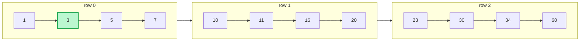
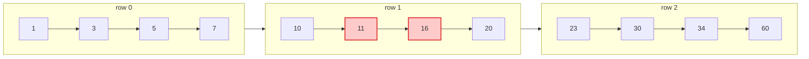

# Search a 2D Matrix

**Date added:** 2026-08-13

## Problem Description

You are given an `m x n` integer matrix `matrix` with the following two properties:

- Each row is sorted in non-decreasing order.
- The first integer of each row is greater than the last integer of the previous row.

Given an integer `target`, return `true` if `target` is in `matrix` or `false` otherwise.

You must write a solution in `O(log(m * n))` time complexity.

**Source:** https://leetcode.com/problems/search-a-2d-matrix

## Examples

**Example 1**
```
Input: matrix = [[1,3,5,7],[10,11,16,20],[23,30,34,60]], target = 3
Output: true
```
Explanation: `3` is the second element of the first row.



**Example 2**
```
Input: matrix = [[1,3,5,7],[10,11,16,20],[23,30,34,60]], target = 13
Output: false
```
Explanation: `13` would fall between `11` and `16` in row 1, but it is not present in the matrix.



**Example 3**
```
Input: matrix = [[1]], target = 1
Output: true
```
Explanation: A single-cell matrix where the only element equals the target.

**Example 4**
```
Input: matrix = [[1]], target = 2
Output: false
```
Explanation: A single-cell matrix where the only element does not equal the target.

**Example 5**
```
Input: matrix = [[1,3]], target = 3
Output: true
```
Explanation: A single-row matrix; the target is the last element.

## Constraints

- `m == matrix.length`
- `n == matrix[i].length`
- `1 <= m, n <= 100`
- `-10^4 <= matrix[i][j], target <= 10^4`

## Hints

1. Notice that if you "flatten" the matrix row by row into a single array, that array would be fully sorted. What algorithm works on a sorted array in `O(log n)` time?
2. You don't need to actually build the flattened array. Can you compute the row and column of the `k`-th element of the flattened array using integer division and modulo?
3. Treat the problem as a binary search over indices `0` to `m * n - 1`.
4. For a given mid index, convert it to `(row, col)` with `row = mid / n` and `col = mid % n`, then compare `matrix[row][col]` against `target`.
5. Standard binary search bounds and comparisons apply from there — narrow the search space based on whether the mid value is less than, greater than, or equal to the target.
