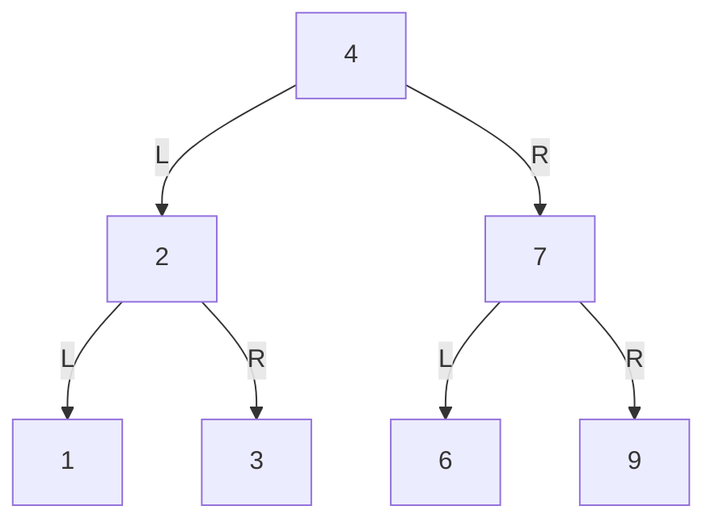
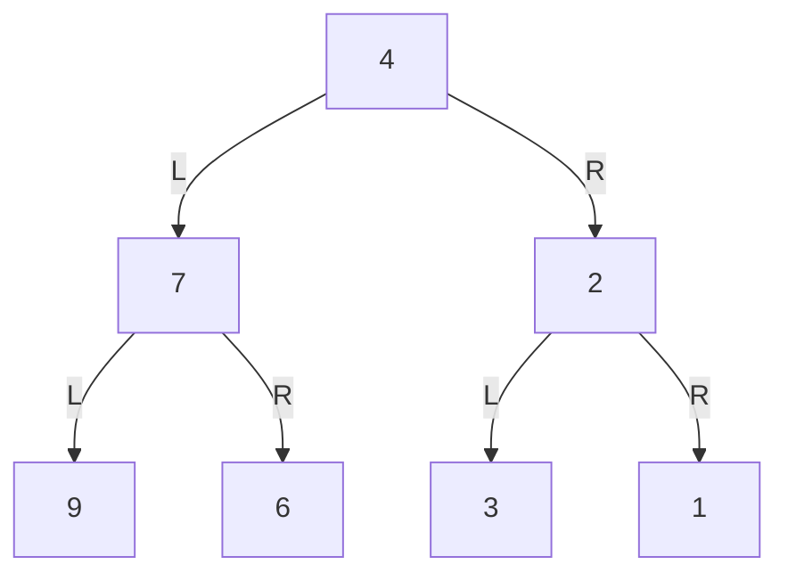
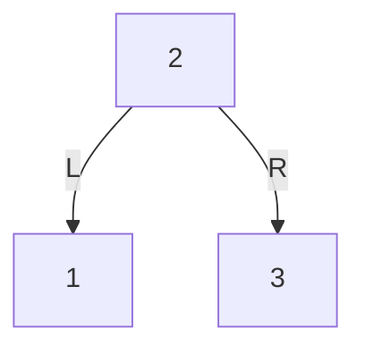
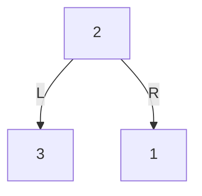
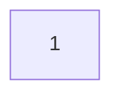
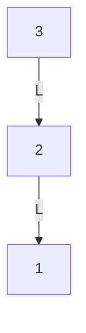
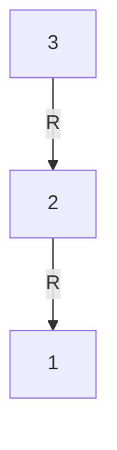

# Invert Binary Tree

**Date added:** 2026-08-13

## Problem Description

Given the root of a binary tree, invert the tree, and return its root. Inverting a binary tree means swapping the left and right children of every node in the tree, so that the tree becomes a mirror image of itself.

**Source:** https://leetcode.com/problems/invert-binary-tree/

## Examples

**Example 1**
```
Input: root = [4,2,7,1,3,6,9]
Output: [4,7,2,9,6,3,1]
Explanation: The left and right children of every node are swapped: 2 and 7 swap under 4, 1 and 3 swap under 2, and 6 and 9 swap under 7.
```

Before:


After:


**Example 2**
```
Input: root = [2,1,3]
Output: [2,3,1]
Explanation: The left child (1) and right child (3) of the root swap places.
```

Before:


After:


**Example 3**
```
Input: root = []
Output: []
Explanation: An empty tree inverts to an empty tree.
```

Before:


After:


**Example 4**
```
Input: root = [1]
Output: [1]
Explanation: A tree with only a root node has no children to swap, so inverting leaves it unchanged.
```

Before:


After:


**Example 5**
```
Input: root = [3,2,null,1]
Output: [3,null,2,null,1]
Explanation: A left-skewed chain (3 → 2 → 1, all via left-child links) becomes a right-skewed chain of the same values, since every left link turns into a right link.
```

Before:


After:


## Constraints

- The number of nodes in the tree is in the range `[0, 100]`.
- `-100 <= Node.val <= 100`

## Hints

1. Think about what "inverting" means for a single node — it's a very local operation.
2. If you knew how to invert a node's left subtree and its right subtree, what's left to do at that node?
3. This suggests a recursive definition: invert(node) = swap(invert(left), invert(right)).
4. Consider the base case — what should happen when the node is `null`?
5. You can also solve this iteratively with a queue or stack, visiting every node and swapping its children as you go.
