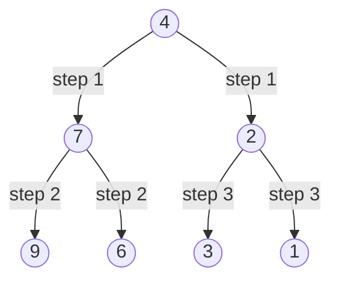
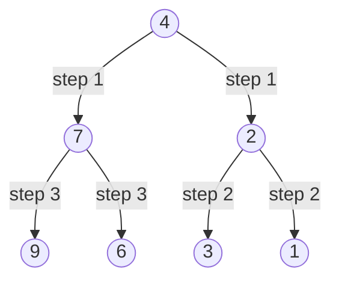

# Invert Binary Tree — Review

| | |
|---|---|
| **Solved on** | 2026-08-13 |
| **DSA Category** | Trees |

---

## 1. Your Solution Assessment

**Correctness:** Fully correct. The null check handles the empty-tree case, both subtrees are inverted before the swap happens at the current node, and the swap itself (`root.left = right; root.right = left;`) correctly uses the *already-inverted* subtrees rather than the originals. This matches LeetCode's acceptance.

**Code quality:** Clean — good variable names, no unnecessary branching, no extraneous comments.

**Time complexity: O(n)** — every node is visited exactly once, doing O(1) work per node.

**Space complexity: O(h)** — no auxiliary data structure is used; the only overhead is the recursion call stack, which grows to the height of the tree. O(log n) for a balanced tree, O(n) worst case for a fully skewed tree.

**Algorithm trace** — Input: `root = [4,2,7,1,3,6,9]`

| Depth | Call | Returns |
|---|---|---|
| 0 | invertTree(4) | — |
| 1 | invertTree(2) | — |
| 2 | invertTree(1) | 1 (left=null, right=null) |
| 2 | invertTree(3) | 3 (left=null, right=null) |
| 1 | (2) swap(left=1, right=3) | 2 (left=3, right=1) |
| 1 | invertTree(7) | — |
| 2 | invertTree(6) | 6 (leaf) |
| 2 | invertTree(9) | 9 (leaf) |
| 1 | (7) swap(left=6, right=9) | 7 (left=9, right=6) |
| 0 | (4) swap(left=2, right=7) | 4 (left=7, right=2) |

→ return `4` with `left=7 (children 9,6)`, `right=2 (children 3,1)` → `[4,7,2,9,6,3,1]`

---

## 2. Optimal Approach

Recurse into both children first, then swap the results onto the current node. There's no way to do better than O(n) — every node must be touched at least once — so this recursive approach (which is what you wrote) is already optimal.

**Time complexity: O(n)** — each node visited once.
**Space complexity: O(h)** — recursion depth equals tree height.

```java
public TreeNode invertTree(TreeNode root) {
    if (root == null) return null;

    TreeNode left = invertTree(root.left);
    TreeNode right = invertTree(root.right);
    root.left = right;
    root.right = left;

    return root;
}
```

**Algorithm trace** — Input: same tree, `root = [4,2,7,1,3,6,9]`

| Depth | Call | Returns |
|---|---|---|
| 0 | invertTree(4) | — |
| 1 | invertTree(2) | — |
| 2 | invertTree(1) | 1 (left=null, right=null) |
| 2 | invertTree(3) | 3 (left=null, right=null) |
| 1 | (2) swap(left=1, right=3) | 2 (left=3, right=1) |
| 1 | invertTree(7) | — |
| 2 | invertTree(6) | 6 (leaf) |
| 2 | invertTree(9) | 9 (leaf) |
| 1 | (7) swap(left=6, right=9) | 7 (left=9, right=6) |
| 0 | (4) swap(left=2, right=7) | 4 (left=7, right=2) |

→ return `4` → `[4,7,2,9,6,3,1]`

---

## 3. Alternative Approaches

### Iterative BFS with a queue

Push the root onto a queue. On each dequeue, swap the current node's children in place, then enqueue whichever children are non-null (post-swap). This avoids recursion entirely, trading call-stack space for an explicit queue.

**Time complexity: O(n)** — every node enqueued and dequeued once.
**Space complexity: O(w)** — the queue holds at most one full level at a time, where w is the tree's maximum width (up to n/2 for a complete tree).

**When acceptable:** Always a fine alternative — some interviewers specifically want to see you're comfortable with both recursive and iterative tree traversals, or want to avoid recursion depth concerns on very large trees.

```java
public TreeNode invertTree(TreeNode root) {
    if (root == null) return null;

    Queue<TreeNode> queue = new ArrayDeque<>();
    queue.add(root);

    while (!queue.isEmpty()) {
        TreeNode current = queue.poll();
        TreeNode temp = current.left;
        current.left = current.right;
        current.right = temp;

        if (current.left != null) queue.add(current.left);
        if (current.right != null) queue.add(current.right);
    }

    return root;
}
```

**Algorithm trace** — Input: same tree, `root = [4,2,7,1,3,6,9]`



Queue evolution: `[4]` → swap 4 → `[7,2]` → swap 7 → `[2,9,6]` → swap 2 → `[9,6,3,1]` → 9,6,3,1 are leaves, swap is a no-op → `[]`

→ return `4` → `[4,7,2,9,6,3,1]`

---

### Iterative DFS with an explicit stack

Same idea as the recursive solution, but the call stack is replaced with an explicit `Deque` used as a stack. Pop a node, swap its children, push whichever children are non-null.

**Time complexity: O(n)** — every node pushed and popped once.
**Space complexity: O(h)** — the stack holds at most one path from root to the deepest unfinished node, so it mirrors the recursive call stack's depth.

**When acceptable:** Functionally identical to the recursive approach in complexity; worth reaching for if recursion is disallowed by the interviewer, or as a way to demonstrate you understand what the recursive call stack is doing under the hood.

```java
public TreeNode invertTree(TreeNode root) {
    if (root == null) return null;

    Deque<TreeNode> stack = new ArrayDeque<>();
    stack.push(root);

    while (!stack.isEmpty()) {
        TreeNode current = stack.pop();
        TreeNode temp = current.left;
        current.left = current.right;
        current.right = temp;

        if (current.left != null) stack.push(current.left);
        if (current.right != null) stack.push(current.right);
    }

    return root;
}
```

**Algorithm trace** — Input: same tree, `root = [4,2,7,1,3,6,9]`



Stack evolution (top on the right): `[4]` → swap 4 → `[7,2]` → swap 2 (popped last-in) → `[7,3,1]` → 1,3 are leaves, no-op → `[7]` → swap 7 → `[9,6]` → 9,6 are leaves, no-op → `[]`

→ return `4` → `[4,7,2,9,6,3,1]`
