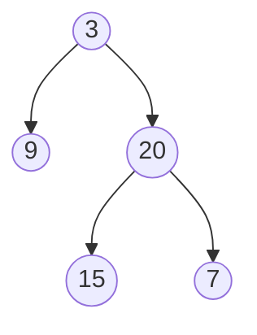
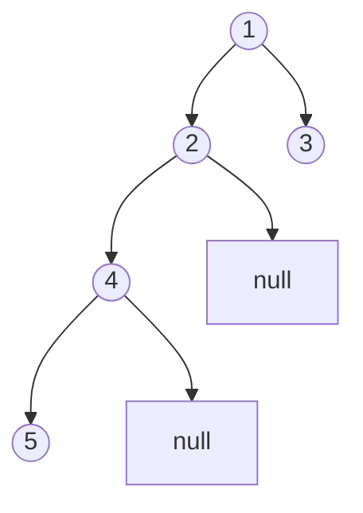

# Maximum Depth of Binary Tree

**Date added:** 2026-08-13

## Problem Description

Given the root of a binary tree, return its maximum depth. A binary tree's maximum depth is the number of nodes along the longest path from the root node down to the farthest leaf node.

**Source:** https://leetcode.com/problems/maximum-depth-of-binary-tree/

## Examples

**Example 1**
```
Input: root = [3,9,20,null,null,15,7]
Output: 3
Explanation: The longest path is 3 -> 20 -> 15 (or 3 -> 20 -> 7), which has 3 nodes.
```



**Example 2**
```
Input: root = [1,null,2]
Output: 2
Explanation: The longest path is 1 -> 2, which has 2 nodes.
```


**Example 3**
```
Input: root = []
Output: 0
Explanation: An empty tree has no nodes, so its maximum depth is 0.
```

**Example 4**
```
Input: root = [1]
Output: 1
Explanation: A tree with a single node has a maximum depth of 1.
```


**Example 5**
```
Input: root = [1,2,3,4,null,null,null,5]
Output: 4
Explanation: The longest path is 1 -> 2 -> 4 -> 5, which has 4 nodes, even though the right subtree is shallower.
```



## Constraints

- The number of nodes in the tree is in the range `[0, 10^4]`.
- `-100 <= Node.val <= 100`

## Hints

1. Think about how the depth of a tree relates to the depths of its left and right subtrees.
2. What is the maximum depth of an empty tree (a `null` node)?
3. If you know the maximum depth of the left subtree and the right subtree, how do you combine them to get the depth of the whole tree?
4. This relationship suggests a recursive solution — what is the base case, and what is the recursive step?
5. Alternatively, think about a level-by-level (breadth-first) traversal: each full level you finish processing adds one to the depth.
