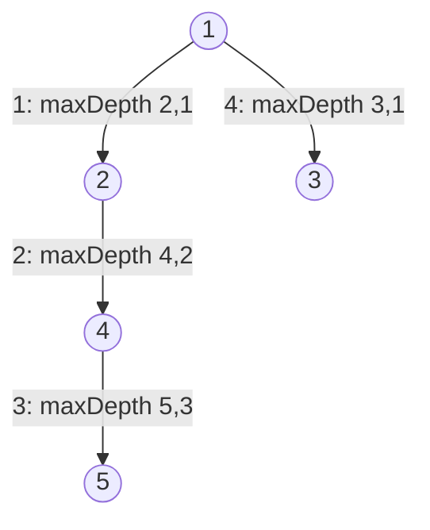
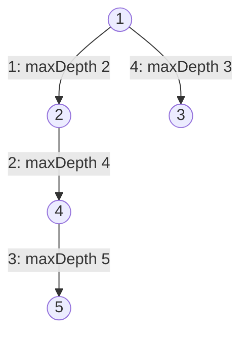
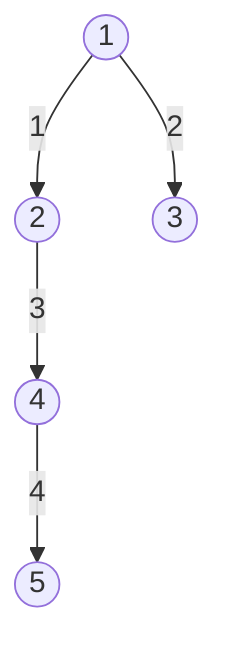
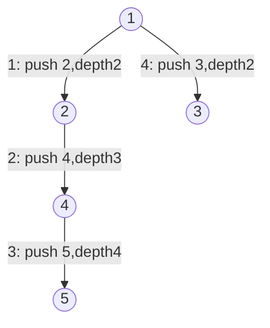

| | |
|---|---|
| **Solved on** | 2026-08-19 |
| **DSA Category** | Trees |

## 1. Your Solution Assessment

**Correctness:** The solution is correct. It handles the empty tree (`root = null` returns the initial `acc`, which is `0`), the single-node case (returns `1`), balanced trees, and unbalanced/skewed trees correctly, as verified by all 13 passing tests. The approach passes the accumulated depth down through recursion (`acc + 1` on each descent) and takes the max of the two subtree results at each level, which correctly captures the longest root-to-leaf path even when the tree is lopsided (e.g. Example 5, where the left subtree is deeper than the right). One latent risk worth knowing about: the constraints allow up to `10^4` nodes, and a fully skewed (linked-list-shaped) tree of that size would recurse `10^4` frames deep — within Java's default stack size this is unlikely to overflow, but it's the kind of edge case where a recursive solution is theoretically more fragile than an iterative one.

**Code quality:** The overloaded private `maxDepth(TreeNode, int)` helper is a reasonable pattern for threading state through recursion without extra fields. The name `acc` is a bit terse for what it represents (the depth of `root`'s parent, or equivalently "how deep are we before considering this node") — a name like `depth` would read more clearly at the call sites. Structurally the code is simple and easy to follow.

**Time complexity:** O(n), where n is the number of nodes — every node is visited exactly once, doing constant work per visit.

**Space complexity:** O(h) in the call stack, where h is the tree's height — O(log n) for a balanced tree, O(n) worst case for a fully skewed tree.

**Algorithm trace** (Example 5: `root = [1,2,3,4,null,null,null,5]`, pre-order call sequence, edges labeled with visit order):



Return values unwind as: `maxDepth(5,3)=4` (both null children hit `acc=4`) → `maxDepth(4,2)=max(4, maxDepth(null,3)=3)=4` → `maxDepth(2,1)=max(4, maxDepth(null,2)=2)=4` → `maxDepth(3,1)=max(maxDepth(null,2)=2, maxDepth(null,2)=2)=2` → `maxDepth(1,0)=max(4, 2)=4`.

## 2. Optimal Approach

The idiomatic version of the same recursive idea computes depth bottom-up instead of threading an accumulator top-down: an empty subtree has depth `0`, and any other node's depth is `1 + max(left depth, right depth)`. This has the same asymptotic complexity as your solution but reads slightly more directly, since each call's return value *is* the depth of that subtree rather than an intermediate accumulator value.

**Time complexity:** O(n) — each node is visited once.

**Space complexity:** O(h) — recursion stack depth equals the tree's height (O(log n) balanced, O(n) worst case).

```java
public int maxDepth(TreeNode root) {
    if (root == null) return 0;
    return 1 + Math.max(maxDepth(root.left), maxDepth(root.right));
}
```

**Algorithm trace** (Example 5, same pre-order call sequence):



Return values unwind as: `maxDepth(5)=1+max(maxDepth(null)=0, maxDepth(null)=0)=1` → `maxDepth(4)=1+max(1, maxDepth(null)=0)=2` → `maxDepth(2)=1+max(2, maxDepth(null)=0)=3` → `maxDepth(3)=1+max(0,0)=1` → `maxDepth(1)=1+max(3,1)=4`.

## 3. Alternative Approaches

**Iterative BFS (level-order traversal):** Traverse the tree level by level using a queue, incrementing a depth counter once per fully-processed level. This avoids recursion entirely, so it sidesteps any stack-depth concern on very large or skewed trees.

**Time complexity:** O(n) — every node is enqueued and dequeued exactly once.

**Space complexity:** O(w), where w is the maximum width of the tree — the queue holds at most one level's worth of nodes at a time; worst case O(n) for a wide, shallow tree.

Acceptable whenever the interviewer wants to see you avoid recursion, or when input trees could be deep enough that stack safety is a real concern.

**Algorithm trace** (Example 5, BFS visit order by level):



Levels processed: `{1}` (depth 1) → `{2,3}` (depth 2) → `{4}` (depth 3) → `{5}` (depth 4); final depth `4`.

**Iterative DFS with an explicit stack:** Push `(node, depth)` pairs onto a stack instead of relying on the call stack, tracking the max depth seen as nodes are popped. Same complexity as the recursive approaches but keeps the traversal state on the heap instead of the JVM call stack.

**Time complexity:** O(n) — each node is pushed and popped once.

**Space complexity:** O(h) — the stack holds at most one path's worth of `(node, depth)` pairs at a time.

Acceptable as a drop-in replacement for the recursive solution when recursion depth is a concern but a full BFS queue isn't desired; otherwise it offers no real advantage over the recursive version and adds bookkeeping.

**Algorithm trace** (Example 5, DFS visit order, same as pre-order in Section 1/2):



Max depth seen while popping: `5` at depth `4` → running max `4`; `3` at depth `2` → running max stays `4`; final answer `4`.
