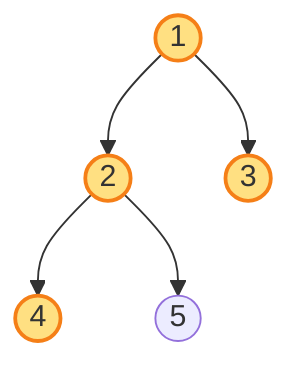
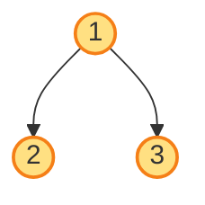
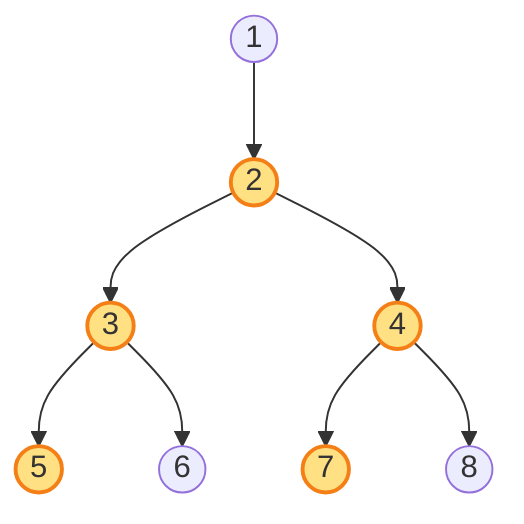
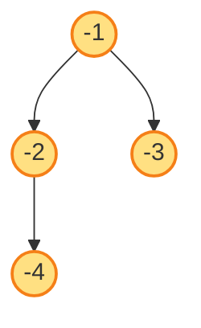
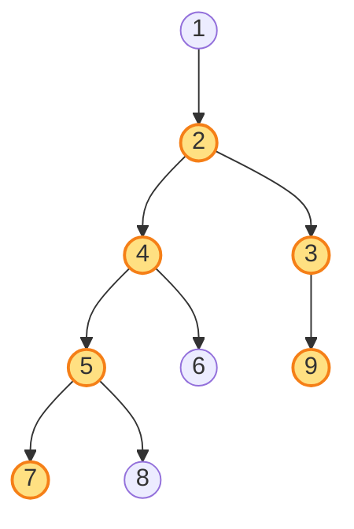

# Diameter of Binary Tree

**Date added:** 2026-08-15

## Problem Description

Given the root of a binary tree, return the length of the diameter of the tree. The diameter of a binary tree is the length of the longest path between any two nodes in the tree. This path may or may not pass through the root. The length of a path between two nodes is represented by the number of edges between them.

**Source:** https://leetcode.com/problems/diameter-of-binary-tree/

## Understanding Diameter

The diameter is **not** about depth from the root — it's the longest walk you could take between *any* two nodes in the tree, counted in edges (not nodes). Picture every node in the tree as a stop on a map, connected by roads (edges) to its parent and children. The diameter is the length of the longest possible trip between two stops, where the trip is allowed to change direction once (go down into one subtree, then back up and down into another) at whichever node makes that trip longest — that "turning point" does not have to be the root. Two consecutive nodes are 1 edge apart, three nodes in a line are 2 edges apart, and so on.

## Examples

**Example 1**
```
Input: root = [1,2,3,4,5]
Output: 3
Explanation: The longest path is 4 -> 2 -> 1 -> 3 (or 5 -> 2 -> 1 -> 3): 3 edges connecting 4 nodes.
```



**Example 2**
```
Input: root = [1,2]
Output: 1
Explanation: The only path is 1 -> 2: a single edge.
```


**Example 3**
```
Input: root = [1]
Output: 0
Explanation: With only one node, there is no pair of distinct nodes to connect, so the diameter is 0.
```


**Example 4**
```
Input: root = [1,2,3]
Output: 2
Explanation: The longest path is 2 -> 1 -> 3: 2 edges. This is the simplest example of a path that turns at the root.
```



**Example 5**
```
Input: root = [1,2,null,3,null,4]
Output: 3
Explanation: The tree is a straight line 1 -> 2 -> 3 -> 4 (every node has only a left child). With no branching, the diameter is simply the length of that line: 3 edges.
```


**Example 6**
```
Input: root = [1,2,null,3,4,5,6,7,8]
Output: 4
Explanation: Node 1 has only a left child, so any path through the root is short. The longest path, 5 -> 3 -> 2 -> 4 -> 7 (or symmetric variants through 6 or 8), turns at node 2 and never touches the root at all: 4 edges.
```



**Example 7**
```
Input: root = [-1,-2,-3,-4]
Output: 3
Explanation: Node values can be negative — the diameter only counts edges, so signs and magnitudes are irrelevant. The longest path is -4 -> -2 -> -1 -> -3: 3 edges.
```



**Example 8**
```
Input: root = [1,null,2,3,4,9,null,5,6,null,null,7,8]
Output: 5
Explanation: A larger, irregular tree combining a skewed trunk (1 -> 2) with bushy branching underneath. The longest path is 9 -> 3 -> 2 -> 4 -> 5 -> 7 (or 8): 5 edges. It turns at node 2, deep inside the tree, and neither the root (1) nor the shallow leaves (6, 8) are part of it.
```



## Constraints

- The number of nodes in the tree is in the range `[1, 10^4]`.
- `-100 <= Node.val <= 100`

## Hints

1. Think about what "distance between two nodes" means here — it's counted in edges, not node values.
2. For a single node, imagine the longest path that turns at that exact node. What determines its length?
3. That length depends on how far down you can reach into the left subtree and how far down into the right subtree, starting from that node.
4. If you already know the height (deepest depth) of a node's left and right subtrees, you can compute the longest path turning at that node without any extra traversal.
5. Compute heights with a post-order traversal, and update a running "best diameter seen so far" every time you finish computing a node's height.
