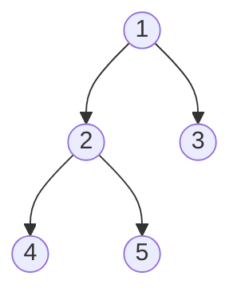

# Diameter of Binary Tree — Review

| | |
|---|---|
| **Solved on** | 2026-08-15 |
| **DSA Category** | Trees |

---

## 1. Your Solution Assessment

**Correctness:** Fully correct after the fix. `dfs` computes each node's height bottom-up while tracking the best `left + right` split seen so far, which is exactly the diameter definition — the longest path turning at some node equals the sum of the deepest reach into its left and right subtrees. The reset of `maxDiameter = 0` at the top of `diameterOfBinaryTree` is what makes the public method safe to call repeatedly on the same instance; without it, state from a prior call leaked into the next one (the bug we caught with a dedicated test before this review).

**Code quality:** Clear naming (`dfs`, `maxDiameter`, `left`/`right`) and a tight, single-purpose recursive helper. One note: using a mutable instance field as the accumulator is inherently fragile — it only stays correct because of the explicit reset, and any future caller who forgets that invariant (e.g. if `dfs` were ever called directly, or the reset line were deleted) reintroduces the bug. The Optimal Approach section below shows an equivalent version that avoids instance state entirely by threading a local accumulator through the recursion instead.

**Time complexity: O(n)** — every node is visited exactly once by `dfs`, doing O(1) work per node (two comparisons, one addition).

**Space complexity: O(h)** — no auxiliary data structure; the only overhead is the recursion call stack, which grows to the tree's height. O(log n) for a balanced tree, O(n) worst case for a fully skewed one.

**Algorithm trace** — Input: `root = [1,2,3,4,5]` (README Example 1)

| Depth | Call | Returns |
|---|---|---|
| 0 | dfs(1) | — |
| 1 | dfs(2) | — |
| 2 | dfs(4) | 1 (leaf; diameter=0, maxDiameter=0) |
| 2 | dfs(5) | 1 (leaf; diameter=0, maxDiameter=0) |
| 1 | (2) diameter = left+right = 1+1 = 2 → maxDiameter=2 | 2 |
| 1 | dfs(3) | 1 (leaf; diameter=0, maxDiameter=2) |
| 0 | (1) diameter = left+right = 2+1 = 3 → maxDiameter=3 | 3 |

→ `maxDiameter = 3`, achieved at node 1 via the path `4 -> 2 -> 1 -> 3`.

---

## 2. Optimal Approach

Compute each subtree's height with a single post-order traversal, and while doing so, track the best `leftHeight + rightHeight` seen at any node — that sum is the length of the longest path that turns at that node. Since every node must be inspected at least once to know the tree's shape, this single-pass approach is already asymptotically optimal; no algorithm can do better than O(n).

**Time complexity: O(n)** — each node visited once.
**Space complexity: O(h)** — recursion depth equals tree height.

The logic is identical to your fixed solution. The only change below is replacing the instance field with a local `int[1]` accumulator passed through the recursion, so the accumulator's lifetime is scoped to a single call rather than the object — removing the reset-or-leak pitfall entirely:

```java
public int diameterOfBinaryTree(TreeNode root) {
    int[] maxDiameter = new int[1];
    height(root, maxDiameter);
    return maxDiameter[0];
}

private int height(TreeNode node, int[] maxDiameter) {
    if (node == null) return 0;

    int left = height(node.left, maxDiameter);
    int right = height(node.right, maxDiameter);
    maxDiameter[0] = Math.max(maxDiameter[0], left + right);

    return 1 + Math.max(left, right);
}
```

**Algorithm trace** — Input: same tree, `root = [1,2,3,4,5]`

| Depth | Call | Returns |
|---|---|---|
| 0 | height(1) | — |
| 1 | height(2) | — |
| 2 | height(4) | 1 (leaf; left+right=0, max=0) |
| 2 | height(5) | 1 (leaf; left+right=0, max=0) |
| 1 | (2) left+right = 1+1 = 2 → max=2 | 2 |
| 1 | height(3) | 1 (leaf; left+right=0, max=2) |
| 0 | (1) left+right = 2+1 = 3 → max=3 | 3 |

→ return `3` (path `4 -> 2 -> 1 -> 3`)

---

## 3. Alternative Approaches

### Brute force: recompute height independently at every node

For each node, compute `height(left) + height(right)` using a separate, standalone `height()` helper, and recurse into both children to check their own best diameter too. This is the natural "first idea" before noticing that height and diameter can be computed together in one pass.

**Time complexity: O(n²) worst case** — for a skewed tree, `height()` called from a node at depth `k` costs O(n − k); summed across all n nodes this is O(n²). For a balanced tree it's O(n log n), since each of the O(log n) levels triggers O(n) total height work.
**Space complexity: O(h)** — the outer traversal and the inner `height()` calls never nest deeper than the tree's height at once, so auxiliary space stays O(h) despite the extra time cost.

**When acceptable:** Fine as an initial correct solution under interview time pressure, or on small inputs — but expect to be asked to optimize it, since the redundant re-traversal is easy to spot.

```java
public int diameterOfBinaryTree(TreeNode root) {
    if (root == null) return 0;

    int throughRoot = height(root.left) + height(root.right);
    int leftDiameter = diameterOfBinaryTree(root.left);
    int rightDiameter = diameterOfBinaryTree(root.right);

    return Math.max(throughRoot, Math.max(leftDiameter, rightDiameter));
}

private int height(TreeNode node) {
    if (node == null) return 0;
    return 1 + Math.max(height(node.left), height(node.right));
}
```

**Algorithm trace** — Input: same tree, `root = [1,2,3,4,5]`

| Depth | Call | Returns |
|---|---|---|
| 0 | diameterOfBinaryTree(1) → height(2)=2, height(3)=1 → throughRoot=3 | — |
| 1 | diameterOfBinaryTree(2) → height(4)=1, height(5)=1 → throughRoot=2 | — |
| 2 | diameterOfBinaryTree(4) → height(null)=0, height(null)=0 → throughRoot=0 | 0 |
| 2 | diameterOfBinaryTree(5) → height(null)=0, height(null)=0 → throughRoot=0 | 0 |
| 1 | (2) max(2, max(0,0)) = 2 | 2 |
| 1 | diameterOfBinaryTree(3) → height(null)=0, height(null)=0 → throughRoot=0 | 0 |
| 0 | (1) max(3, max(2,0)) = 3 | 3 |

→ return `3`, but note `height(2)` at the root's step redundantly re-descends into nodes 4 and 5, which the outer traversal visits again on its own a moment later.

---

### Iterative post-order traversal with an explicit stack

Same height/diameter logic as the optimal approach, but replace the recursive call stack with an explicit `Deque` and a map of computed child heights, visiting nodes in post-order (children fully processed before their parent). Useful when recursion depth itself is a concern.

**Time complexity: O(n)** — each node pushed and popped once.
**Space complexity: O(n)** — the explicit stack plus a height map can hold up to O(n) entries in the worst case (a fully skewed tree), versus O(h) for the pure-recursion version.

**When acceptable:** When recursion is disallowed, or as a defensive choice against stack-overflow risk on very deep, heavily skewed trees (this problem allows up to 10⁴ nodes, so a fully skewed input is a real possibility).

```java
public int diameterOfBinaryTree(TreeNode root) {
    Map<TreeNode, Integer> heights = new HashMap<>();
    Deque<TreeNode> stack = new ArrayDeque<>();
    Deque<TreeNode> postOrder = new ArrayDeque<>();
    if (root != null) stack.push(root);

    while (!stack.isEmpty()) {
        TreeNode node = stack.pop();
        postOrder.push(node);
        if (node.left != null) stack.push(node.left);
        if (node.right != null) stack.push(node.right);
    }

    int maxDiameter = 0;
    while (!postOrder.isEmpty()) {
        TreeNode node = postOrder.pop();
        int left = node.left == null ? 0 : heights.get(node.left);
        int right = node.right == null ? 0 : heights.get(node.right);
        maxDiameter = Math.max(maxDiameter, left + right);
        heights.put(node, 1 + Math.max(left, right));
    }

    return maxDiameter;
}
```

**Algorithm trace** — Input: same tree, `root = [1,2,3,4,5]`



Post-order visit sequence (children before parent): `4 -> 5 -> 2 -> 3 -> 1`

Running heights as each node is popped from `postOrder`: `heights={4:1}` → `heights={4:1,5:1}` → node 2: `left=1,right=1 → diameter=2, max=2`, `heights={...,2:2}` → `heights={...,3:1}` → node 1: `left=2,right=1 → diameter=3, max=3`, `heights={...,1:3}`

→ return `3`
