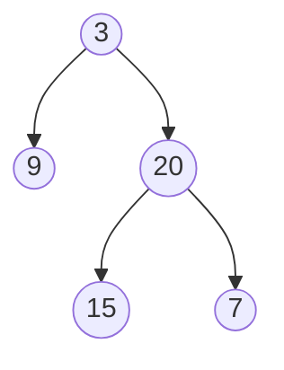
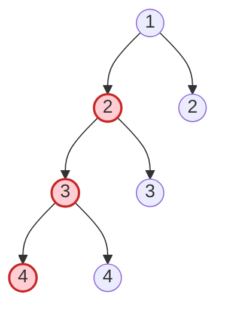
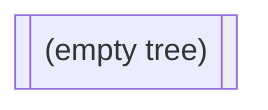

# Balanced Binary Tree

**Date added:** 2026-08-16

## Problem Description

Given a binary tree, determine if it is height-balanced. A binary tree is height-balanced if, for every node in the tree, the height difference between its left and right subtrees is never more than 1.

**Source:** https://leetcode.com/problems/balanced-binary-tree/

## Examples

**Example 1**
```
Input: root = [3,9,20,null,null,15,7]
Output: true
Explanation: Every node's left and right subtree heights differ by at most 1. Node 3 has a left subtree of height 1 (just node 9) and a right subtree of height 2 (20 -> 15/7), a difference of 1, which is allowed.
```



**Example 2**
```
Input: root = [1,2,2,3,3,null,null,4,4]
Output: false
Explanation: Node 2 (the left child of the root) has a left subtree of height 2 (3 -> 4) and a right subtree of height 0 (empty), a difference of 2, which breaks balance.
```



**Example 3**
```
Input: root = []
Output: true
Explanation: An empty tree has no nodes to violate the balance condition, so it is trivially balanced.
```



**Example 4**
```
Input: root = [1]
Output: true
Explanation: A single node has empty left and right subtrees, both of height 0, so the difference is 0.
```


**Example 5**
```
Input: root = [1,2,null,3,null,4]
Output: false
Explanation: This is a straight line of left children (1 -> 2 -> 3 -> 4). At node 1, the left subtree has height 3 while the right subtree has height 0, a difference of 3, which is unbalanced.
```


## Constraints

- The number of nodes in the tree is in the range `[0, 5000]`.
- `-10^4 <= Node.val <= 10^4`

## Hints

1. Balance is a property that must hold at *every* node, not just the root — a global check needs local information from each subtree.
2. Naively recomputing height from scratch at every node leads to redundant work. What if a single traversal could compute a node's height while also checking balance?
3. Think of a post-order (bottom-up) traversal that returns the height of a subtree, but also signals "already unbalanced" if it finds an imbalance deeper down.
4. A useful trick: have the height function return `-1` (a sentinel) as soon as it detects an imbalance anywhere below, so the imbalance short-circuits all the way back up to the root.
5. At each node, compare the heights returned by the left and right recursive calls — if either is already `-1`, or their difference exceeds 1, propagate `-1` upward instead of a real height.
