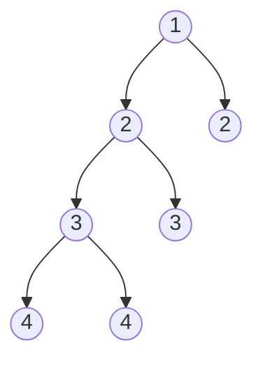

# Balanced Binary Tree — Review

| | |
|---|---|
| **Solved on** | 2026-08-16 |
| **DSA Category** | Trees |

---

## 1. Your Solution Assessment

**Correctness:** Fully correct. `height` computes each subtree's height bottom-up, and as soon as it detects an imbalance (either child already returned the `-1` sentinel, or the current node's own `|left - right| > 1`) it returns `-1` itself instead of a real height. Because `-1` fails the `left >= 0 && right >= 0` check at every ancestor above it, one violation anywhere in the tree poisons the return value all the way up to the root — this is what fixes the earlier bug where a locally-balanced root could overwrite and hide a violation found deeper in the tree.

**Code quality:** Clear naming and a tight, single-purpose recursive helper. One note: the instance field `balanced` is now redundant. Since `height` already returns `-1` exactly when the tree is unbalanced, `isBalanced` could simply be `return height(root) != -1;` and drop the field (and the `balanced = true` reset) entirely — this removes the same "mutable state only stays correct because of an explicit reset" fragility flagged in the Diameter of Binary Tree review. The Optimal Approach below shows this simplification.

**Time complexity: O(n)** — every node is visited exactly once by `height`, doing O(1) work per node.

**Space complexity: O(h)** — no auxiliary data structure; the only overhead is the recursion call stack, which grows to the tree's height. O(log n) for a balanced tree, O(n) worst case for a fully skewed one.

**Algorithm trace** — Input: `root = [1,2,2,3,3,null,null,4,4]` (README Example 2)

| Depth | Call | Returns |
|---|---|---|
| 0 | height(1) | — |
| 1 | height(2) [left, with two 3-children] | — |
| 2 | height(3) [has two 4-children] | — |
| 3 | height(4) [left leaf] | 1 |
| 3 | height(4) [right leaf] | 1 |
| 2 | (3) diff = \|1-1\| = 0 → balanced | 2 |
| 2 | height(3) [right, leaf] | 1 |
| 1 | (2) diff = \|2-1\| = 1 → balanced | 3 |
| 1 | height(2) [right, leaf] | 1 |
| 0 | (1) diff = \|3-1\| = 2 → **unbalanced** | **-1** |

→ `height(root) = -1`, so `isBalanced` returns `false`.

---

## 2. Optimal Approach

Compute each subtree's height with a single post-order traversal, and encode "unbalanced" with a sentinel (`-1`) instead of a separate mutable flag: as soon as either child comes back `-1`, or the current node's own children differ in height by more than 1, return `-1` and let it propagate upward. Since every node must be visited at least once to know the tree's shape, this single pass is already asymptotically optimal.

**Time complexity: O(n)** — each node visited once.
**Space complexity: O(h)** — recursion depth equals tree height.

This is the same algorithm as your fixed solution, with the redundant instance field removed:

```java
public boolean isBalanced(TreeNode root) {
    return height(root) != -1;
}

private int height(TreeNode root) {
    if (root == null) return 0;

    int left = height(root.left);
    int right = height(root.right);
    if (left == -1 || right == -1 || Math.abs(left - right) > 1) return -1;

    return 1 + Math.max(left, right);
}
```

**Algorithm trace** — Input: same tree, `root = [1,2,2,3,3,null,null,4,4]`

| Depth | Call | Returns |
|---|---|---|
| 0 | height(1) | — |
| 1 | height(2) [left, with two 3-children] | — |
| 2 | height(3) [has two 4-children] | — |
| 3 | height(4) [left leaf] | 1 |
| 3 | height(4) [right leaf] | 1 |
| 2 | (3) diff = \|1-1\| = 0 | 2 |
| 2 | height(3) [right, leaf] | 1 |
| 1 | (2) diff = \|2-1\| = 1 | 3 |
| 1 | height(2) [right, leaf] | 1 |
| 0 | (1) diff = \|3-1\| = 2 → **-1** | **-1** |

→ `height(root) = -1`, so `isBalanced` returns `false`.

---

## 3. Alternative Approaches

### Brute force: recompute height independently at every node (top-down)

At each node, compute `height(left)` and `height(right)` with a standalone helper, check the diff there, and separately recurse into `isBalanced(left)` and `isBalanced(right)`. This is the natural "first idea" before noticing that height and balance can be checked together in one bottom-up pass — it's exactly the pitfall your very first attempt at this problem ran into (checking a `diff` at each node but never combining results across the tree).

**Time complexity: O(n²) worst case** — for a skewed tree, `height()` called from a node at depth `k` costs O(n − k); summed across all n nodes this is O(n²). For a balanced tree it's O(n log n), since each of the O(log n) levels triggers O(n) total height work.
**Space complexity: O(h)** — the outer traversal and the inner `height()` calls never nest deeper than the tree's height at once, so auxiliary space stays O(h) despite the extra time cost.

**When acceptable:** Fine as an initial correct solution under interview time pressure, or on small inputs — but expect to be asked to optimize it, since the redundant re-traversal is easy to spot.

```java
public boolean isBalanced(TreeNode root) {
    if (root == null) return true;

    int leftHeight = height(root.left);
    int rightHeight = height(root.right);

    return Math.abs(leftHeight - rightHeight) <= 1
        && isBalanced(root.left)
        && isBalanced(root.right);
}

private int height(TreeNode node) {
    if (node == null) return 0;
    return 1 + Math.max(height(node.left), height(node.right));
}
```

**Algorithm trace** — Input: `root = [3,9,20,null,null,15,7]` (README Example 1)

| Depth | Call | Returns |
|---|---|---|
| 0 | isBalanced(3) → height(9)=1, height(20)=2, diff=1 | — |
| 1 | isBalanced(9) → height(null)=0, height(null)=0, diff=0 | true |
| 1 | isBalanced(20) → height(15)=1, height(7)=1, diff=0 | — |
| 2 | isBalanced(15) → height(null)=0, height(null)=0 | true |
| 2 | isBalanced(7) → height(null)=0, height(null)=0 | true |
| 1 | (20) true && true | true |
| 0 | (3) diff-ok && true && true | true |

→ return `true`, but note `height(20)` redundantly re-descends into nodes 15 and 7, which `isBalanced` then visits again separately right after.

---

### Iterative post-order traversal with an explicit stack

Same sentinel-based height/balance logic as the optimal approach, but replace the recursive call stack with an explicit `Deque`, computing heights bottom-up via a two-pass post-order (build the visit order with one stack, then process it with another) and returning `false` the moment any node's children differ by more than 1.

**Time complexity: O(n)** — each node pushed and popped a constant number of times.
**Space complexity: O(n)** — the explicit stacks plus a height map can hold up to O(n) entries in the worst case (a fully skewed tree), versus O(h) for the pure-recursion version.

**When acceptable:** When recursion is disallowed, or as a defensive choice against stack-overflow risk on very deep, heavily skewed trees (this problem allows up to 5000 nodes, so a fully skewed input is a real possibility).

```java
public boolean isBalanced(TreeNode root) {
    if (root == null) return true;

    Map<TreeNode, Integer> heights = new HashMap<>();
    Deque<TreeNode> stack = new ArrayDeque<>();
    Deque<TreeNode> postOrder = new ArrayDeque<>();
    stack.push(root);

    while (!stack.isEmpty()) {
        TreeNode node = stack.pop();
        postOrder.push(node);
        if (node.left != null) stack.push(node.left);
        if (node.right != null) stack.push(node.right);
    }

    while (!postOrder.isEmpty()) {
        TreeNode node = postOrder.pop();
        int left = node.left == null ? 0 : heights.get(node.left);
        int right = node.right == null ? 0 : heights.get(node.right);

        if (Math.abs(left - right) > 1) return false;

        heights.put(node, 1 + Math.max(left, right));
    }

    return true;
}
```

**Algorithm trace** — Input: same tree, `root = [1,2,2,3,3,null,null,4,4]`



Post-order pop sequence: `4a -> 4b -> 3a(left=1,right=1,diff=0, heights[3a]=2) -> 3b(leaf, heights[3b]=1) -> 2a(left=2,right=1,diff=1, heights[2a]=3) -> 2b(leaf, heights[2b]=1) -> 1(left=3,right=1,diff=2 → return false immediately)`

→ return `false`
