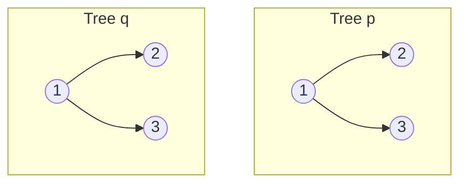
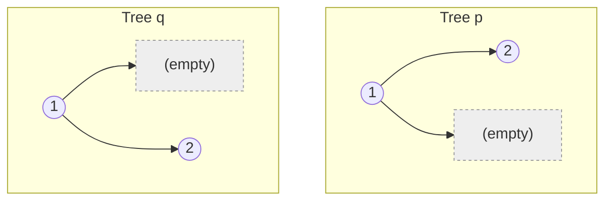
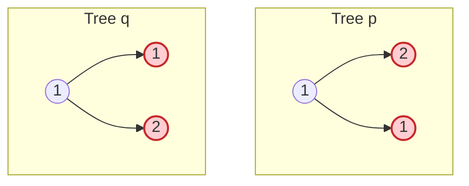
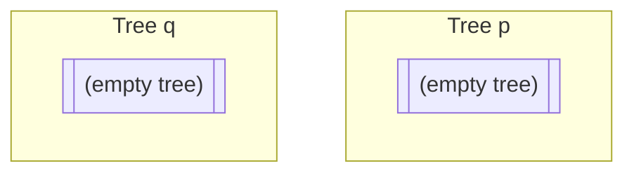
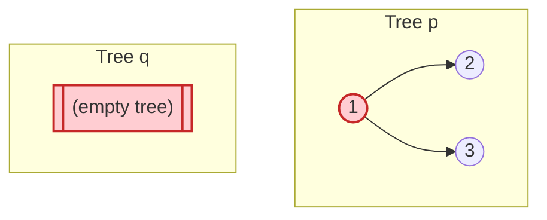

# Same Tree

**Date added:** 2026-08-16

## Problem Description

Given the roots of two binary trees `p` and `q`, return `true` if they are the same tree, and `false` otherwise. Two binary trees are considered the same if they are structurally identical, and the nodes have the same value at each corresponding position.

**Source:** https://leetcode.com/problems/same-tree/

## Examples

**Example 1**
```
Input: p = [1,2,3], q = [1,2,3]
Output: true
Explanation: Both trees have the exact same shape and every corresponding node holds the same value, so they are the same tree.
```



**Example 2**
```
Input: p = [1,2], q = [1,null,2]
Output: false
Explanation: Both trees have a root of 1 and a single child of value 2, but in p the 2 is a left child while in q the 2 is a right child. Different structure means they are not the same tree, even though the values present are identical.
```



**Example 3**
```
Input: p = [1,2,1], q = [1,1,2]
Output: false
Explanation: Both trees have identical structure (a root with two children), but the left and right values are swapped: p has left=2, right=1, while q has left=1, right=2. The mismatched values at those positions make them different trees.
```



**Example 4**
```
Input: p = [], q = []
Output: true
Explanation: Two empty trees have no nodes to compare and no structural difference, so they are trivially the same tree.
```



**Example 5**
```
Input: p = [1,2,3], q = []
Output: false
Explanation: p has three nodes while q has none, so the trees differ in structure from the very first comparison (root p is non-null, root q is null), making them different trees.
```



## Constraints

- The number of nodes in both trees is in the range `[0, 100]`.
- `-10^4 <= Node.val <= 10^4`

## Hints

1. Two trees are the same only if every corresponding pair of nodes matches — think about what "corresponding" means when one tree has a node and the other doesn't at the same position.
2. Consider the base cases first: what should happen when both nodes being compared are `null`? What about when exactly one of them is `null`?
3. If both nodes are non-null, what two things need to be true about them (beyond their children) for that position to match?
4. This problem has a natural recursive shape: a tree comparison reduces to comparing the current pair of nodes, plus comparing their left subtrees, plus comparing their right subtrees.
5. The overall answer is `true` only if the current node pair matches *and* both the left-subtree comparison *and* the right-subtree comparison also return `true`.
