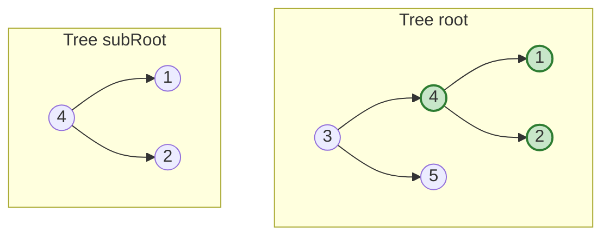
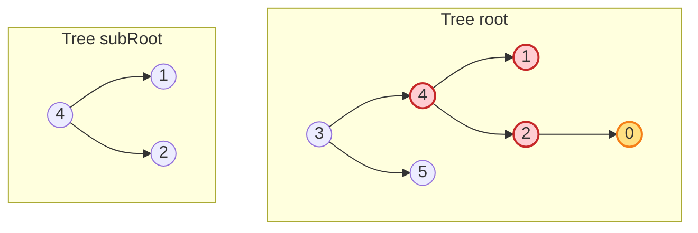
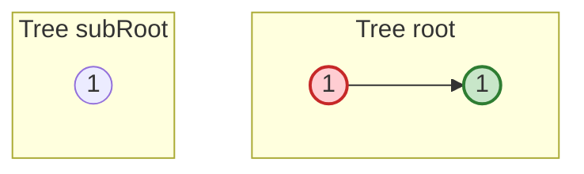
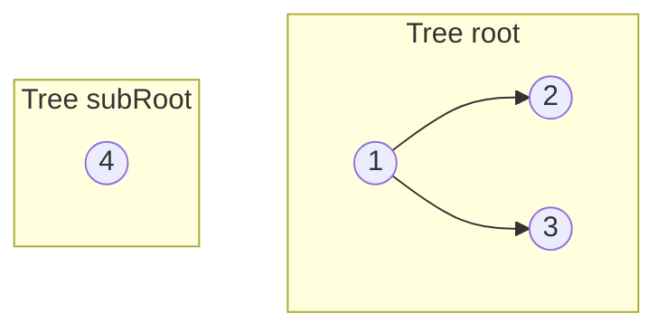
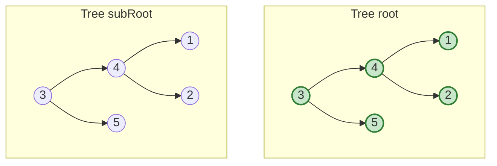

# Subtree of Another Tree

**Date added:** 2026-08-16

## Problem Description

Given the roots of two binary trees `root` and `subRoot`, return `true` if there is a subtree of `root` with the same structure and node values as `subRoot`, and `false` otherwise. A subtree of a binary tree `tree` is a tree that consists of a node in `tree` and all of this node's descendants. The tree `tree` could also be considered as a subtree of itself.

**Source:** https://leetcode.com/problems/subtree-of-another-tree/

## Examples

**Example 1**
```
Input: root = [3,4,5,1,2], subRoot = [4,1,2]
Output: true
Explanation: The node with value 4 in root, together with its two children 1 and 2, forms a subtree that is structurally identical to subRoot with matching values, so the answer is true.
```



**Example 2**
```
Input: root = [3,4,5,1,2,null,null,null,null,0], subRoot = [4,1,2]
Output: false
Explanation: The node with value 4 looks like a match at first glance, but in root its child 2 has an extra left child with value 0 that subRoot does not have. That extra descendant breaks the structural match, and no other node in root matches subRoot either, so the answer is false.
```



**Example 3**
```
Input: root = [1,1], subRoot = [1]
Output: true
Explanation: The root node itself does not match subRoot because root has a left child while subRoot has none. However, root's left child is a lone node with value 1 and no children, which is structurally identical to subRoot, so the answer is true.
```



**Example 4**
```
Input: root = [1,2,3], subRoot = [4]
Output: false
Explanation: No node in root holds the value 4, so there is no candidate position where a structural comparison could even begin. The answer is false.
```



**Example 5**
```
Input: root = [3,4,5,1,2], subRoot = [3,4,5,1,2]
Output: true
Explanation: subRoot is identical to root in its entirety, and a tree is always considered a subtree of itself, so the answer is true.
```



## Constraints

- The number of nodes in the `root` tree is in the range `[1, 2000]`.
- The number of nodes in the `subRoot` tree is in the range `[1, 1000]`.
- `-10^4 <= root.val <= 10^4`
- `-10^4 <= subRoot.val <= 10^4`

## Hints

1. A brute-force idea: for every single node in `root`, check whether the subtree rooted at that node is *the same tree* as `subRoot`. Do you already have a way to check if two trees are identical?
2. If you compare "is this exact tree the same as subRoot" at every node in `root`, think about how many nodes you visit in `root`, and how much work each comparison costs — what's the total time complexity?
3. The comparison "are these two trees identical" is itself a small recursive problem: two nodes match only if their values match and both their left and right subtrees also match.
4. Structure your solution as two recursive functions: one that walks `root` looking for a candidate starting point, and one that verifies whether the tree at that candidate is identical to `subRoot`.
5. For a faster approach, consider serializing both trees into strings that capture structure and values unambiguously (careful with how you mark `null` children and separate values, or 1 vs 12 could collide), then check whether subRoot's serialization is a substring of root's serialization.
