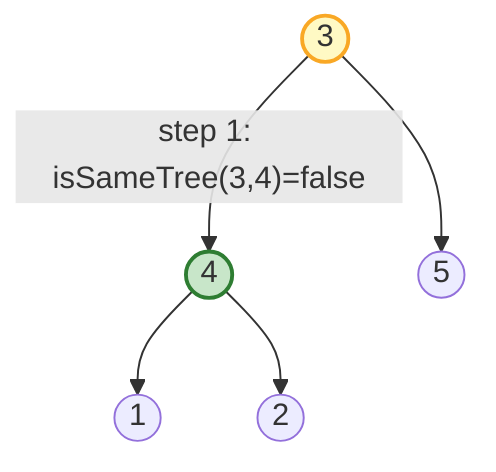
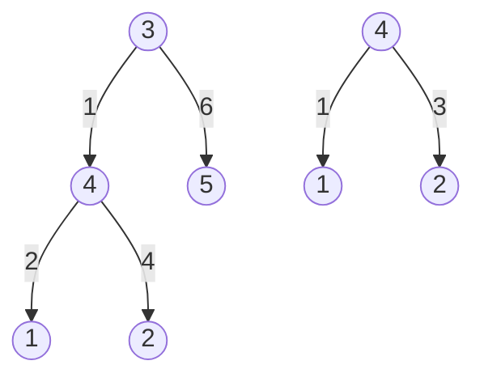

| | |
|---|---|
| **Solved on** | 2026-08-16 |
| **DSA Category** | Trees |

## 1. Your Solution Assessment

**Correctness.** The solution is correct. It runs a level-order (BFS) traversal over `root`, and at every visited node calls the standard `isSameTree` structural-equality check against `subRoot`. As soon as one node's subtree matches, it returns `true`; if the whole traversal finishes without a match, it returns `false`. All 13 tests pass, including the tricky "duplicate values, only one structural match" case and the value-range boundaries (`-10000` / `10000`) from the constraints.

There is one latent gap: if `root` were `null` while `subRoot` were non-null, `queue.offer(root)` would enqueue a `null`, and `current.left` on the next iteration would throw a `NullPointerException`. This is unreachable under the problem's own constraints (`root` always has at least 1 node), so it isn't a real bug for this problem — just worth knowing if this traversal shape gets reused elsewhere without that guarantee.

**Code quality.** Clear and idiomatic: `isSameTree` is a clean, minimal recursive helper, and the BFS loop is easy to follow. The inner `size`/level-tracking loop (lines 43–54) is a level-order idiom, but nothing in this problem needs level boundaries — a plain `while (!queue.isEmpty())` with a single `poll()` per iteration would do the same job with less code.

**Time complexity: O(N × M)**, where `N` is the number of nodes in `root` and `M` is the number of nodes in `subRoot`. The BFS visits each of the `N` nodes once, and at each visited node `isSameTree` can cost up to `O(M)` before finding a mismatch (worst case: many near-matching candidates, e.g. a `root` that is a long chain of the same value as `subRoot`'s root).

**Space complexity: O(N + M)**. The BFS queue holds up to a full level of `root`, which is `O(N)` in the worst case (a wide, shallow tree). The `isSameTree` recursion adds up to `O(M)` stack frames on top of that when comparing a candidate subtree.

**Algorithm trace** — `root = [3,4,5,1,2]`, `subRoot = [4,1,2]`:


Step 1: dequeue `3`, `isSameTree(3-subtree, subRoot)` → values `3` vs `4` mismatch → enqueue `4`, `5`.
Step 2: dequeue `4`, `isSameTree(4-subtree, subRoot)` → `4/1/2` matches `4/1/2` exactly → return `true` immediately (node `5` is never visited).

## 2. Optimal Approach

**Serialize + substring search.** Convert both trees into unambiguous strings via preorder traversal, marking every node with a sentinel before its value (e.g. `"^3"`) and every missing child with a distinct marker (e.g. `"#"`). This guarantees structure is encoded, not just values (so `"^1^2"` can never accidentally match a differently-shaped tree with concatenated digits `1` and `2`). Then `root` contains `subRoot` as a subtree if and only if `subRoot`'s serialization is a contiguous substring of `root`'s serialization. Using KMP (or Z-function) for the substring search keeps the whole algorithm linear instead of relying on the average-case behavior of naive substring search.

**Time complexity: O(N + M)** — building both serializations is a single traversal of each tree (`O(N)` and `O(M)`), and KMP substring search runs in `O(N + M)`.

**Space complexity: O(N + M)** — for the two serialized strings and the KMP failure-function array.

```java
public boolean isSubtree(TreeNode root, TreeNode subRoot) {
    StringBuilder rootSerial = new StringBuilder();
    StringBuilder subSerial = new StringBuilder();

    serialize(root, rootSerial);
    serialize(subRoot, subSerial);

    return kmpContains(rootSerial.toString(), subSerial.toString());
}

private void serialize(TreeNode node, StringBuilder out) {
    if (node == null) {
        out.append("#");
        return;
    }

    out.append("^").append(node.val);
    serialize(node.left, out);
    serialize(node.right, out);
}

private boolean kmpContains(String text, String pattern) {
    int[] lps = buildLpsArray(pattern);
    int i = 0, j = 0;

    while (i < text.length()) {
        if (text.charAt(i) == pattern.charAt(j)) {
            i++;
            j++;
            if (j == pattern.length()) return true;
        } else if (j > 0) {
            j = lps[j - 1];
        } else {
            i++;
        }
    }

    return false;
}

private int[] buildLpsArray(String pattern) {
    int[] lps = new int[pattern.length()];
    int len = 0, i = 1;

    while (i < pattern.length()) {
        if (pattern.charAt(i) == pattern.charAt(len)) {
            lps[i++] = ++len;
        } else if (len > 0) {
            len = lps[len - 1];
        } else {
            lps[i++] = 0;
        }
    }

    return lps;
}
```

**Algorithm trace** — preorder serialization of `root = [3,4,5,1,2]` and `subRoot = [4,1,2]`:


Preorder visit order on `root`: `3 → 4 → 1 → 2 → 5`, producing `"^3^4^1##^2###^5##"`.
Preorder visit order on `subRoot`: `4 → 1 → 2`, producing `"^4^1##^2##"`.
`"^4^1##^2##"` appears starting at index 2 of the root string → KMP reports a match → return `true`.

## 3. Alternative Approaches

**Recursive DFS "check every node"** — structurally identical to the submitted solution but implemented as plain recursion instead of BFS: `isSubtree(root, subRoot)` returns `true` if `isSameTree(root, subRoot)`, or if either recursive call `isSubtree(root.left, subRoot)` / `isSubtree(root.right, subRoot)` returns `true`.
- Time: **O(N × M)**, same reasoning as the submitted solution.
- Space: **O(H)** for the outer recursion (`H` = height of `root`) plus **O(M)** for the inner `isSameTree` calls — often better than BFS's `O(N)` queue on a tall, narrow tree, though worse on a deep, skewed one.
- When acceptable: interchangeable with the submitted BFS version; pick whichever traversal style you're more comfortable writing correctly under interview pressure.

Call stack trace on `root = [3,4,5,1,2]`, `subRoot = [4,1,2]`:

| Depth | Call | Returns |
|---|---|---|
| 0 | `isSubtree(3, subRoot)` | `isSameTree(3,4)=false` → `isSubtree(4,subRoot)` |
| 1 | `isSubtree(4, subRoot)` | `isSameTree(4-subtree, subRoot)=true` → `true` |
→ `isSubtree(3, subRoot) = true` (right subtree rooted at `5` is never explored)

**Serialize + naive substring check** — same serialization idea as the optimal approach, but using `rootSerial.contains(subSerial)` (Java's built-in substring search) instead of KMP.
- Time: **O(N × M)** worst case (Java's `String.contains` isn't guaranteed linear), though in practice fast for the given constraints (`N ≤ 2000`).
- Space: **O(N + M)** for the two strings.
- When acceptable: perfectly fine in an interview given these constraints — it trades a theoretical worst-case guarantee for much less code to write and reason about live.

Trace: identical serialization step as the optimal approach above; the only difference is using `"^3^4^1##^2###^5##".contains("^4^1##^2##")`, which returns `true`.

**Merkle-style subtree hashing** — compute a hash for every node bottom-up, combining the node's value with the hashes of its left and right children (e.g. `hash(node) = node.val * 31 * 31 + hash(left) * 31 + hash(right)`, using a sentinel hash for `null`). Collect all of `root`'s subtree hashes into a set while computing them, then check whether `subRoot`'s hash is in that set.
- Time: **O(N + M)** — one bottom-up pass over each tree.
- Space: **O(N + M)** — one hash per node stored in the set, plus recursion stack.
- When acceptable: this is the fastest approach in practice (no string building), but it introduces hash-collision risk; a careful implementation needs either a strong combined hash or a collision-check fallback (e.g. `isSameTree` on hash ties), which adds complexity that usually isn't worth it unless `N` and `M` are very large.

Trace: bottom-up hash computation on `subRoot = [4,1,2]` → `hash(1) = h1`, `hash(2) = h2`, `hash(4) = 4·31² + h1·31 + h2 = target`. Bottom-up hash computation on `root` visits `1`, `2`, then `4` in the same order, producing the identical `target` value at node `4`, which is found in the set collected from `root` → `true`.
