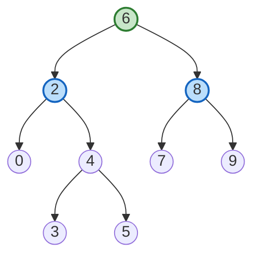
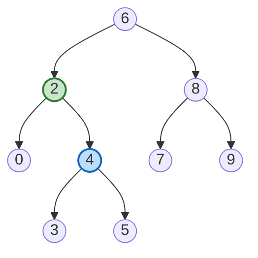
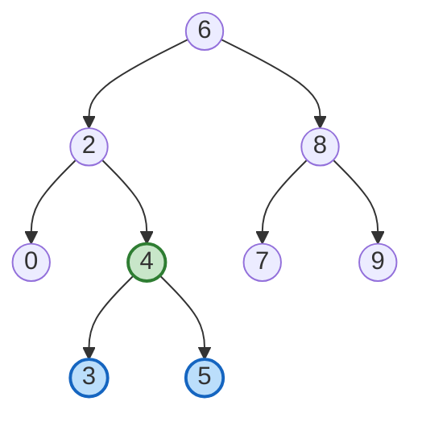
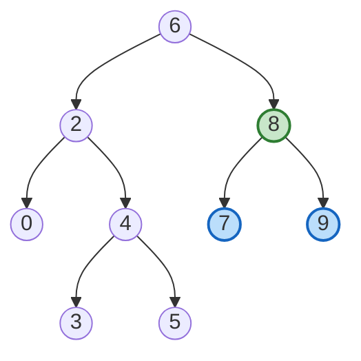
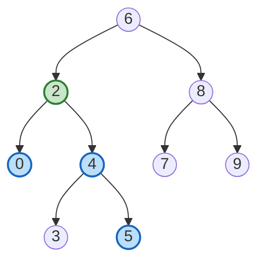
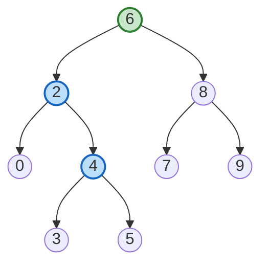

# Lowest Common Ancestor of a Binary Search Tree

**Date added:** 2026-08-16

## Problem Description

Given a binary search tree (BST), find the lowest common ancestor (LCA) node of two given nodes in the BST. According to the definition of LCA on Wikipedia: "The lowest common ancestor is defined between two nodes `p` and `q` as the lowest node in T that has both `p` and `q` as descendants (where we allow a node to be a descendant of itself)."

**Source:** https://leetcode.com/problems/lowest-common-ancestor-of-a-binary-search-tree/

## Examples

**Example 1**
```
Input: root = [6,2,8,0,4,7,9,null,null,3,5], p = 2, q = 8
Output: 6
Explanation: 2 lives in the left subtree of 6 and 8 lives in the right subtree of 6, so 6 is the lowest node that has both as descendants.
```



**Example 2**
```
Input: root = [6,2,8,0,4,7,9,null,null,3,5], p = 2, q = 4
Output: 2
Explanation: 4 lives in the subtree rooted at 2, and a node is allowed to be a descendant of itself, so 2 is its own lowest common ancestor with 4.
```



**Example 3**
```
Input: root = [2,1], p = 2, q = 1
Output: 2
Explanation: 1 is a direct child of 2, so 2 has both 2 (itself) and 1 as descendants, making 2 the lowest common ancestor.
```


**Example 4**
```
Input: root = [6,2,8,0,4,7,9,null,null,3,5], p = 3, q = 5
Output: 4
Explanation: 3 and 5 are both direct children of 4, so 4 is the lowest node that has both as descendants.
```



**Example 5**
```
Input: root = [6,2,8,0,4,7,9,null,null,3,5], p = 7, q = 9
Output: 8
Explanation: 7 and 9 are both direct children of 8, so 8 is the lowest node that has both as descendants.
```



**Example 6**
```
Input: root = [6,2,8,0,4,7,9,null,null,3,5], p = 0, q = 5
Output: 2
Explanation: 0 is a direct child of 2, and 5 lives deeper inside 2's right subtree (through 4), so the lowest node with both as descendants is 2.
```



**Example 7**
```
Input: root = [6,2,8,0,4,7,9,null,null,3,5], p = 6, q = 4
Output: 6
Explanation: p is the root itself, and a node is a descendant of itself, so as long as q lives anywhere in the tree, the root is the lowest common ancestor.
```



## Constraints

- The number of nodes in the tree is in the range `[2, 10^5]`.
- `-10^9 <= Node.val <= 10^9`
- All `Node.val` are unique.
- `p != q`
- `p` and `q` will exist in the BST.

## Hints

1. This is a BST, not just any binary tree — the ordering property (`left.val < node.val < right.val`) tells you something about where `p` and `q` must live relative to any given node without having to search both subtrees blindly.
2. At the current node, compare its value to both `p.val` and `q.val`. If both are smaller, where must their LCA be? If both are larger?
3. If `p` and `q` fall on different sides of the current node's value (or the current node's value equals one of them), what does that tell you about the current node?
4. The moment `p` and `q` stop being on the same side, you've found the split point — that node is the answer. You don't need to explore both children.
5. This can be solved iteratively with a single pointer walking down the tree, without any recursion or extra data structures — think about how far you can get with just a `while` loop and comparisons.
