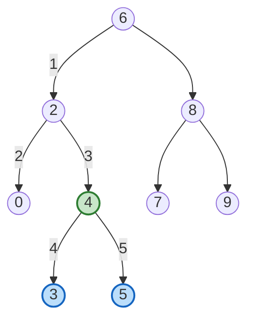

| | |
|---|---|
| **Solved on** | 2026-08-16 |
| **DSA Category** | Trees |

## 1. Your Solution Assessment

**Correctness:** Correct. The recursion relies on the BST invariant (`left.val < node.val < right.val`) rather than blindly exploring both children: if `root.val` matches either target, `root` is the split point (a node is its own descendant); if both targets are strictly greater, the LCA must be in the right subtree; if both are strictly smaller, it must be in the left subtree; otherwise `p` and `q` straddle `root.val` and `root` is the answer. This handles every case in the constraints — `p` or `q` being the root itself, both nodes on the same side at different depths, and values at the `[-10^9, 10^9]` boundary all fall out naturally from the comparisons.

**Code quality:** Clean and easy to follow — the three-way branch mirrors the BST property directly, and naming (`root`, `p`, `q`) matches the problem statement.

**Time complexity:** O(h), where `h` is the height of the tree. Each call moves one level down a single path (never both children), so the number of recursive calls is bounded by the height. Worst case O(n) for a completely skewed BST, O(log n) for a balanced one.

**Space complexity:** O(h), for the recursion call stack — one stack frame per level descended. An iterative version of the same logic would bring this down to O(1).

**Algorithm trace** — `root = [6,2,8,0,4,7,9,null,null,3,5]`, `p = 3`, `q = 5` (expected LCA: `4`):

| Depth | Call | Comparison | Returns |
|---|---|---|---|
| 0 | lowestCommonAncestor(6, 3, 5) | 6 ≠ 3, 6 ≠ 5; 6 > 3 and 6 > 5 → go left | lowestCommonAncestor(2, 3, 5) |
| 1 | lowestCommonAncestor(2, 3, 5) | 2 ≠ 3, 2 ≠ 5; 2 < 3 and 2 < 5 → go right | lowestCommonAncestor(4, 3, 5) |
| 2 | lowestCommonAncestor(4, 3, 5) | 4 ≠ 3, 4 ≠ 5; not both > 4, not both < 4 → split found | 4 |

→ `lowestCommonAncestor(6, 3, 5) = 4`

## 2. Optimal Approach

The recursive solution above is already optimal in time (O(h)) and follows the textbook approach for LCA in a BST. The one refinement worth knowing is converting the recursion into a `while` loop: since each call is a tail call (nothing happens after the recursive call returns), it can be replaced with pointer reassignment, dropping the O(h) call stack down to O(1) auxiliary space.

**Time complexity:** O(h) — same single-path descent as the recursive version, just without stack frames.

**Space complexity:** O(1) — one pointer variable, no call stack growth.

```java
public TreeNode lowestCommonAncestor(TreeNode root, TreeNode p, TreeNode q) {
    TreeNode current = root;

    while (current != null) {
        if (current.val > p.val && current.val > q.val) {
            current = current.left;
        } else if (current.val < p.val && current.val < q.val) {
            current = current.right;
        } else {
            return current;
        }
    }

    return null;
}
```

**Algorithm trace** — same input, `p = 3`, `q = 5`:

| Step | current.val | comparison | action |
|---|---|---|---|
| 1 | 6 | 6 > 3 and 6 > 5 | move to `current.left` |
| 2 | 2 | 2 < 3 and 2 < 5 | move to `current.right` |
| 3 | 4 | not both greater, not both smaller | split found, return `4` |

→ return `4`

## 3. Alternative Approaches

**A. General binary tree LCA (ignore the BST property).** Recurse on both children unconditionally: if the current node is `null`, `p`, or `q`, return it as-is; otherwise recurse left and right, and if both sides return non-null, the current node is the LCA — otherwise propagate whichever side is non-null. This works correctly on a BST too, but it doesn't use the ordering at all, so it visits nodes that the BST-aware approach would skip entirely.

- **Time complexity:** O(n) — in the worst case every node is visited, since there's no ordering to prune the search.
- **Space complexity:** O(h) — recursion stack depth equals tree height, same as the optimal approach, even though total work is higher.
- **When acceptable:** Reasonable under interview time pressure if you forget the input is a BST, or if you want one implementation that also works for the general "Lowest Common Ancestor of a Binary Tree" problem.

**Algorithm trace** — same input, `p = 3`, `q = 5`:


Node `4` is visited, finds `3` on its left and `5` on its right, and returns itself as the LCA — nodes `8`, `7`, and `9` are visited too (unlike the BST-aware version) even though they can't possibly contain the answer.

**B. Explicit root-to-node paths.** Walk from the root to `p`, recording every node visited into a list; do the same for `q`. Then walk both lists in lockstep from the front and return the last node where they still agree (the point right before they diverge).

- **Time complexity:** O(h) — building each path still uses the BST property to go straight down, so it's no slower than the optimal approach; comparing the two lists afterward is also O(h).
- **Space complexity:** O(h) — both paths are stored explicitly in lists, unlike the optimal approach which needs no extra storage beyond a single pointer.
- **When acceptable:** Useful when you also need the full ancestor chain of `p` and/or `q` for something else afterward (e.g., computing distances between nodes), since the paths are already materialized instead of discarded.

**Algorithm trace** — same input, `p = 3`, `q = 5`:

| Step | pathToP | pathToQ | comparison |
|---|---|---|---|
| Build pathToP | `[6, 2, 4, 3]` | — | descend via BST comparisons until reaching `3` |
| Build pathToQ | `[6, 2, 4, 3]` | `[6, 2, 4, 5]` | descend via BST comparisons until reaching `5` |
| Compare index 0 | 6 | 6 | match, keep going |
| Compare index 1 | 2 | 2 | match, keep going |
| Compare index 2 | 4 | 4 | match, keep going |
| Compare index 3 | 3 | 5 | mismatch, stop |

→ last matching node is `4`, return `4`
