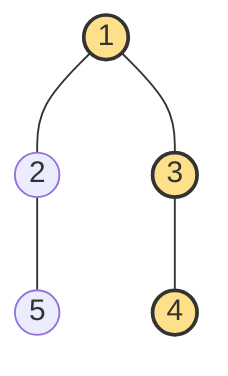
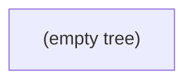
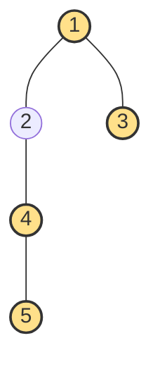
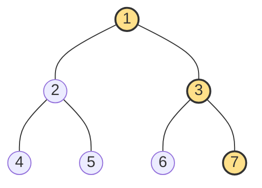
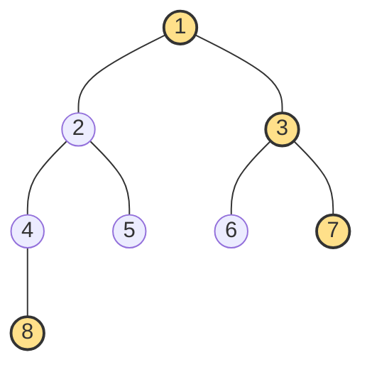

# Binary Tree Right Side View

**Date added:** 2026-08-16

## Problem Description

Given the root of a binary tree, imagine yourself standing on the right side of it. Return the values of the nodes you can see, ordered from top to bottom. A node is visible from the right side if it is the rightmost node at its depth, meaning no other node at that same depth sits further to the right of it.

**Source:** https://leetcode.com/problems/binary-tree-right-side-view/

## Examples

**Example 1**
```
Input: root = [1,2,3,null,5,null,4]
Output: [1,3,4]
Explanation: Level 0 has only node 1. Level 1 has nodes 2 and 3, and 3 is the rightmost. Level 2 has only node 4 (the right child of 3), so it is visible even though it hangs off the left subtree's side.
```


**Example 2**
```
Input: root = [1,2,null,3]
Output: [1,2,3]
Explanation: Every level has exactly one node because the tree only branches to the left, so each node is trivially the rightmost (and only) node at its depth.
```


**Example 3**
```
Input: root = [1,null,2,null,3]
Output: [1,2,3]
Explanation: The tree only branches to the right, so every node visited is automatically the rightmost one at its depth.
```


**Example 4**
```
Input: root = [1]
Output: [1]
Explanation: A single node tree has only one level, and that node is both the leftmost and rightmost node at depth 0.
```


**Example 5**
```
Input: root = []
Output: []
Explanation: An empty tree has no nodes at any depth, so the right side view is empty.
```


**Example 6**
```
Input: root = [1,2,3,4,null,null,null,5]
Output: [1,3,4,5]
Explanation: Level 0 has node 1. Level 1 has nodes 2 and 3, and 3 is rightmost. Level 2 has only node 4, which hangs off the left subtree (2's left child), so it is visible since it is the only node at that depth. Level 3 has only node 5 (4's left child), which is likewise the only node at that depth and therefore visible.
```


**Example 7**
```
Input: root = [1,2,3,4,5,6,7]
Output: [1,3,7]
Explanation: This is a perfect binary tree. Level 0 has node 1. Level 1 has nodes 2 and 3, and 3 is rightmost. Level 2 has nodes 4, 5, 6, 7, and 7 (3's right child) is rightmost.
```


**Example 8**
```
Input: root = [1,2,3,4,5,6,7,8]
Output: [1,3,7,8]
Explanation: Level 0 has node 1. Level 1 has nodes 2 and 3, and 3 is rightmost. Level 2 has nodes 4, 5, 6, 7, and 7 is rightmost. Level 3 has only node 8 (4's left child), so it is visible even though it hangs deep off the left subtree.
```


## Constraints

- The number of nodes in the tree is in the range `[0, 100]`.
- `-100 <= Node.val <= 100`

## Hints

1. Think about what information you'd need to know at each depth of the tree to decide which single node is "visible" there.
2. A traversal that processes the tree one full depth level at a time makes it easy to identify the last node seen at each level.
3. Breadth-first search naturally groups nodes by depth — the last node dequeued at each level is the one on the right.
4. Alternatively, a depth-first traversal that always visits the right child before the left child will encounter the rightmost node of each depth first — track the first node seen at each new depth.
5. Whichever traversal you pick, you only need to record one value per depth, not the whole level.
