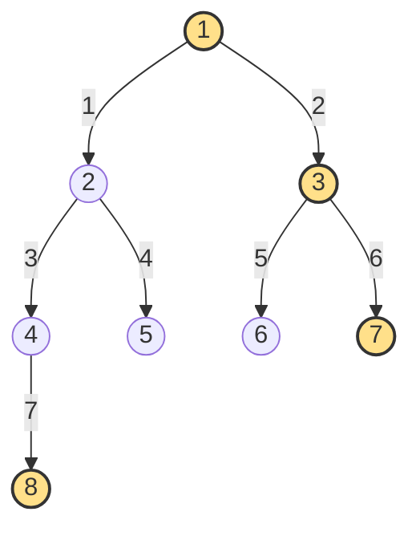

| | |
|---|---|
| **Solved on** | 2026-08-16 |
| **DSA Category** | Trees |

## 1. Your Solution Assessment

**Correctness:** Correct. `rightSideView` handles the empty tree up front (`root == null` returns `List.of()` before the queue is even created), then performs a standard level-order BFS: `levelSize` is captured once per level and decremented as each node is dequeued, so the check `if (levelSize == 0)` fires on exactly the last node polled for that level — the rightmost one — regardless of whether that node came from a right subtree or, as in Example 6 and Example 8, hangs off a left-only chain. All 10 tests pass, including the empty-tree, single-node, left/right-skewed, and boundary-value (`-100`/`100`) cases.

**Code quality:** Clear and idiomatic. Using an `ArrayDeque` as a FIFO queue and decrementing a local `levelSize` counter (rather than re-reading `queue.size()` inside the inner loop, which would be wrong once children are enqueued) is the correct standard idiom. The inline comment on line 44 documents the non-obvious part — *why* `levelSize == 0` means "this is the rightmost node" — rather than restating the code. A second method, `rightSideViewExtraMemory`, is also present; it isn't required by the problem interface but explores a variant using an explicit per-level `Deque<Integer>` — see Alternative Approaches below.

**Time complexity:** O(n), where n is the number of nodes in the tree — every node is enqueued and dequeued exactly once.

**Space complexity:** O(w), where w is the maximum width of the tree — the queue holds at most one full level at a time. Worst case O(n) for a perfect or complete tree, where the last level holds roughly n/2 nodes.

**Algorithm trace** — Mermaid graph on the tree from Example 8 (`root = [1,2,3,4,5,6,7,8]`), edges labelled with BFS dequeue order; the last node dequeued at each level (highlighted) is the one appended to `view`:


→ `view` after each level closes: `[1]` → `[1, 3]` → `[1, 3, 7]` → `[1, 3, 7, 8]`
→ return `[1, 3, 7, 8]`

## 2. Optimal Approach

The submitted BFS solution *is* the optimal approach. Every node must potentially be visited (the rightmost node at the deepest level could be an isolated left-only descendant, as in Examples 6 and 8, so no algorithm can skip subtrees in the worst case), so O(n) time is the best achievable. Processing the tree one full level at a time — via a queue and a per-level counter — makes identifying "the last node at this depth" trivial: it's whichever node is dequeued when the counter hits zero.

**Time complexity:** O(n) — each node is enqueued and dequeued exactly once.

**Space complexity:** O(w) — the queue holds at most the widest level of the tree at any point, O(n) worst case for a perfect tree's bottom level.

```java
public List<Integer> rightSideView(TreeNode root) {
    if (root == null) return List.of();

    List<Integer> view = new ArrayList<>();
    Deque<TreeNode> queue = new ArrayDeque<>();
    queue.offer(root);

    while (!queue.isEmpty()) {
        int levelSize = queue.size();

        for (int i = 0; i < levelSize; i++) {
            TreeNode current = queue.poll();

            if (i == levelSize - 1) view.add(current.val);

            if (current.left != null) queue.offer(current.left);
            if (current.right != null) queue.offer(current.right);
        }
    }

    return view;
}
```

**Algorithm trace** — same tree and format as Section 1 (Example 8, `root = [1,2,3,4,5,6,7,8]`):


→ return `[1, 3, 7, 8]`

## 3. Alternative Approaches

**DFS, right child before left, track depth.** Recursively visit the right subtree before the left one, passing along the current depth. The *first* node encountered at each depth is guaranteed to be the rightmost, since right subtrees are always explored first — so a node is added to the result only when `depth == view.size()`.

- Time: O(n) — every node is visited exactly once.
- Space: O(h) for the recursion call stack, where h is the tree height — O(log n) for a balanced tree, O(n) worst case for a skewed one (better than the O(w) worst case of BFS when the tree is tall and narrow rather than short and wide).
- When acceptable: preferred when recursion is more natural than managing an explicit queue, or when the tree is known to be tall and narrow so the recursion-stack space beats BFS's queue width.

```java
public List<Integer> rightSideView(TreeNode root) {
    List<Integer> view = new ArrayList<>();
    dfs(root, 0, view);
    return view;
}

private void dfs(TreeNode node, int depth, List<Integer> view) {
    if (node == null) return;

    if (depth == view.size()) view.add(node.val);

    dfs(node.right, depth + 1, view);
    dfs(node.left, depth + 1, view);
}
```

- Algorithm trace — Mermaid graph on Example 8, edges labelled with DFS (right-before-left) visit order; a node is only added to the result the first time its depth is reached:


→ visited in order 1(depth0, add), 3(depth1, add), 7(depth2, add), 6(depth2, skip — depth already seen), 2(depth1, skip), 5(depth2, skip), 4(depth2, skip), 8(depth3, add)
→ return `[1, 3, 7, 8]`

**Full level-order traversal, then take the last element of each level.** This is exactly what `rightSideViewExtraMemory` does: BFS as usual, but instead of tracking only the rightmost value inline, collect every node's value into a per-level `Deque<Integer>` and call `removeLast()` once the level is done.

- Time: O(n) — same BFS traversal, just with extra bookkeeping per node.
- Space: O(w) for the per-level `Deque`, same asymptotic class as the main solution, but with a constant-factor overhead — every node's value is temporarily stored in `level` even though only the last one is ever used — and no need to allocate/discard a new `Deque<Integer>` once per level in the direct version.
- When acceptable: fine for readability or if the full per-level breakdown is needed for something else downstream (e.g., reusing the same traversal to also return `levelOrder`-style output), but strictly more allocation than necessary for this problem alone.
