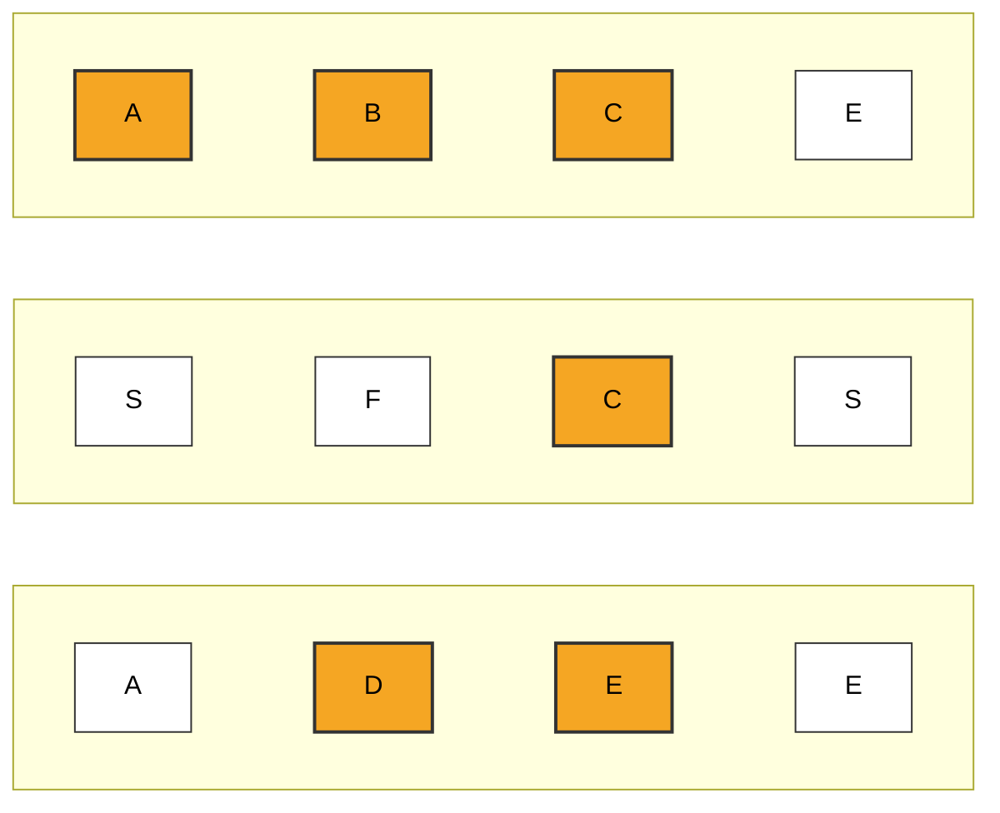
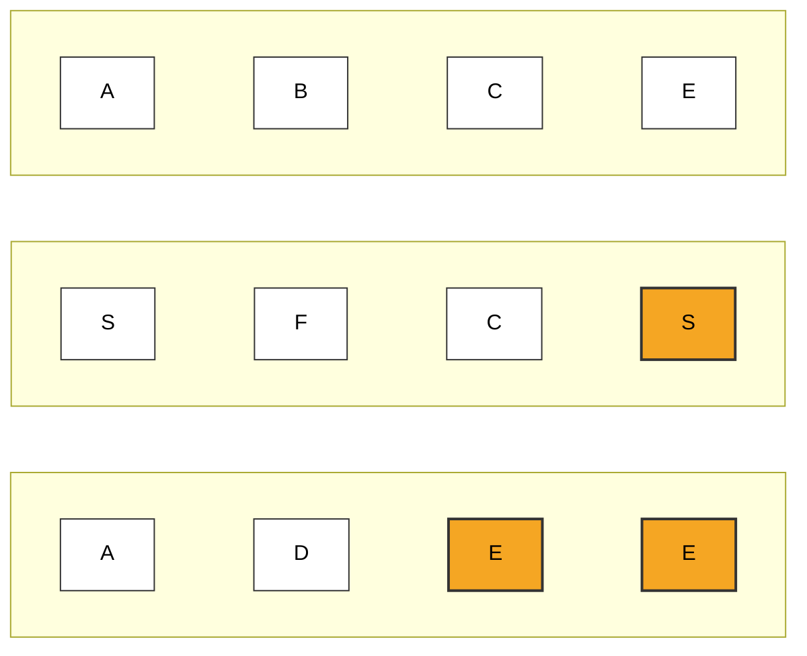
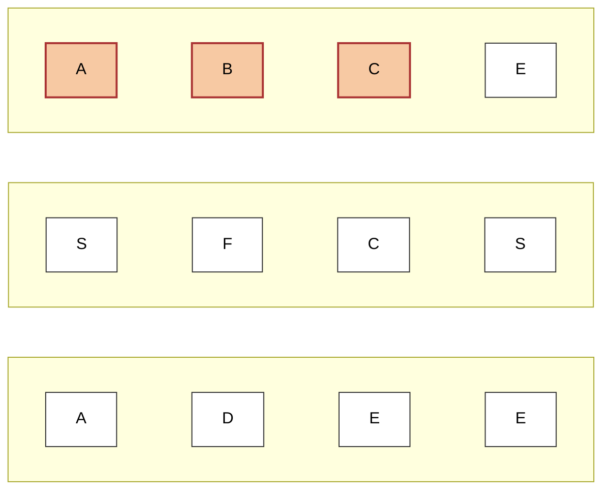
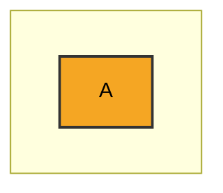
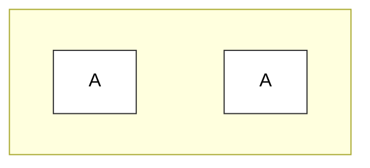
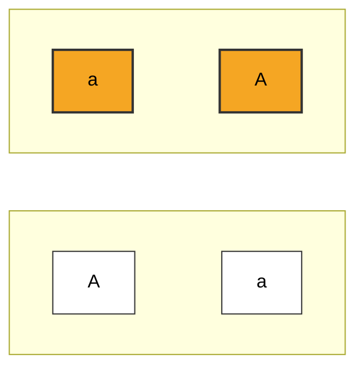
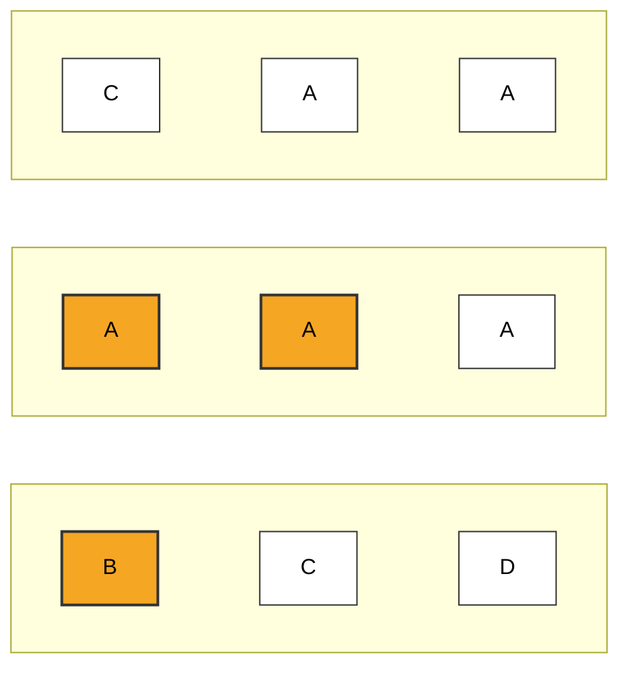

# Word Search

**Date added:** 2026-08-22

## Problem Description

Given an `m x n` grid of characters `board` and a string `word`, return `true` if `word` exists in the grid.

The word can be constructed from letters of sequentially adjacent cells, where adjacent cells are horizontally or vertically neighboring. The same letter cell may not be used more than once.

**Source:** https://leetcode.com/problems/word-search/

## Examples

**Example 1**
```
Input: board = [["A","B","C","E"],["S","F","C","S"],["A","D","E","E"]], word = "ABCCED"
Output: true
Explanation: The path A(0,0) → B(0,1) → C(0,2) → C(1,2) → E(2,2) → D(2,1) spells "ABCCED" using only horizontal/vertical moves and no repeated cell.
```



**Example 2**
```
Input: board = [["A","B","C","E"],["S","F","C","S"],["A","D","E","E"]], word = "SEE"
Output: true
Explanation: The path S(1,3) → E(2,3) → E(2,2) spells "SEE" moving down then left.
```



**Example 3**
```
Input: board = [["A","B","C","E"],["S","F","C","S"],["A","D","E","E"]], word = "ABCB"
Output: false
Explanation: A(0,0) → B(0,1) → C(0,2) starts correctly, but no unused neighbor of C(0,2) holds a "B" (its neighbors are E(0,3), C(1,2), and the already-used B(0,1)), so the search fails from every starting cell.
```



**Example 4**
```
Input: board = [["A"]], word = "A"
Output: true
Explanation: A 1x1 grid trivially satisfies a single-character word by matching the only cell.
```



**Example 5**
```
Input: board = [["A","A"]], word = "AAA"
Output: false
Explanation: The grid only has 2 cells, but "AAA" needs 3 distinct cells since a cell cannot be reused, so no path can exist regardless of letter matches.
```



**Example 6**
```
Input: board = [["a","A"],["A","a"]], word = "aA"
Output: true
Explanation: Matching is case-sensitive, so lowercase "a" and uppercase "A" are different characters. The path a(0,0) → A(0,1) (or a(0,0) → A(1,0)) spells "aA".
```



**Example 7**
```
Input: board = [["C","A","A"],["A","A","A"],["B","C","D"]], word = "AAB"
Output: true
Explanation: Several starting cells lead to dead ends (e.g. A(0,1) → A(0,2) → ... has no adjacent "B"), so the search must backtrack and try other cells. The path A(1,1) → A(1,0) → B(2,0) succeeds.
```



## Constraints

- `m == board.length`
- `n == board[i].length`
- `1 <= m, n <= 6`
- `1 <= word.length <= 15`
- `board` and `word` consist of only lowercase and uppercase English letters.

## Hints

1. Think brute-force first: for every cell in the grid that matches the first letter of `word`, try to build the rest of the word from there. What's the time complexity of trying every starting cell?
2. From a starting cell, explore up/down/left/right recursively, only continuing into a neighbor if it holds the next character of `word`.
3. You need a way to avoid reusing a cell within the current path — how could you temporarily mark a cell as "in use" while exploring from it?
4. Backtracking is essential: after a recursive exploration in one direction fails, undo the "in use" mark on that cell before trying the next direction, so other paths can still use it.
5. For the follow-up on pruning: counting letter frequencies in the board up front (and comparing against the letters needed in `word`) can let you bail out early, or reorder the search to fail faster.
