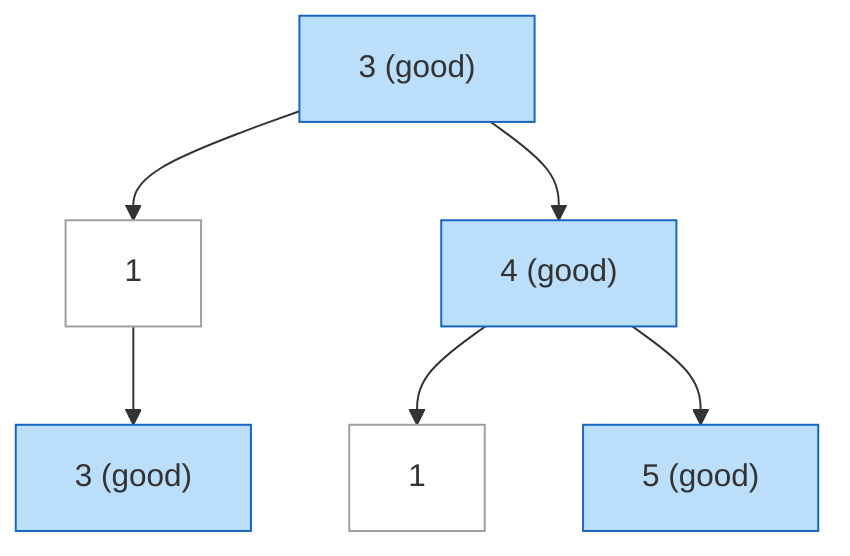
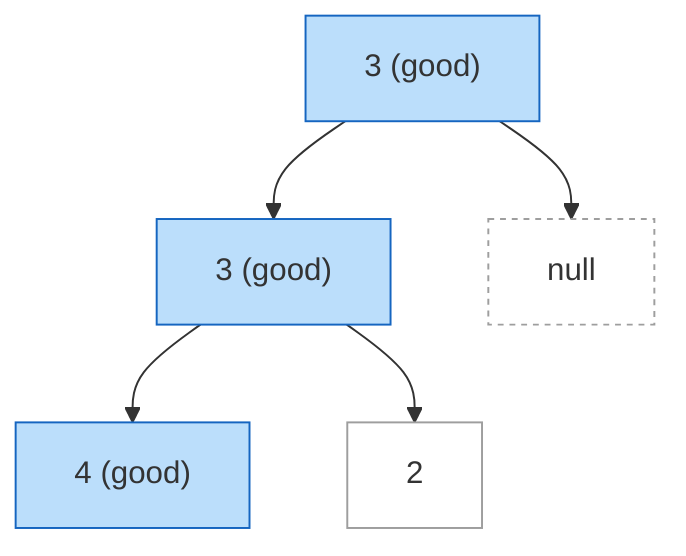
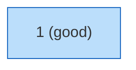
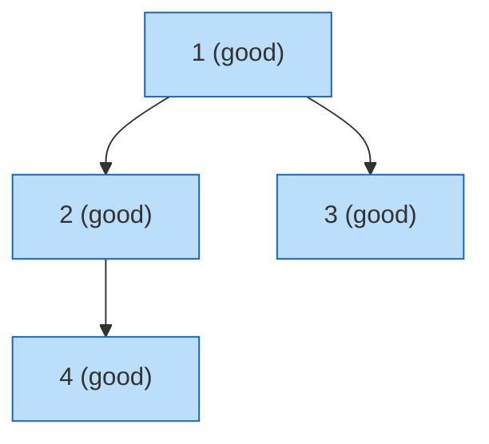
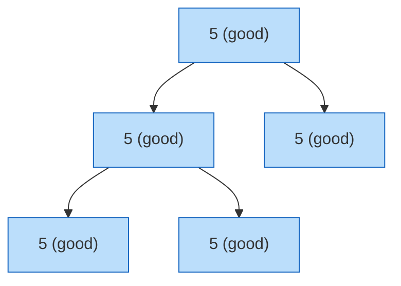
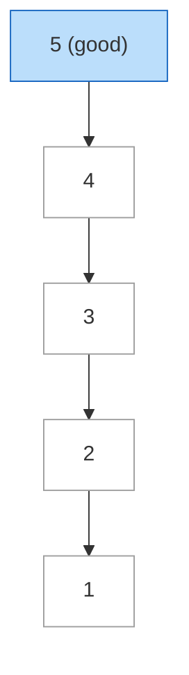
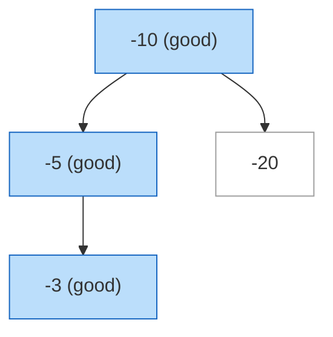

# Count Good Nodes in Binary Tree

**Date added:** 2026-08-26

## Problem Description

Given a binary tree `root`, a node X in the tree is named good if in the path from root to X there are no nodes with a value greater than X.

Return the number of good nodes in the binary tree.

**Source:** https://leetcode.com/problems/count-good-nodes-in-binary-tree/

## Examples

**Example 1**
```
Input: root = [3,1,4,3,null,1,5]
Output: 4
Explanation: Nodes in blue are good.
Root Node (3) is always a good node.
Node 4 -> (3,4) is the maximum value in the path starting from the root.
Node 5 -> (3,4,5) is the maximum value in the path.
Node 3 -> (3,1,3) is the maximum value in the path.
```



**Example 2**
```
Input: root = [3,3,null,4,2]
Output: 3
Explanation: Node 2 -> (3, 3, 2) is not good, because "3" is higher than it.
```



**Example 3**
```
Input: root = [1]
Output: 1
Explanation: Root is considered as good.
```



**Example 4**
```
Input: root = [1,2,3,4]
Output: 4
Explanation: Every node's value is strictly greater than every ancestor's value on its
own root path (1 -> 2 -> 4 and 1 -> 3), so each node is a new maximum. All four nodes are good.
```



**Example 5**
```
Input: root = [5,5,5,5,5]
Output: 5
Explanation: Equal values are not "greater than", so a node whose value ties the
running maximum is still good. Since every node has the same value, all of them qualify.
```



**Example 6**
```
Input: root = [5,4,null,3,null,2,null,1]
Output: 1
Explanation: A strictly decreasing left-skewed path. Only the root (5) is good,
since every node after it is smaller than an ancestor already seen.
```



**Example 7**
```
Input: root = [-10,-5,-20,-3]
Output: 3
Explanation: Negative values follow the same comparison rules as positive ones.
Node -5 is good because it's greater than the root (-10).
Node -20 is not good because it's smaller than the root (-10).
Node -3 is good because it's greater than the running maximum on its path (-5).
```



## Constraints

- The number of nodes in the binary tree is in the range `[1, 10^5]`.
- Each node's value is between `[-10^4, 10^4]`.

## Hints

1. Think about what information you need to carry down from an ancestor to decide whether the current node is good.
2. A simple depth-first traversal works well here — what extra parameter could you pass alongside the current node?
3. Track the maximum value seen so far along the current root-to-node path.
4. At each node, compare its value to that running maximum: if it's greater than or equal, the node is good and the running maximum updates.
5. Recurse into both children with the (possibly updated) running maximum, and sum the good-node counts from each subtree plus the current node's own contribution.
