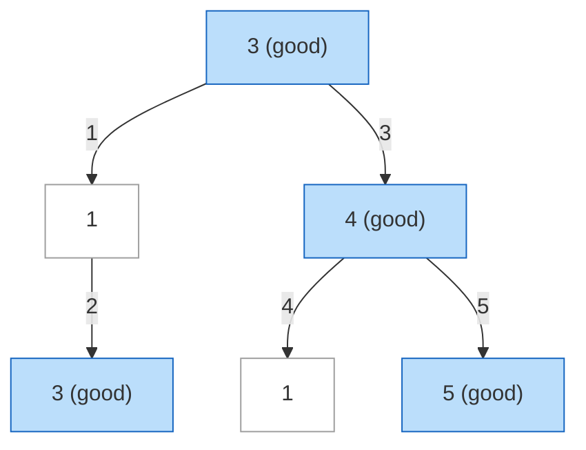

| | |
|---|---|
| **Solved on** | 2026-08-26 |
| **DSA Category** | Trees |

## 1. Your Solution Assessment

**Correctness:** The implementation is correct. It carries the running maximum down through recursion and re-derives "good" by checking `root.val >= max` *after* `max` has already been updated with `Math.max(max, root.val)`. That's a subtle but valid trick: post-update, `max` only equals `root.val` when `root.val` was the new maximum (i.e., `root.val >= max_before`), so the comparison correctly identifies good nodes, including ties. All 13 tests pass, covering the LeetCode examples, all-equal values, strictly increasing/decreasing paths, negative values, and constraint boundaries.

One practical caveat worth flagging: the constraints allow up to `10^5` nodes, and this solution recurses one stack frame per node. A fully skewed tree of `10^5` nodes could exceed Java's default thread stack size and throw a `StackOverflowError`. The test suite only exercises a 100-node skewed tree, so it wouldn't catch this. It's a common and generally accepted trade-off for interview-style code, but worth knowing — the iterative alternatives below sidestep it.

**Code quality:** Naming is clear (`goodNodes`, `isGoodNode`, `max`). The one minor nit is that `isGoodNode` re-derives the answer from the *already-mutated* `max`, which reads a bit indirectly — comparing `root.val` to the max *before* the update (as in the Optimal Approach below) is functionally identical but easier to follow on first read.

**Time complexity:** O(n) — every node is visited exactly once, with O(1) work per visit.

**Space complexity:** O(h) auxiliary, where h is the tree height, from the recursion call stack. Worst case O(n) for a fully skewed tree, O(log n) for a balanced tree.

**Algorithm trace** (Call stack table) — `root = [3,1,4,3,null,1,5]`:

| Depth | Call | Own contribution (res) | Returns |
|---|---|---|---|
| 2 | goodNodes(D=3, max=3) | 1 (3≥3) | 1 |
| 1 | goodNodes(B=1, max=3) | 0 (1<3) | 0+1+0 = 1 |
| 2 | goodNodes(E=1, max=4) | 0 (1<4) | 0 |
| 2 | goodNodes(F=5, max=4) | 1 (5≥5) | 1 |
| 1 | goodNodes(C=4, max=3) | 1 (4≥4) | 1+0+1 = 2 |
| 0 | goodNodes(A=3, max=-∞) | 1 (3≥3) | 1+1+2 = 4 |

→ `goodNodes(root) = 4`

## 2. Optimal Approach

This problem is already solved optimally by a single DFS pass: at each node, compare its value against the maximum value seen so far *on the path from the root*, then propagate the (possibly updated) maximum down to both children. A node is good exactly when its value is greater than or equal to that running maximum. Summing 1 for each good node across the traversal gives the answer in one pass.

The cleanest way to express this compares the node's value to the max *before* updating it, avoiding the "update then re-check" indirection:

```java
public int goodNodes(TreeNode root) {
    return dfs(root, root.val);
}

private int dfs(TreeNode node, int maxSoFar) {
    if (node == null) return 0;

    int count = node.val >= maxSoFar ? 1 : 0;
    int newMax = Math.max(maxSoFar, node.val);

    return count + dfs(node.left, newMax) + dfs(node.right, newMax);
}
```

**Time complexity:** O(n) — each node is visited once, doing O(1) comparison work.

**Space complexity:** O(h) — recursion stack depth equals the tree's height; O(log n) balanced, O(n) worst case skewed.

**Algorithm trace** (Call stack table) — `root = [3,3,null,4,2]`:

| Depth | Call | Own contribution (count) | Returns |
|---|---|---|---|
| 2 | dfs(C=4, maxSoFar=3) | 1 (4≥3) | 1 |
| 2 | dfs(D=2, maxSoFar=3) | 0 (2<3) | 0 |
| 1 | dfs(B=3, maxSoFar=3) | 1 (3≥3) | 1+1+0 = 2 |
| 0 | dfs(A=3, maxSoFar=3) | 1 (3≥3) | 1+2+0 = 3 |

→ `goodNodes(root) = 3`

## 3. Alternative Approaches

### 3.1 Iterative DFS with an explicit stack

Same idea as the optimal approach, but push `(node, maxSoFar)` pairs onto an explicit `Deque` instead of relying on the call stack. This trades recursion for heap-allocated stack frames, which avoids the JVM's `StackOverflowError` risk on very deep (skewed) trees — a real concern given the `10^5`-node constraint.

**Time complexity:** O(n) — identical traversal, just iterative.

**Space complexity:** O(n) worst case — the explicit stack can hold as many entries as the tree is deep (or wide, depending on push order), same asymptotic bound as recursion but backed by the heap instead of the limited thread stack.

**When acceptable:** Preferred over the recursive version whenever input trees might be adversarially skewed and stack-depth safety matters (e.g., production code, or an interviewer explicitly probing for this).

**Algorithm trace** (Mermaid graph, preorder visit order via stack pop) — `root = [3,1,4,3,null,1,5]`:



Stack starts with `(A, -∞)`. Pop A (good, max=3) → push `(C,3)` then `(B,3)` so B pops first. Pop B (not good, max=3) → push `(null,3)` then `(D,3)`. Pop D (good, max=3). Pop C (good, max=4) → push `(F,4)` then `(E,4)`. Pop E (not good, max=4). Pop F (good, max=4). Good count = 4.

### 3.2 BFS with a queue

Level-order traversal using a queue of `(node, maxSoFar)` pairs instead of a stack. Functionally equivalent to the iterative DFS — same running-maximum rule, just a different visitation order (level by level instead of depth-first).

**Time complexity:** O(n) — every node dequeued and processed once.

**Space complexity:** O(n) worst case — the queue can hold up to the tree's widest level, which for a complete tree is O(n) (roughly n/2 leaf nodes at once).

**When acceptable:** Equivalent robustness to 3.1 regarding stack-depth safety; choose BFS over DFS mainly if you also need level-by-level information for a follow-up requirement (this problem alone doesn't need it, so it's a lateral choice rather than a better one).

**Algorithm trace** (Mermaid graph, level-order visit order via queue) — `root = [3,1,4,3,null,1,5]`:


### 3.3 Brute force: recompute the ancestor path max at every node

Instead of tracking a running maximum incrementally, maintain a `List<Integer>` of ancestor values while recursing (push before descending into children, pop on the way back up). At each node, scan the entire list to find the max-so-far and compare. This is the "naive first attempt" many interviewees write before realizing the max can be tracked incrementally in O(1) per node.

**Time complexity:** O(n · h) — every node triggers an O(depth) scan of its ancestor list; worst case (skewed tree) this is O(n²), best/average case (balanced tree) O(n log n).

**Space complexity:** O(h) — the ancestor path list plus the recursion stack, both bounded by tree height.

**When acceptable:** Fine for small inputs or as a correct-but-unoptimized starting point under interview time pressure, but should be called out as suboptimal and improved to the running-maximum version once correctness is established.

**Algorithm trace** (Call stack table) — `root = [3,1,4,3,null,1,5]`:

| Depth | Call | ancestors (path) | currentMax | good? (res) | Returns |
|---|---|---|---|---|---|
| 2 | dfs(D=3) | [3,1] | 3 | yes (res=1) | 1 |
| 1 | dfs(B=1) | [3] | 3 | no (res=0) | 0+1+0 = 1 |
| 2 | dfs(E=1) | [3,4] | 4 | no (res=0) | 0 |
| 2 | dfs(F=5) | [3,4] | 4 | yes (res=1) | 1 |
| 1 | dfs(C=4) | [3] | 3 | yes (res=1) | 1+0+1 = 2 |
| 0 | dfs(A=3) | [] | -∞ | yes (res=1) | 1+1+2 = 4 |

→ `goodNodes(root) = 4`
