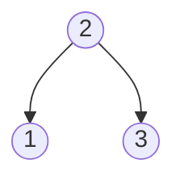
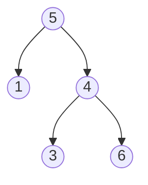
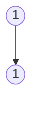
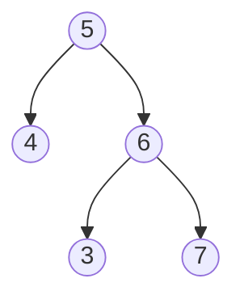
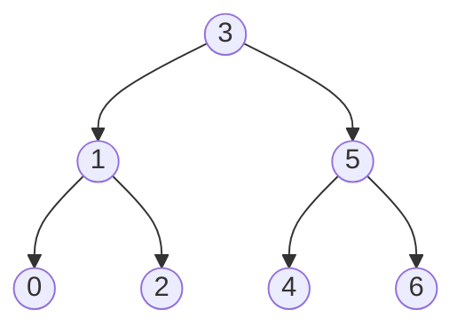
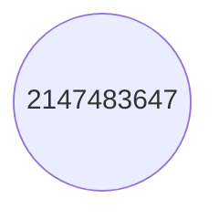

# Validate Binary Search Tree

**Date added:** 2026-08-26

## Problem Description

Given the `root` of a binary tree, determine if it is a valid binary search tree (BST). A valid BST is defined as follows: the left subtree of a node contains only nodes with keys strictly less than the node's key; the right subtree of a node contains only nodes with keys strictly greater than the node's key; and both the left and right subtrees must also be binary search trees.

**Source:** https://leetcode.com/problems/validate-binary-search-tree/

## Examples

**Example 1**
```
Input: root = [2,1,3]
Output: true
Explanation: Every node satisfies the BST property: 1 < 2 < 3.
```


**Example 2**
```
Input: root = [5,1,4,null,null,3,6]
Output: false
Explanation: The root's right subtree contains the value 3, which is less than the root's value 5, so the BST property is violated.
```


**Example 3**
```
Input: root = [1]
Output: true
Explanation: A tree with a single node has no ordering to violate, so it is trivially a valid BST.
```


**Example 4**
```
Input: root = [1,1]
Output: false
Explanation: The left child has the same value as its parent. The BST property requires strictly less than, so equal values are not allowed.
```


**Example 5**
```
Input: root = [5,4,6,null,null,3,7]
Output: false
Explanation: Node 3 satisfies its immediate parent (3 < 6), but it violates the root's constraint because it lies in the root's right subtree and must be greater than 5. Checking only against the immediate parent is not enough.
```


**Example 6**
```
Input: root = [3,1,5,0,2,4,6]
Output: true
Explanation: Every node's value falls within the valid range implied by its ancestors: 0 < 1 < 2 < 3 < 4 < 5 < 6, so the whole tree is a valid BST.
```


**Example 7**
```
Input: root = [2147483647]
Output: true
Explanation: A single node holding the maximum 32-bit integer value is still a valid BST. This case highlights why a solution should not use Integer.MIN_VALUE / Integer.MAX_VALUE as sentinel bounds without care, since a node could legitimately hold those exact values.
```


## Constraints

- The number of nodes in the tree is in the range `[1, 10^4]`.
- `-2^31 <= Node.val <= 2^31 - 1`

## Hints

1. What property must hold between a node and its parent? Is comparing only against the immediate parent enough to guarantee the whole tree is a valid BST?
2. Consider a node deep in the right subtree of the root — what value range must it satisfy, not just relative to its immediate parent?
3. Track a valid `(min, max)` range for each node as you recurse, narrowing that range as you move left or right.
4. Alternatively, recall that an in-order traversal of a valid BST visits node values in strictly increasing order.
5. If you use the in-order traversal idea, you only need to compare each visited value against the previously visited value, not the whole tree.
