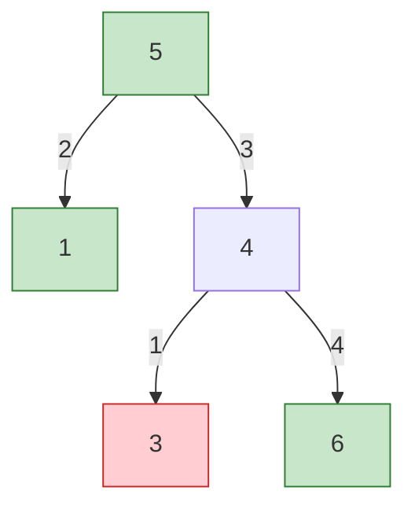
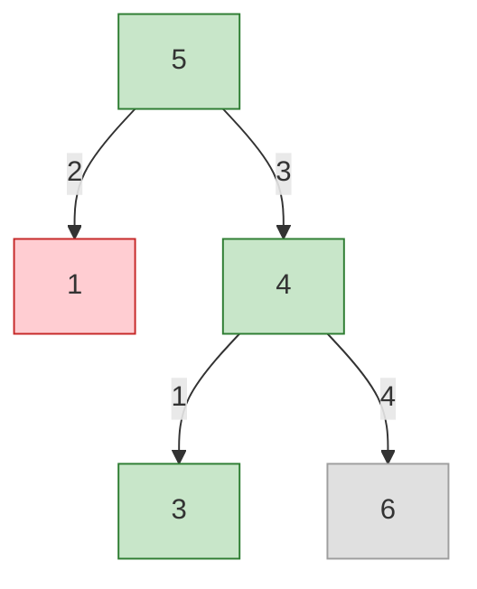

| | |
|---|---|
| **Solved on** | 2026-08-26 |
| **DSA Category** | Trees |

## 1. Your Solution Assessment

**Correctness:** The final implementation is correct. It recurses top-down carrying a `(lowerLimit, upperLimit)` range that a node's value must strictly fall within, narrowing that range for each child by passing `root.val` itself as the new bound. The check `root.val <= lowerLimit || root.val >= upperLimit` correctly enforces strict inequality on both sides, and using `long` for the bounds (seeded with `Long.MIN_VALUE`/`Long.MAX_VALUE`) sidesteps integer overflow entirely, since no arithmetic is ever performed on `root.val` when narrowing the range. All 16 tests pass.

Getting here took two iterations worth calling out, since they're common pitfalls for this exact problem: the first version compared only against the immediate parent value using non-strict operators, which let equal values slip through (e.g. `[1,1]` was wrongly accepted). The second version fixed that with `<=`/`>=` but narrowed the bound arithmetically (`root.val + 1` / `root.val - 1`), which silently overflowed at `Integer.MAX_VALUE`/`Integer.MIN_VALUE` and wrongly accepted a tree where a node's right child should be impossible (e.g. root at `MAX_VALUE` with any right child). Switching to `long` bounds and comparing without shifting them fixes both issues at once.

**Code quality:** Clear and minimal — two well-named parameters (`lowerLimit`, `upperLimit`), no unnecessary state, and the public/private overload split keeps the recursive helper's extra parameters out of the public API.

**Time complexity:** O(n) — each node is visited exactly once with O(1) work per visit.

**Space complexity:** O(h) — the recursion call stack holds one frame per level of depth; O(log n) for a balanced tree, O(n) worst case for a fully skewed tree.

**Algorithm trace** (Call stack table) — `root = [5,1,4,null,null,3,6]`:

| Depth | Call (lowerLimit, upperLimit) | Check | Returns |
|---|---|---|---|
| 1 | isValidBST(1, -∞, 5) | -∞ < 1 < 5 → valid, children null | true |
| 1 | isValidBST(4, 5, +∞) | 4 <= 5 → **invalid**, stop | false |
| 0 | isValidBST(5, -∞, +∞) | -∞ < 5 < +∞ → valid | left(true) && right(false) = **false** |

→ `isValidBST(root) = false` (node `4`, the right child of `5`, must be greater than `5` but isn't — recursion never needs to reach node `3` to detect the violation)

## 2. Optimal Approach

The user's fixed solution already is the optimal approach: a single top-down DFS pass carrying a valid `(lowerLimit, upperLimit)` range per node, narrowed to `(lowerLimit, node.val)` going left and `(node.val, upperLimit)` going right. Using `long` bounds (or `Long` boxed with `null` sentinels, or a mutable single-element array holding the "previous value" for an in-order variant — see 3.1) avoids the classic overflow trap at the `int` boundary values without adding real complexity.

```java
public boolean isValidBST(TreeNode root) {
    return isValidBST(root, Long.MIN_VALUE, Long.MAX_VALUE);
}

private boolean isValidBST(TreeNode node, long lowerLimit, long upperLimit) {
    if (node == null) return true;

    if (node.val <= lowerLimit || node.val >= upperLimit) return false;

    return isValidBST(node.left, lowerLimit, node.val)
        && isValidBST(node.right, node.val, upperLimit);
}
```

**Time complexity:** O(n) — every node is visited once; the range check is O(1).

**Space complexity:** O(h) — bounded by the recursion depth, i.e. the tree's height.

**Algorithm trace** (Call stack table) — `root = [3,1,5,0,2,4,6]`:

| Depth | Call (lowerLimit, upperLimit) | Check | Returns |
|---|---|---|---|
| 2 | isValidBST(0, -∞, 1) | -∞ < 0 < 1 → valid | true |
| 2 | isValidBST(2, 1, 3) | 1 < 2 < 3 → valid | true |
| 1 | isValidBST(1, -∞, 3) | -∞ < 1 < 3 → valid | true && true = true |
| 2 | isValidBST(4, 3, 5) | 3 < 4 < 5 → valid | true |
| 2 | isValidBST(6, 5, +∞) | 5 < 6 < +∞ → valid | true |
| 1 | isValidBST(5, 3, +∞) | 3 < 5 < +∞ → valid | true && true = true |
| 0 | isValidBST(3, -∞, +∞) | -∞ < 3 < +∞ → valid | true && true = **true** |

→ `isValidBST(root) = true`

## 3. Alternative Approaches

### 3.1 In-order traversal, comparing against the previous value

A BST's in-order traversal visits values in strictly increasing order — that's an equivalent characterization of the whole problem. Walk the tree in-order (recursively or iteratively) while tracking the last value seen; if the current value isn't strictly greater than it, the tree is invalid. This avoids reasoning about ranges entirely and needs no `long` widening, since it's a single running comparison rather than nested bounds.

```java
private Long previous = null;

public boolean isValidBST(TreeNode root) {
    if (root == null) return true;
    if (!isValidBST(root.left)) return false;
    if (previous != null && root.val <= previous) return false;
    previous = (long) root.val;
    return isValidBST(root.right);
}
```

**Time complexity:** O(n) — every node visited once during the traversal.

**Space complexity:** O(h) — recursion stack depth, same as the range-based approach.

**When acceptable:** A clean, arguably more elegant alternative to the range-passing approach; some interviewers prefer it since it directly encodes the "sorted sequence" property of a BST. The one caveat is the mutable instance field (`previous`), which is slightly less idiomatic for a stateless public method than passing bounds explicitly.

**Algorithm trace** (Mermaid graph, in-order visit order) — `root = [5,1,4,null,null,3,6]`:



In-order visit sequence: `D(3) → C(4) → A(5) → B(1) → E(6)`. Step 1 visits `3`, `previous = null` so it's accepted, `previous = 3`. Step 2 visits `4`; `4 > 3` accepted, `previous = 4`. Step 3 visits `5`; `5 > 4` accepted, `previous = 5`. Step 4 visits `1`; `1 <= 5` → **violation found, return false immediately**. The traversal never reaches `6`.

### 3.2 Iterative in-order traversal with an explicit stack

Same idea as 3.1, but replace the recursive call stack with an explicit `Deque<TreeNode>` to simulate in-order traversal manually: push left children until `null`, pop, compare against the previous value, then move to the right child. This removes any dependency on the JVM's call stack.

**Time complexity:** O(n) — each node is pushed and popped exactly once.

**Space complexity:** O(h) — the explicit stack holds at most one path's worth of nodes at a time, same bound as the recursive version but backed by the heap instead of the thread stack.

**When acceptable:** Preferred when the input tree could be adversarially skewed and stack-depth safety matters (the constraint allows up to `10^4` nodes, which is unlikely to overflow Java's default thread stack, but the pattern is worth knowing for larger inputs or production code).

**Algorithm trace** (Mermaid graph, in-order visit order via explicit stack) — `root = [5,1,4,null,null,3,6]`:



Push `5 → 1` (following left children) — stack: `[5,1]`. Pop `1` (leftmost), no left child so nothing to push; compare: `previous=null` → accept, `previous=1`. Move to `1`'s right (`null`), pop next: `5`; compare `5 > 1` → accept, `previous=5`. Move to `5`'s right (`4`), push `4 → 3` — stack: `[4,3]`. Pop `3`; compare `3 <= 5` → **violation, return false**. Node `6` is never visited.

### 3.3 Brute force: validate min/max of each subtree independently

For every node, recursively compute the max value of its left subtree and the min value of its right subtree, then check `leftMax < node.val < rightMin`, in addition to recursively validating that both subtrees are themselves valid BSTs. This is the "naive first instinct" many interviewees reach for before realizing the range can be threaded through a single pass instead of recomputed at every node.

**Time complexity:** O(n²) worst case — computing the min/max of a subtree costs O(subtree size), and this is repeated at every node; for a skewed tree this degrades to O(n²), and even for a balanced tree it's O(n log n) due to the repeated subtree scans.

**Space complexity:** O(h) — recursion depth for the validation calls, plus O(h) more for each min/max helper call (not cumulative, since they don't nest across levels).

**When acceptable:** Only for very small trees, or as a stepping stone during an interview to show correctness before optimizing to the single-pass range approach — it should be explicitly flagged as suboptimal rather than left as a final answer.

**Algorithm trace** (Call stack table) — `root = [5,1,4,null,null,3,6]`:

| Depth | Call | leftMax | rightMin | Check | Returns |
|---|---|---|---|---|---|
| 1 | validate(1) | -∞ (no left) | +∞ (no right) | -∞ < 1 < +∞ → valid | true |
| 2 | subtreeMax(3) / subtreeMin(3) called for node 4's check | — | — | — | 3 |
| 1 | validate(4) | 3 (left subtree max) | 6 (right subtree min) | 3 < 4 < 6 → valid locally | but recurses into validate(3) and validate(6) |
| 0 | validate(5) | 4 (left subtree max, via node 1... and 4) | 3 (right subtree min, via node 4's left child 3) | 3 < 5? no, **5 not < rightMin(3)** → **invalid** | false |

→ `isValidBST(root) = false` — caught at the root because the right subtree's minimum value (`3`, found in node `4`'s left child) is less than the root's value (`5`), even though node `4` locally looked fine against its own immediate children.
