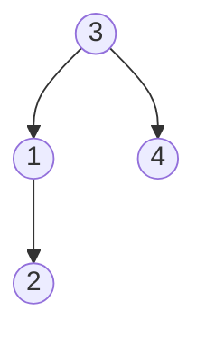
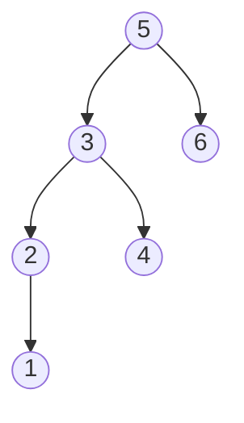
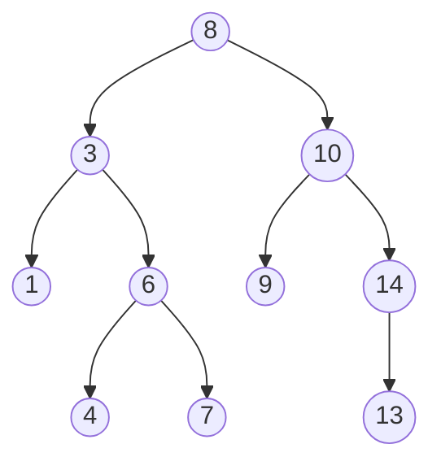

# Kth Smallest Element in a BST

**Date added:** 2026-08-26

## Problem Description

Given the `root` of a binary search tree, and an integer `k`, return the `k`th smallest value (1-indexed) of all the values of the nodes in the tree.

**Source:** https://leetcode.com/problems/kth-smallest-element-in-a-bst/

## Examples

**Example 1**
```
Input: root = [3,1,4,null,2], k = 1
Output: 1
Explanation: The in-order traversal visits values in ascending order: 1, 2, 3, 4. The 1st smallest value is 1.
```


**Example 2**
```
Input: root = [5,3,6,2,4,null,null,1], k = 3
Output: 3
Explanation: The in-order traversal visits values in ascending order: 1, 2, 3, 4, 5, 6. The 3rd smallest value is 3.
```


**Example 3**
```
Input: root = [1], k = 1
Output: 1
Explanation: A tree with a single node has only one value, so the 1st smallest is that node's value.
```


**Example 4**
```
Input: root = [5,4,null,3,null,2,null,1], k = 4
Output: 4
Explanation: This tree is entirely left-skewed. Its in-order traversal still visits values in ascending order: 1, 2, 3, 4, 5. The 4th smallest value is 4.
```


**Example 5**
```
Input: root = [1,null,2,null,3,null,4,null,5], k = 5
Output: 5
Explanation: This tree is entirely right-skewed. Its in-order traversal visits values in ascending order: 1, 2, 3, 4, 5. The 5th smallest, and largest, value is 5.
```


**Example 6**
```
Input: root = [3,1,4,null,2], k = 4
Output: 4
Explanation: When k equals the total number of nodes, the answer is simply the maximum value in the tree, which is the last value visited by an in-order traversal.
```


**Example 7**
```
Input: root = [8,3,10,1,6,9,14,null,null,4,7,null,null,13], k = 6
Output: 8
Explanation: The in-order traversal visits values in ascending order: 1, 3, 4, 6, 7, 8, 9, 10, 13, 14. The 6th smallest value is 8, which happens to be the root in this particular tree.
```


## Constraints

- The number of nodes in the tree is `n`.
- `1 <= k <= n <= 10^4`
- `0 <= Node.val <= 10^4`

## Hints

1. An in-order traversal of a BST visits node values in strictly ascending order. How could that ordering help you find the `k`th smallest value directly?
2. You don't need to collect every value into a list before answering — you can stop as soon as you've visited the `k`th one.
3. Try an iterative in-order traversal using an explicit stack, decrementing a counter each time you visit a node, so you can return early once the counter reaches zero.
4. Think about the follow-up: if `k` were queried repeatedly and the tree were mutated with inserts/deletes, what extra piece of information could each node store to answer "how many nodes are in my left subtree" in O(log n) instead of re-traversing?
5. Storing a subtree-size (or rank) at each node, updated on insert/delete, lets you navigate directly toward the kth smallest node without a full traversal.
