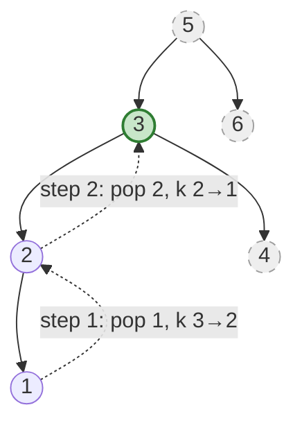
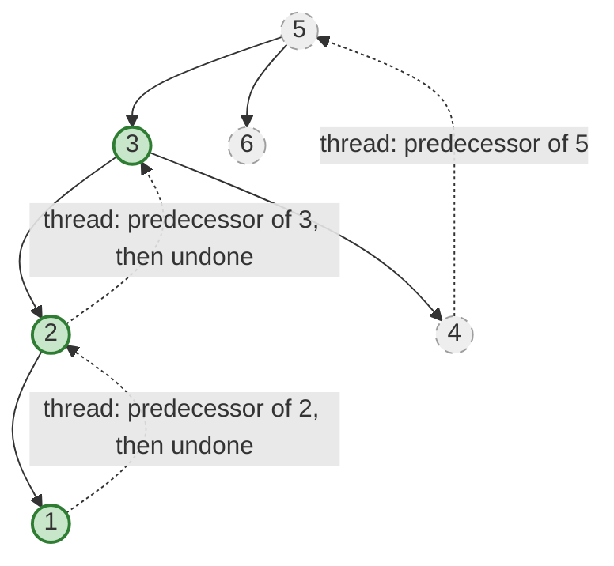

| | |
|---|---|
| **Solved on** | 2026-08-26 |
| **DSA Category** | Trees |

## 1. Your Solution Assessment

**Correctness:** The implementation is correct. It performs a DFS that mimics an in-order traversal (left, visit, right), incrementing a shared mutable `Counter.count` on each visit, and returns `root.val` the instant `count == k`. Since the counter only ever increases and the equality check fires exactly once, there's no risk of a false match. All 12 tests pass, including the single node, left/right-skewed trees, `k` equal to the node count, boundary values (`0` and `10^4`), and a 10,000-node skewed tree (confirming no stack overflow within the constraint's bounds).

**Code quality:** The `Counter` wrapper class is a legitimate and well-documented workaround for Java's pass-by-value semantics — the comment explaining why a plain `int` parameter doesn't work is a nice touch. One real inefficiency: the algorithm never stops early. Once the `k`th node is found and returned up through `left`, every ancestor still executes `counter.count = counter.count + 1` and still recurses into `dfs(root.right, ...)` before the `left >= 0 ? left : right` ternary discards that wasted work. So the traversal always visits all `n` nodes, regardless of how small `k` is.

**Time complexity:** O(n) — every node is visited exactly once per call, and (per the note above) this happens unconditionally even after the answer is already found, so there's no early exit to shrink this bound.

**Space complexity:** O(H) — one stack frame per level of recursion, where H is the tree height; O(log n) balanced, O(n) worst case (confirmed by the skewed-tree test), plus O(1) for the single shared `Counter` instance.

**Algorithm trace** (Call stack table) — `root = [5,3,6,2,4,null,null,1]`, `k = 3`:

| Depth | Call | counter before | counter after | match `k=3`? | Returns |
|---|---|---|---|---|---|
| 3 | dfs(1) | 0 | 1 | No | -1 |
| 2 | dfs(2) (resumes after left = dfs(1)) | 1 | 2 | No | -1 |
| 1 | dfs(3) (resumes after left = dfs(2)) | 2 | 3 | **Yes** | **3** |
| 0 | dfs(5) (resumes after left = dfs(3)) | 3 | 4 | No | recurses into dfs(6) anyway |
| 1 | dfs(6) | 4 | 5 | No | -1 |
| 0 | dfs(5) (final) | — | — | — | `left = 3` wins over `right = -1` → **3** |

→ `kthSmallest(root, 3) = 3`. Note nodes `5` and `6` are still fully visited and counted (`counter` climbs to `5`) even though the answer was already found at node `3` — that's the wasted work called out above.

**A more idiomatic version:** the same DFS-with-shared-counter idea, written with two changes: a plain `int[]` single-element array instead of a bespoke `Counter` class (a common, lighter-weight Java idiom for "give me a mutable box around a primitive"), and a guard clause that actually stops the recursion once the answer has been found, fixing the inefficiency above:

```java
public int kthSmallest(TreeNode root, int k) {
    int[] counter = {0};
    int[] result = {-1};
    inorder(root, k, counter, result);
    return result[0];
}

private void inorder(TreeNode node, int k, int[] counter, int[] result) {
    if (node == null || counter[0] >= k) return;

    inorder(node.left, k, counter, result);

    if (counter[0] < k) {
        counter[0]++;
        if (counter[0] == k) {
            result[0] = node.val;
            return;
        }
    }

    inorder(node.right, k, counter, result);
}
```

The `counter[0] >= k` check at the top of every call means that once the answer is found, every subsequent call (including the "wasted" ones into ancestors' right subtrees) does O(1) work and returns immediately instead of descending into a whole subtree — giving the true O(H + k) bound described in Section 2, without needing a separate `Counter` class.

## 2. Optimal Approach

Do an **iterative in-order traversal with an explicit stack**: push every left child while descending, then pop, decrement `k`, and return as soon as `k` hits `0`; otherwise move to the popped node's right child and repeat. This is the same in-order idea as the user's solution, but because it's iterative and checks the counter *before* doing any more work, it naturally stops the moment the answer is found — it never touches nodes past the `k`th one.

**Time complexity:** O(H + k) — H to descend the leftmost spine initially, then at most `k` pop/push cycles; worst case O(n) for a skewed tree where `k` is large, but typically far better than a full traversal.

**Space complexity:** O(H) — the explicit stack holds at most one root-to-leaf path at a time.

```java
public int kthSmallest(TreeNode root, int k) {
    Deque<TreeNode> stack = new ArrayDeque<>();
    TreeNode current = root;

    while (current != null || !stack.isEmpty()) {
        while (current != null) {
            stack.push(current);
            current = current.left;
        }

        current = stack.pop();
        if (--k == 0) return current.val;

        current = current.right;
    }

    throw new IllegalArgumentException("k is out of bounds for this tree");
}
```

**Algorithm trace** (Mermaid graph, visit order) — `root = [5,3,6,2,4,null,null,1]`, `k = 3`:



Descend the left spine `5 → 3 → 2 → 1`, pushing each. Pop `1` (`k: 3→2`), no right child. Pop `2` (`k: 2→1`), no right child. Pop `3` (`k: 1→0`) → **match, return 3**. Nodes `4`, `5`, and `6` (greyed out) are never touched — a direct improvement over Section 1's trace, where every node was visited regardless.

## 3. Alternative Approaches

### 3.1 Full in-order traversal into a list, then index

Collect every value via a standard recursive in-order traversal into a `List<Integer>`, then return `values.get(k - 1)`.

```java
public int kthSmallest(TreeNode root, int k) {
    List<Integer> values = new ArrayList<>();
    inorder(root, values);
    return values.get(k - 1);
}

private void inorder(TreeNode node, List<Integer> values) {
    if (node == null) return;
    inorder(node.left, values);
    values.add(node.val);
    inorder(node.right, values);
}
```

**Time complexity:** O(n) — always visits every node, even when `k = 1`.

**Space complexity:** O(n) — the output list holds every value, plus O(H) recursion stack.

**When acceptable:** Reasonable if you need to answer many `kthSmallest` queries against the *same, unchanging* tree — build the list once for O(n), then each query is O(1). The stack-based optimal approach would instead redo O(H + k) work per query, which loses to this if queries are frequent enough.

**Algorithm trace** (Call stack table) — `root = [3,1,4,null,2]`, `k = 1`:

| Depth | Call | Action | List state |
|---|---|---|---|
| 2 | inorder(1) | visit & add `1` | `[1]` |
| 3 | inorder(2) | visit & add `2` | `[1, 2]` |
| 1 | inorder(3) | visit & add `3` | `[1, 2, 3]` |
| 2 | inorder(4) | visit & add `4` | `[1, 2, 3, 4]` |

→ `values.get(k - 1) = values.get(0) = 1`

### 3.2 Morris in-order traversal (O(1) space)

Temporarily thread the tree: for a node with a left child, find that child's rightmost descendant (its in-order predecessor) and point its `right` pointer back at the current node. This lets you return to the current node later without a stack or recursion. Undo the thread once you've used it.

```java
public int kthSmallest(TreeNode root, int k) {
    TreeNode current = root;
    int count = 0;

    while (current != null) {
        if (current.left == null) {
            count++;
            if (count == k) return current.val;
            current = current.right;
        } else {
            TreeNode predecessor = current.left;
            while (predecessor.right != null && predecessor.right != current) {
                predecessor = predecessor.right;
            }

            if (predecessor.right == null) {
                predecessor.right = current;
                current = current.left;
            } else {
                predecessor.right = null;
                count++;
                if (count == k) return current.val;
                current = current.right;
            }
        }
    }

    throw new IllegalArgumentException("k is out of bounds for this tree");
}
```

**Time complexity:** O(n) worst case (each edge is threaded and un-threaded at most once, amortized O(1) per node); can return earlier once `k` is hit, same spirit as the stack approach.

**Space complexity:** O(1) — no recursion, no explicit stack, just a couple of pointers. This is the whole point of Morris traversal.

**When acceptable:** When O(H) auxiliary space is genuinely too much — very deep or adversarially skewed trees where even an explicit stack risks memory pressure, or when a follow-up specifically asks for O(1) space. **Caveat:** if you return early (as this problem invites), any thread created but not yet undone above the found node stays dangling and permanently corrupts the tree's `right` pointers — fine if the tree is discarded after the query, but dangerous if it's reused. A production version would need to walk back and clean up remaining threads before returning, or avoid early-exit entirely.

**Algorithm trace** (Mermaid graph, threads created) — `root = [5,3,6,2,4,null,null,1]`, `k = 3`:



Visit order `1 → 2 → 3` (match, `count` reaches `3`), returning before nodes `4`, `5`, `6` are reached. The `4 → 5` thread created in the very first step is never undone, since the function returns early — exactly the dangling-thread caveat above.

### 3.3 Augmented BST with subtree sizes (order-statistics tree)

This is the direct answer to the problem's own follow-up: *"if the BST is modified often... how would you optimize?"* Store a `size` at each node (count of nodes in its subtree, including itself), maintained incrementally on insert/delete. To find the `k`th smallest: compare `k` against `leftSize = size(node.left)`. If `k == leftSize + 1`, `node` is the answer. If `k <= leftSize`, recurse left. Otherwise recurse right with `k - leftSize - 1`.

```java
static class Node {
    int val, size = 1;
    Node left, right;
    Node(int val) { this.val = val; }
}

static int size(Node node) {
    return node == null ? 0 : node.size;
}

static int kthSmallest(Node node, int k) {
    int leftSize = size(node.left);
    if (k == leftSize + 1) return node.val;
    if (k <= leftSize) return kthSmallest(node.left, k);
    return kthSmallest(node.right, k - leftSize - 1);
}

static Node insert(Node node, int val) {
    if (node == null) return new Node(val);
    if (val < node.val) node.left = insert(node.left, val);
    else node.right = insert(node.right, val);
    node.size = 1 + size(node.left) + size(node.right);
    return node;
}
```

**Time complexity:** O(H) per query and per insert/delete — O(log n) if the tree is kept balanced (e.g., an augmented AVL or Red-Black tree that also rotates the `size` field), O(n) worst case if it's allowed to degenerate.

**Space complexity:** O(1) extra per node for the `size` field (O(n) total), plus O(H) recursion stack per operation.

**When acceptable:** This is the right answer when `kthSmallest` is queried frequently *and* the tree is mutated frequently — every other approach here either re-traverses from scratch per query (Sections 1–2, 3.1, 3.2) or has no way to stay consistent under insert/delete without redoing that work. Only worth the added bookkeeping (updating `size` on every mutation) when both conditions hold.

**Algorithm trace** (Call stack table) — same shape tree as above, sizes annotated, `k = 3`:

| Depth | Call | leftSize | Compare | Returns |
|---|---|---|---|---|
| 0 | kthSmallest(5, k=3) | size(3) = 4 | `k=3` vs `leftSize+1=5` → `3 <= 4` → recurse left | kthSmallest(3, 3) |
| 1 | kthSmallest(3, k=3) | size(2) = 2 | `k=3 == leftSize+1=3` → match | **3** |

→ `kthSmallest = 3`, and nodes `1`, `2`, `4`, `6` are never even visited — this approach is bounded purely by tree height, independent of where `k` falls.

### 3.4 `dfs(TreeNode, int, Optional<Integer>)` — using `Optional` as the counter wrapper

The instinct behind this signature is the same one behind the `Counter` class in Section 1: wrap the counter in "a class" so it can be passed around and mutated. But `Optional<Integer>` doesn't actually give you that — it's immutable (no setter, all fields final, and it boxes an already-immutable `Integer`). Naively reassigning it inside `dfs` (`counter = Optional.of(counter.get() + 1);`) hits the *exact* same bug as Section 3.5 below: the reassignment only rebinds the local parameter, invisible to the caller.

To make this signature actually work, you have to stop relying on parameter mutation and instead **thread the updated value through the return type**, reassigning `counter` at each call site from what the recursive call returns — plus a separate mutable side-channel (`int[] result`) for the found answer, since a single `Optional<Integer>` return slot can't carry both "updated counter" and "found value" at once:

```java
public int kthSmallest(TreeNode root, int k) {
    int[] result = {-1};
    dfs(root, k, Optional.of(0), result);
    return result[0];
}

private Optional<Integer> dfs(TreeNode node, int k, Optional<Integer> counter, int[] result) {
    if (node == null || result[0] != -1) return counter;

    counter = dfs(node.left, k, counter, result);
    if (result[0] != -1) return counter;

    int next = counter.get() + 1;
    if (next == k) {
        result[0] = node.val;
        return Optional.of(next);
    }

    return dfs(node.right, k, Optional.of(next), result);
}
```

**Time complexity:** O(H + k) — the `result[0] != -1` guard means once the answer is found, no further subtree is ever descended into.

**Space complexity:** O(H) recursion stack, plus a new `Optional<Integer>` allocated per visited node (strictly more allocation than the `int[]` or `Counter` versions, for no benefit).

**When acceptable:** Really only as a stepping stone to realizing the fix — once you're threading state through return values to make `Optional<Integer>` work, the `Optional` itself is doing nothing useful that a plain `int` return value wouldn't do better and cheaper. It's included here to make the underlying lesson concrete: wrapping a value in *any* class doesn't make it mutable — the class itself needs a mutable field or setter (like `Counter.count`, or an `int[]`'s single slot), and `Optional` deliberately has neither.

**Algorithm trace** (Call stack table) — `root = [3,1,4,null,2]`, `k = 3`:

| Depth | Call | counter received | next | match `k=3`? | result[0] |
|---|---|---|---|---|---|
| 2 | dfs(1) | Optional[0] | 1 | No | -1 |
| 3 | dfs(2) | Optional[1] | 2 | No | -1 |
| 0 | dfs(3) (root, after left = dfs(1) returns Optional[2]) | Optional[2] | 3 | **Yes** | **3** |

→ `kthSmallest(root, 3) = 3`, and `dfs(4, ...)` — the root's right child — is **never called**. Unlike Section 1's original `Counter`-based solution (which visited every node regardless), this version genuinely short-circuits, because every call checks `result[0] != -1` before doing any more work.

### 3.5 `dfs(TreeNode, int, Integer)` — why this doesn't work

This is the version worth documenting precisely because the reasoning behind it is so natural: `Integer` is a class, Java is supposedly "pass objects by reference," so mutating `counter` inside `dfs` should be visible to the caller. It isn't — and it's worth being precise about why.

```java
public int kthSmallest(TreeNode root, int k) {
    return dfs(root, k, 0);
}

private int dfs(TreeNode root, int k, Integer counter) {
    if (root == null) return -1;

    int left = dfs(root.left, k, counter);

    counter = counter + 1;
    if (counter == k) return root.val;

    int right = dfs(root.right, k, counter);

    return left >= 0 ? left : right;
}
```

Java is always pass-by-value — including for references. What gets copied into the `counter` parameter is the *reference itself* (a pointer to some `Integer` object), not a link back to the caller's variable. The line `counter = counter + 1` unboxes the current value, adds `1`, autoboxes a **brand-new** `Integer`, and rebinds the local parameter `counter` to point at it. The caller's own `counter` variable still points at the old object and is never touched. This would be true of *any* immutable type in this position — `String`, `Long`, `Optional<Integer>` (Section 3.4) — mutability requires a mutable field to write into, and boxed primitives simply don't have one. (If you specifically want a mutable boxed integer, `AtomicInteger` is the type built for that — its `incrementAndGet()` mutates the same object every caller shares.)

**Concrete counterexample** — `root = [3,1,4,null,2]`, `k = 3`. Expected: `3` (in-order sequence is `1, 2, 3, 4`).

**Algorithm trace** (Call stack table):

| Depth | Call | counter param (received) | local recompute | match `k=3`? | Returns |
|---|---|---|---|---|---|
| 2 | dfs(1) | 0 | `0+1=1` | No | -1 |
| 2 | dfs(2) (1's right, called with `counter=1`) | 1 | `1+1=2` | No | -1 |
| 0 | dfs(3) (root, after left = dfs(1)) | **0** (unchanged — the child calls' increments never touched the root's own local `counter`) | `0+1=1` | No — **should have matched here, this is the correct 3rd node** | continues |
| 1 | dfs(4) (root's right, called with `counter=1`) | 1 | `1+1=2` | No | -1 |
| 0 | dfs(3) (final) | — | — | — | **-1** |

→ `kthSmallest(root, 3)` returns **`-1`** instead of **`3`**. The root's own `counter` local is stuck at whatever was passed into *its* frame (`0`), because the two increments performed deep inside the left subtree happened on that subtree's own local copies and never propagated back up — there was no return-value or shared-object channel for them to travel through.
