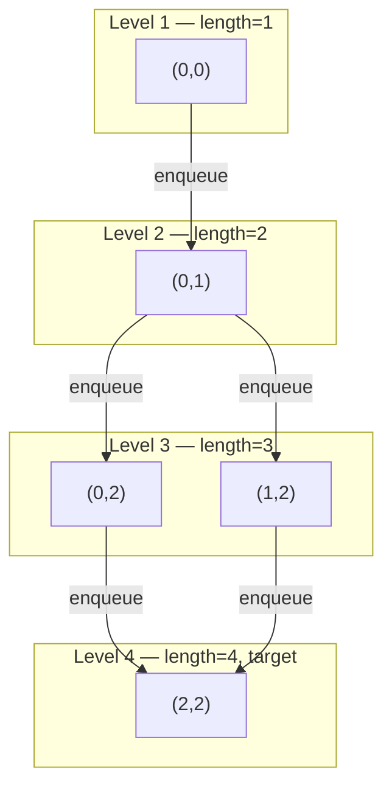
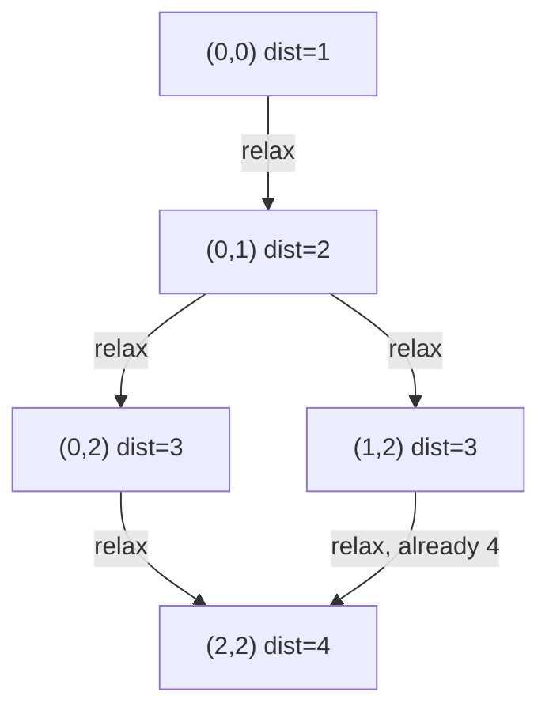
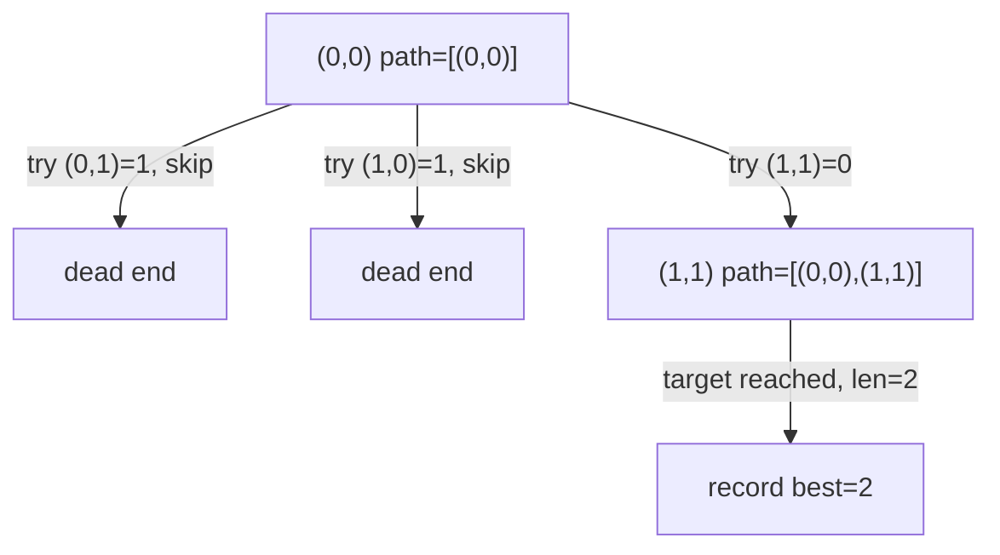
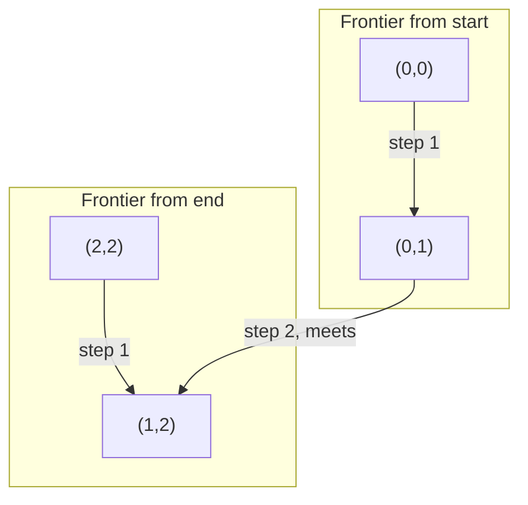

# Shortest Path in Binary Matrix — Review

| | |
|---|---|
| **Solved on** | 2026-08-27 |
| **DSA Category** | Graphs |

---

### 1. Your Solution Assessment

Your approach is a level-order BFS from `(0,0)`, using two parallel `Deque<Integer>` queues (`qRow`, `qCol`) to hold the frontier, and mutating `grid` in place to mark visited cells (turning a visited `0` into a `1`) instead of allocating a separate `visited` matrix.

- `grid[newRow][newCol] = 1` happens at enqueue time, so a cell can never be queued twice.
- The outer `while` loop snapshots `levelSize = qRow.size()` and drains exactly that many nodes before incrementing `length` once, so `length` tracks BFS depth rather than dequeue count.

**Correctness:** Handles all cases in the suite — blocked start, blocked end, the single-cell open/blocked edge cases, the all-zero diagonal-shortest-path case, the obstacle-forced-detour case, and the `100×100` boundary. All 11 tests pass.

**Code quality:** Clean and readable overall — the `directions` array and `outOfBounds` helper are good reusable pieces, and the level-batching loop is idiomatic BFS. The one thing worth reconsidering is representing each queue entry as two parallel `Integer` deques rather than a single `Queue<int[]>` (or a packed `row * n + col` int) — it works, but it's easy for the two queues to drift out of sync if a future edit only touches one of them, and it costs an extra deque plus Integer boxing per coordinate.

**Time complexity — O(n²):** every cell is enqueued at most once (visited is marked on enqueue), and each dequeue does O(1) work per direction across up to 8 directions, so total work is O(8 · n²) = O(n²).

**Space complexity — O(n²):** worst case (e.g., an open grid) the BFS frontier plus everything ever enqueued is bounded by the number of cells, so the two deques hold O(n²) entries total across the run. No separate `visited` matrix is needed since `grid` itself is reused as the visited marker.

**Algorithm trace** — Input: `grid = [[0,0,0],[1,1,0],[1,1,0]]` (Example 2, expected `4`)


→ `(2,2)` is first reached at level 4, so `shortestPathBinaryMatrix` returns `4`.

---

### 2. Optimal Approach

BFS is already the optimal approach for this problem — unweighted graphs (every move costs the same "1 step") always have their shortest path found by BFS in linear time, with no need for Dijkstra's or any weighted-graph machinery. The only two things that matter are: (1) mark a cell visited the instant you discover it (at enqueue time), not when you get around to processing it, and (2) advance the path length once per full level, not once per node.

A slightly more idiomatic encoding uses a single `Queue<int[]>` of `{row, col}` pairs instead of two parallel deques, which removes the risk of the two queues ever getting out of sync:

```java
public int shortestPathBinaryMatrix(int[][] grid) {
    int n = grid.length;

    if (grid[0][0] != 0 || grid[n - 1][n - 1] != 0) return -1;
    if (n == 1) return 1;

    int[][] directions = {
        {-1, -1}, {-1, 0}, {-1, 1},
        {0, -1},           {0, 1},
        {1, -1},  {1, 0},  {1, 1}
    };

    Queue<int[]> queue = new ArrayDeque<>();
    queue.add(new int[]{0, 0});
    grid[0][0] = 1;
    int length = 1;

    while (!queue.isEmpty()) {
        int levelSize = queue.size();

        for (int i = 0; i < levelSize; i++) {
            int[] cell = queue.poll();
            int row = cell[0], col = cell[1];

            if (row == n - 1 && col == n - 1) return length;

            for (int[] dir : directions) {
                int newRow = row + dir[0];
                int newCol = col + dir[1];

                if (newRow < 0 || newRow >= n || newCol < 0 || newCol >= n) continue;
                if (grid[newRow][newCol] != 0) continue;

                grid[newRow][newCol] = 1;
                queue.add(new int[]{newRow, newCol});
            }
        }

        length++;
    }

    return -1;
}
```

**Time complexity — O(n²):** each of the n² cells is enqueued and dequeued at most once, with O(1) amortized work per cell across its 8 neighbor checks.

**Space complexity — O(n²):** worst case the queue holds a large fraction of the grid's cells (e.g., a wide-open grid where an entire diagonal band is on the frontier at once).

**Algorithm trace** — same as above (Example 2): reaches `(2,2)` at level 4 → returns `4`.

---

### 3. Alternative Approaches

#### Dijkstra's algorithm (priority queue)

Treat the grid as a weighted graph where every edge has weight 1, and run Dijkstra's with a `PriorityQueue` ordered by distance-so-far instead of a plain BFS queue.

**Time complexity — O(n² log n):** each of the n² cells can be pushed onto the heap multiple times (once per discovering neighbor), and each heap operation costs O(log n²) = O(log n).

**Space complexity — O(n²):** the heap can hold up to O(n²) entries in the worst case.

**When acceptable:** never really the right choice here — since every edge has identical weight, Dijkstra's degenerates into BFS but pays an extra `log n` factor for no benefit. It would only make sense if move costs later became non-uniform (e.g., diagonal moves cost more than straight moves).

**Algorithm trace** — Input: `grid = [[0,0,0],[1,1,0],[1,1,0]]`


→ pop `(2,2)` off the heap with `dist=4` → return `4` (same answer as BFS, more overhead to get there).

#### Brute-force DFS enumerating all paths

Recursively explore every possible path from `(0,0)` to `(n-1,n-1)`, tracking the minimum length seen, backtracking after each dead end.

**Time complexity — O(8ⁿ²)** in the worst case: from every cell there are up to 8 choices, and a fully-open grid has exponentially many distinct paths to explore.

**Space complexity — O(n²)** for the recursion stack and a `visited` set along the current path (reverted on backtrack).

**When acceptable:** only for tiny grids (n ≤ 4 or so) under extreme time pressure where writing a correct BFS isn't coming to mind — it's simple to reason about but will time out on anything resembling the real constraint (`n` up to 100).

**Algorithm trace** — Input: `grid = [[0,1],[1,0]]` (Example 1, expected `2`)


→ only one viable branch exists; DFS records `best = 2` after exploring it.

#### Bidirectional BFS

Run BFS simultaneously from `(0,0)` and from `(n-1,n-1)`, alternating which frontier expands each round, and stop as soon as the two frontiers meet.

**Time complexity — O(n²)** worst case, same asymptotic bound as single-direction BFS, but the constant factor is typically much smaller — two BFS "circles" of radius r/2 cover far fewer cells than one circle of radius r.

**Space complexity — O(n²)** worst case, same as BFS, for the two frontier sets.

**When acceptable:** worth reaching for if this were a follow-up ("now optimize for very large, mostly-open grids") — it's a nice demonstration of algorithmic insight in an interview, but for the base problem as stated, plain BFS is simpler to implement correctly under time pressure and asymptotically just as good.

**Algorithm trace** — Input: `grid = [[0,0,0],[1,1,0],[1,1,0]]`


→ frontiers meet at `(1,2)` after 1 step each → total path length = 1 (start) + 1 (to meeting) + 1 (meeting) + 1 (to end) = `4`.
