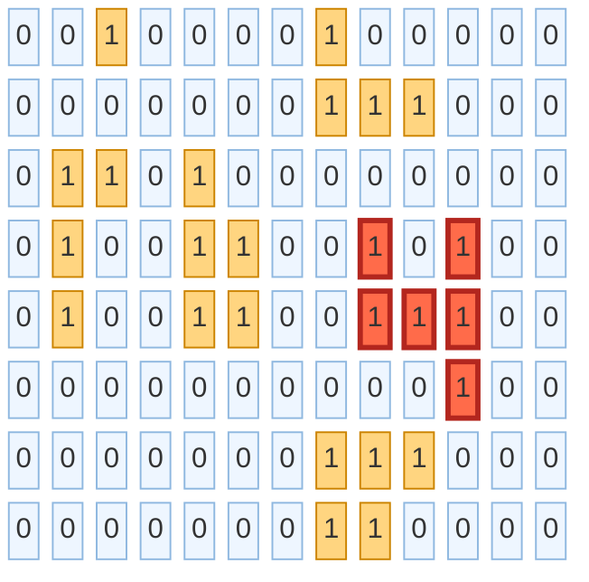
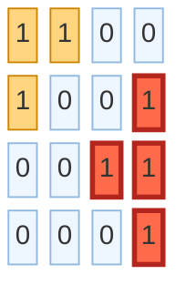
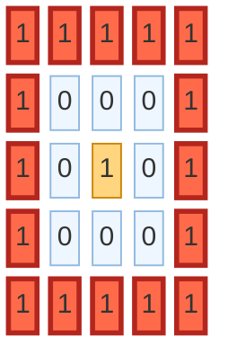

# Max Area of Island

**Date added:** 2026-08-28

## Problem Description

You are given an `m x n` binary matrix `grid`. An island is a group of 1's (representing land) connected 4-directionally (horizontal or vertical). You may assume all four edges of the grid are surrounded by water.

The area of an island is the number of cells with a value 1 in the island.

Return the maximum area of an island in `grid`. If there is no island, return 0.

**Source:** https://leetcode.com/problems/max-area-of-island/description/

## Examples

Legend for the diagrams: light blue squares are water (`0`), orange squares are land (`1`) belonging to a non-maximal island, and red squares mark the land cells that make up the island with the largest area.

**Example 1**
```
Input: grid = [[0,0,1,0,0,0,0,1,0,0,0,0,0],[0,0,0,0,0,0,0,1,1,1,0,0,0],[0,1,1,0,1,0,0,0,0,0,0,0,0],[0,1,0,0,1,1,0,0,1,0,1,0,0],[0,1,0,0,1,1,0,0,1,1,1,0,0],[0,0,0,0,0,0,0,0,0,0,1,0,0],[0,0,0,0,0,0,0,1,1,1,0,0,0],[0,0,0,0,0,0,0,1,1,0,0,0,0]]
Output: 6
Explanation: The largest island is made up of the cells (3,8), (3,10), (4,8), (4,9), (4,10), (5,10) — connected as (3,8)-(4,8)-(4,9)-(4,10)-(3,10) and (4,10)-(5,10). Note that (3,8) and (3,10) are not directly adjacent to each other; they are only connected through the island's other cells. All other islands in the grid are smaller.
```



**Example 2**
```
Input: grid = [[0,0,0,0,0,0,0,0]]
Output: 0
Explanation: There are no 1's anywhere in the grid, so no island exists and the answer is 0.
```



```mermaid
block-beta
columns 8
    r0c0["0"] r0c1["0"] r0c2["0"] r0c3["0"] r0c4["0"] r0c5["0"] r0c6["0"] r0c7["0"]
    classDef zero fill:#eef6ff,stroke:#8fb8e0,color:#123
    classDef island fill:#ffd580,stroke:#cc8400,color:#402d00
    classDef max fill:#ff6b4a,stroke:#b3261e,stroke-width:3px,color:#3a0000
    class r0c0,r0c1,r0c2,r0c3,r0c4,r0c5,r0c6,r0c7 zero
```

**Example 3**
```
Input: grid = [[1,1,1],[1,1,1],[1,1,1]]
Output: 9
Explanation: Every cell is land and all of them are 4-directionally connected, so the whole grid is a single island whose area equals the total number of cells.
```



```mermaid
block-beta
columns 3
    r0c0["1"] r0c1["1"] r0c2["1"]
    r1c0["1"] r1c1["1"] r1c2["1"]
    r2c0["1"] r2c1["1"] r2c2["1"]
    classDef zero fill:#eef6ff,stroke:#8fb8e0,color:#123
    classDef island fill:#ffd580,stroke:#cc8400,color:#402d00
    classDef max fill:#ff6b4a,stroke:#b3261e,stroke-width:3px,color:#3a0000
    class r0c0,r0c1,r0c2,r1c0,r1c1,r1c2,r2c0,r2c1,r2c2 max
```

**Example 4**
```
Input: grid = [[1]]
Output: 1
Explanation: The grid is a single cell of land with no neighbors, so it is its own island with area 1. This exercises the minimum allowed grid size (m == n == 1).
```


**Example 5**
```
Input: grid = [[1,1,0,0],[1,0,0,1],[0,0,1,1],[0,0,0,1]]
Output: 4
Explanation: The top-left island is (0,0)-(0,1)-(1,0), area 3. The bottom-right island is (1,3)-(2,3)-(2,2)-(3,3), area 4, which wins. This shows a grid with several separate islands of different sizes.
```



**Example 6**
```
Input: grid = [[1,0,1],[0,1,0],[1,0,1]]
Output: 1
Explanation: Every 1 only touches other 1's diagonally, and diagonal adjacency does not count. Each land cell is therefore its own island of area 1, so the maximum area is 1.
```



```mermaid
block-beta
columns 3
    r0c0["1"] r0c1["0"] r0c2["1"]
    r1c0["0"] r1c1["1"] r1c2["0"]
    r2c0["1"] r2c1["0"] r2c2["1"]
    classDef zero fill:#eef6ff,stroke:#8fb8e0,color:#123
    classDef island fill:#ffd580,stroke:#cc8400,color:#402d00
    classDef max fill:#ff6b4a,stroke:#b3261e,stroke-width:3px,color:#3a0000
    class r0c1,r1c0,r1c2,r2c1 zero
    class r0c0,r0c2,r1c1,r2c0,r2c2 max
```

**Example 7**
```
Input: grid = [[1,1,1,1,1],[1,0,0,0,1],[1,0,1,0,1],[1,0,0,0,1],[1,1,1,1,1]]
Output: 16
Explanation: The border cells form one connected ring of 16 land cells that runs along all four edges of the grid. The single land cell in the center, (2,2), is surrounded by water on all four sides, so it forms its own separate island of area 1 and does not connect to the ring.
```



## Constraints

- `m == grid.length`
- `n == grid[i].length`
- `1 <= m, n <= 50`
- `grid[i][j]` is either `0` or `1`.

## Hints

1. This is a connected-components problem — you need to find each group of adjacent 1's and measure its size.
2. A depth-first (or breadth-first) search starting from any unvisited land cell can explore its entire island.
3. Mark cells as visited as you explore them (e.g., by flipping a `1` to `0`, or using a separate visited set) so you never count the same cell twice or loop forever.
4. Each time you start a fresh search from an unvisited `1`, count how many cells that search visits — that count is the area of that island.
5. Scan every cell in the grid as a potential search-starting point, and keep a running maximum of the areas you find; remember to return `0` if the grid has no land at all.
