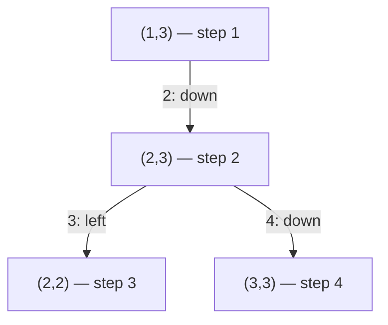
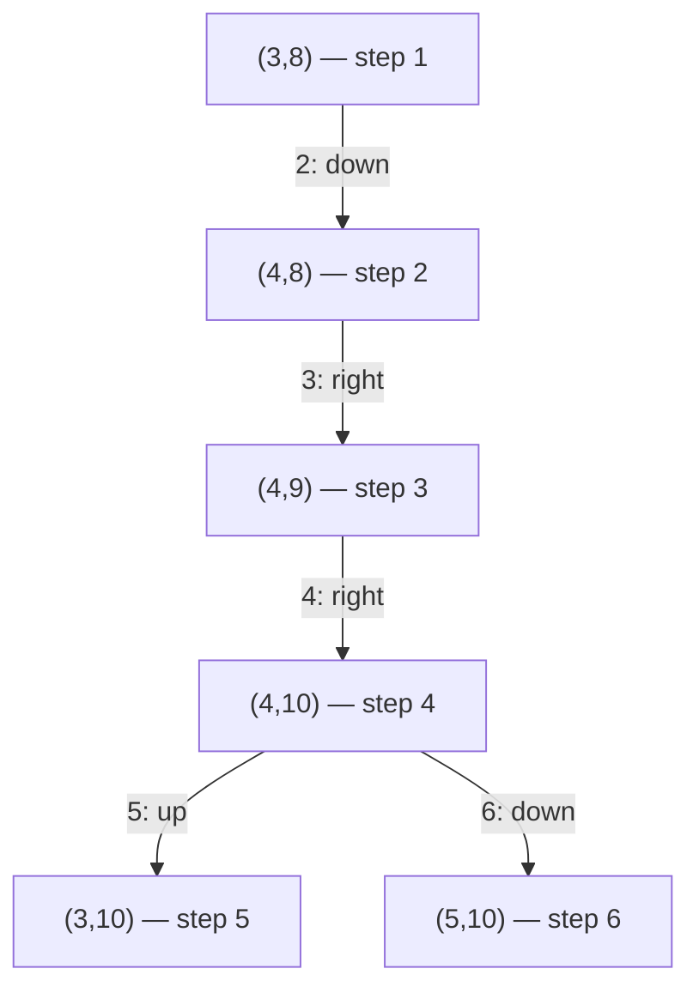
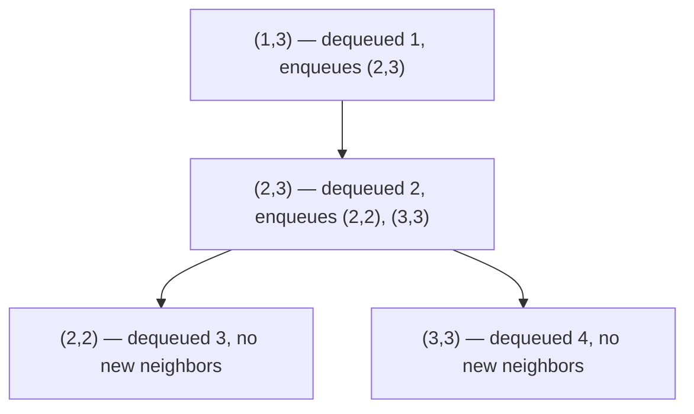

| | |
|---|---|
| **Solved on** | 2026-08-28 |
| **DSA Category** | Graphs |

## 1. Your Solution Assessment

**Correctness:** Correct. The solution scans every cell; whenever it finds an unvisited land cell it runs a DFS (`getArea`) that sinks each visited cell to `0` before recursing into its neighbors, so no cell is counted twice and no infinite loop can occur even on fully-flooded grids. It handles the all-water case (returns the initial `maxArea = 0`), the single-cell grid, and the maximum `50 x 50` constraint correctly, as confirmed by all 12 passing tests.

**Code quality:** Clean and readable. Extracting `isLand`, `outOfBounds`, and `sink` into small named helpers makes `getArea` read almost like prose. The `directions` array laid out in a plus-sign shape is a nice visual touch that makes the 4-directional intent obvious at a glance.

**Time complexity:** O(m · n). Every cell is visited by `getArea` at most once — the moment a cell is explored it's sunk to `0`, so `isLand` will reject it on any future visit (including the outer loop's own scan).

**Space complexity:** O(m · n) in the worst case, from the recursion call stack. A grid that is entirely land (e.g., all 2500 cells in a `50 x 50` grid) produces a single DFS chain 2500 frames deep, since each call only returns after all four of its neighbors have been fully explored.

**Algorithm trace** (DFS is a graph traversal, traced as a Mermaid graph): using the island `{(1,3), (2,2), (2,3), (3,3)}` from `grid = [[1,1,0,0],[1,0,0,1],[0,0,1,1],[0,0,0,1]]` (README Example 5). The outer scan reaches `(1,3)` first among this island's cells (row-major order), and `directions` is checked in `up, left, right, down` order.



`getArea(1,3)` = 1 + `getArea(2,3)`; `getArea(2,3)` = 1 + `getArea(2,2)` + `getArea(3,3)` = 1 + 1 + 1 = 3; so `getArea(1,3)` = 1 + 3 = **4**, matching the expected island area.

## 2. Optimal Approach

This problem has no asymptotically better strategy than a single full traversal — every land cell must be looked at at least once to know which island it belongs to, so O(m · n) is optimal. The approach the user already implemented (DFS with in-place sinking) is the standard optimal solution: scan every cell, and each time an unvisited `1` is found, flood-fill outward to measure that island's full area while marking every cell in it as visited, tracking the largest area seen.

**Time complexity:** O(m · n) — each cell is visited exactly once by the flood fill (as a sunk cell fails the land check immediately) plus once by the outer scan.

**Space complexity:** O(m · n) worst case for the DFS call stack (a grid that is a single giant island), or O(1) extra space if you count only the grid itself as scratch space and ignore call-stack overhead, since the input is mutated in place rather than using a separate `visited` matrix.

```java
public int maxAreaOfIsland(int[][] grid) {
    int maxArea = 0;

    for (int row = 0; row < grid.length; row++) {
        for (int col = 0; col < grid[0].length; col++) {
            maxArea = Math.max(maxArea, dfs(grid, row, col));
        }
    }

    return maxArea;
}

private int dfs(int[][] grid, int row, int col) {
    if (row < 0 || row >= grid.length || col < 0 || col >= grid[0].length) return 0;
    if (grid[row][col] != 1) return 0;

    grid[row][col] = 0;

    return 1 + dfs(grid, row - 1, col)
              + dfs(grid, row + 1, col)
              + dfs(grid, row, col - 1)
              + dfs(grid, row, col + 1);
}
```

**Algorithm trace:** using the max-area island from README Example 1 (`grid` rows 3–5, cols 8–10, area 6). The outer row-major scan reaches `(3,8)` first among these cells; `directions` order is `up, left, right, down`.



`dfs(3,8)` = 1 + `dfs(4,8)`; `dfs(4,8)` = 1 + `dfs(4,9)`; `dfs(4,9)` = 1 + `dfs(4,10)`; `dfs(4,10)` = 1 + `dfs(3,10)` + `dfs(5,10)` = 1 + 1 + 1 = 3. Unwinding: `dfs(4,9)` = 4, `dfs(4,8)` = 5, `dfs(3,8)` = **6** — matching the expected output.

## 3. Alternative Approaches

### Iterative BFS with an explicit queue

Instead of recursing, push the starting land cell onto a queue, and repeatedly dequeue a cell, mark it visited, count it, and enqueue any of its unvisited land neighbors. This explores the island level by level rather than depth-first.

- **Time complexity:** O(m · n) — identical reasoning to DFS; every cell is enqueued and dequeued at most once.
- **Space complexity:** O(m · n) worst case for the queue (e.g., a fully-land grid can have up to ~m·n/2 cells in the queue at once in a checkerboard-like frontier), versus DFS's call-stack space.
- **When it's a good choice:** Preferred over recursive DFS when the grid can be very large, since deep recursion risks a `StackOverflowError` (Java's default stack depth is a few thousand frames) — an iterative BFS has no such risk since the queue lives on the heap.

```java
public int maxAreaOfIsland(int[][] grid) {
    int maxArea = 0;

    for (int row = 0; row < grid.length; row++) {
        for (int col = 0; col < grid[0].length; col++) {
            if (grid[row][col] != 1) continue;

            int area = 0;
            Deque<int[]> queue = new ArrayDeque<>();
            queue.add(new int[]{row, col});
            grid[row][col] = 0;

            while (!queue.isEmpty()) {
                int[] cell = queue.poll();
                area++;

                for (int[] d : new int[][]{{-1,0},{1,0},{0,-1},{0,1}}) {
                    int r = cell[0] + d[0], c = cell[1] + d[1];
                    if (r >= 0 && r < grid.length && c >= 0 && c < grid[0].length && grid[r][c] == 1) {
                        grid[r][c] = 0;
                        queue.add(new int[]{r, c});
                    }
                }
            }

            maxArea = Math.max(maxArea, area);
        }
    }

    return maxArea;
}
```

**Algorithm trace:** same island as the Section 1 trace, `{(1,3), (2,2), (2,3), (3,3)}`, neighbor order `up, down, left, right`.



Final area = 4 cells dequeued, matching the DFS result.

### Union-Find (Disjoint Set Union)

Give every cell an index `row * n + col`. Scan the grid once; for each land cell, union it with any land neighbor to its right or below (checking only two directions avoids redundant unions). Track a running `size[]` per component root, updating it on every union, and keep a running maximum.

- **Time complexity:** O(m · n · α(m · n)), where α is the inverse Ackermann function — effectively O(m · n) in practice, since path compression and union by size keep each operation nearly constant time.
- **Space complexity:** O(m · n) for the `parent[]` and `size[]` arrays.
- **When it's a good choice:** Rarely better than DFS/BFS for this exact problem — it's more code for the same asymptotic complexity. It becomes worthwhile if the grid is processed as a stream of unions across multiple queries (e.g., "what is the max island area after each of these cells turns to land"), which DFS/BFS can't answer incrementally without redoing full traversals.

```java
public int maxAreaOfIsland(int[][] grid) {
    int m = grid.length, n = grid[0].length;
    int[] parent = new int[m * n];
    int[] size = new int[m * n];

    for (int i = 0; i < m * n; i++) {
        parent[i] = i;
        size[i] = 1;
    }

    int maxArea = 0;

    for (int row = 0; row < m; row++) {
        for (int col = 0; col < n; col++) {
            if (grid[row][col] != 1) continue;

            maxArea = Math.max(maxArea, size[find(parent, row * n + col)]);

            if (row + 1 < m && grid[row + 1][col] == 1) {
                union(parent, size, row * n + col, (row + 1) * n + col);
            }
            if (col + 1 < n && grid[row][col + 1] == 1) {
                union(parent, size, row * n + col, row * n + col + 1);
            }

            maxArea = Math.max(maxArea, size[find(parent, row * n + col)]);
        }
    }

    return maxArea;
}

private int find(int[] parent, int x) {
    if (parent[x] != x) parent[x] = find(parent, parent[x]);
    return parent[x];
}

private void union(int[] parent, int[] size, int a, int b) {
    int rootA = find(parent, a), rootB = find(parent, b);
    if (rootA == rootB) return;

    if (size[rootA] < size[rootB]) { int t = rootA; rootA = rootB; rootB = t; }
    parent[rootB] = rootA;
    size[rootA] += size[rootB];
}
```

**Algorithm trace** (step table, since this is an iterative scan with union operations rather than a traversal): same island, `{(1,3), (2,2), (2,3), (3,3)}`, scanned in row-major order, unioning only right/down neighbors.

| Cell scanned | Right neighbor land? | Down neighbor land? | Union performed | Root size after |
|---|---|---|---|---|
| (1,3) | no (out of bounds) | yes, (2,3) | union((1,3), (2,3)) | 2 |
| (2,2) | yes, (2,3) | no, (3,2)=0 | union((2,2), (2,3)) | 3 |
| (2,3) | no (out of bounds) | yes, (3,3) | union((2,3), (3,3)) | 4 |
| (3,3) | no (out of bounds) | no (out of bounds) | — | 4 |

→ max component size = **4**, matching the DFS and BFS results.
