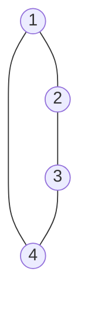
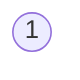
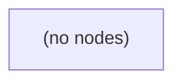
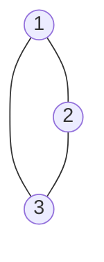
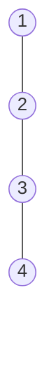
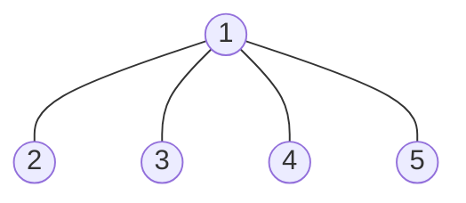
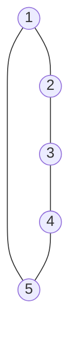

# Clone Graph

**Date added:** 2026-08-28

## Problem Description

Given a reference of a node in a connected undirected graph, return a deep copy (clone) of the graph.

Each node in the graph contains a value (`int`) and a list (`List<Node>`) of its neighbors.

```java
class Node {
    public int val;
    public List<Node> neighbors;
}
```

Test case format: for simplicity, each node's value is the same as the node's index (1-indexed). For example, the first node has `val == 1`, the second node has `val == 2`, and so on. The graph is represented in the test case using an adjacency list, where each list describes the set of neighbors of a node in the graph. The given node will always be the first node with `val = 1`. You must return the copy of the given node as a reference to the cloned graph.

**Source:** https://leetcode.com/problems/clone-graph/

## Examples

**Example 1**
```
Input: adjList = [[2,4],[1,3],[2,4],[1,3]]
Output: [[2,4],[1,3],[2,4],[1,3]]
Explanation: There are 4 nodes forming a square (a 4-cycle). Node 1 connects to
2 and 4, node 2 connects to 1 and 3, node 3 connects to 2 and 4, and node 4
connects to 1 and 3.
```



**Example 2**
```
Input: adjList = [[]]
Output: [[]]
Explanation: The graph consists of only one node with val = 1 and it does not
have any neighbors.
```



**Example 3**
```
Input: adjList = []
Output: []
Explanation: This is an empty graph. It does not have any nodes, so the input
node reference itself is null.
```



**Example 4**
```
Input: adjList = [[2,3],[1,3],[1,2]]
Output: [[2,3],[1,3],[1,2]]
Explanation: A triangle where every node connects to every other node: 1-2,
1-3, and 2-3.
```



**Example 5**
```
Input: adjList = [[2],[1,3],[2,4],[3]]
Output: [[2],[1,3],[2,4],[3]]
Explanation: A straight path graph: 1-2-3-4. The end nodes (1 and 4) only have
a single neighbor each.
```



**Example 6**
```
Input: adjList = [[2,3,4,5],[1],[1],[1],[1]]
Output: [[2,3,4,5],[1],[1],[1],[1]]
Explanation: A star graph where node 1 is the hub connected to every other
node, and the leaf nodes (2, 3, 4, 5) each connect only back to node 1.
```



**Example 7**
```
Input: adjList = [[2,5],[1,3],[2,4],[3,5],[1,4]]
Output: [[2,5],[1,3],[2,4],[3,5],[1,4]]
Explanation: A 5-node cycle (pentagon): 1-2-3-4-5-1. Every node has exactly two
neighbors.
```



## Constraints

- The number of nodes in the graph is in the range `[0, 100]`.
- `1 <= Node.val <= 100`.
- `Node.val` is unique for each node.
- There are no repeated edges and no self-loops in the graph.
- The graph is connected and all nodes can be visited starting from the given node.

## Hints

1. Think about how you would traverse every node in the graph starting from the given reference — what traversal strategies visit every reachable node exactly once?
2. Because the graph can contain cycles, a naive recursive or iterative traversal could loop forever. How can you avoid revisiting the same node twice?
3. Consider keeping track of which original nodes you have already cloned, so you can detect when you're about to process one again.
4. A map from an original node to its corresponding clone lets you both avoid infinite loops and reconnect neighbors correctly once they're created.
5. When cloning a node's neighbors, check the map first: if a neighbor was already cloned, reuse that clone instead of creating a new one; otherwise, clone it and recurse (or enqueue it) before linking it into the current clone's neighbor list.
