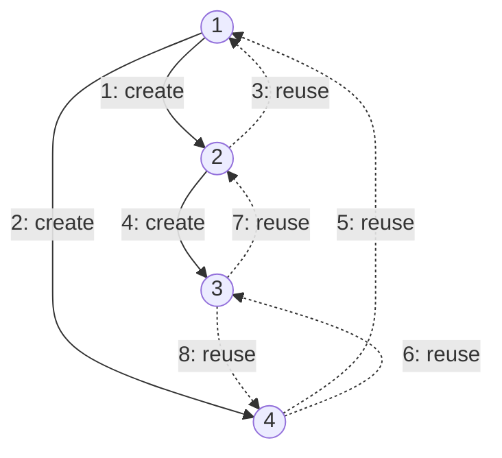
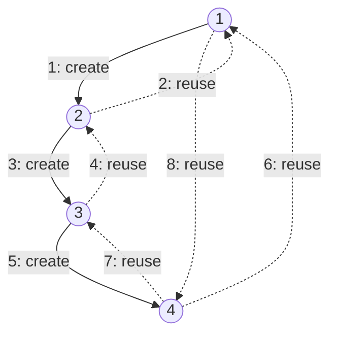
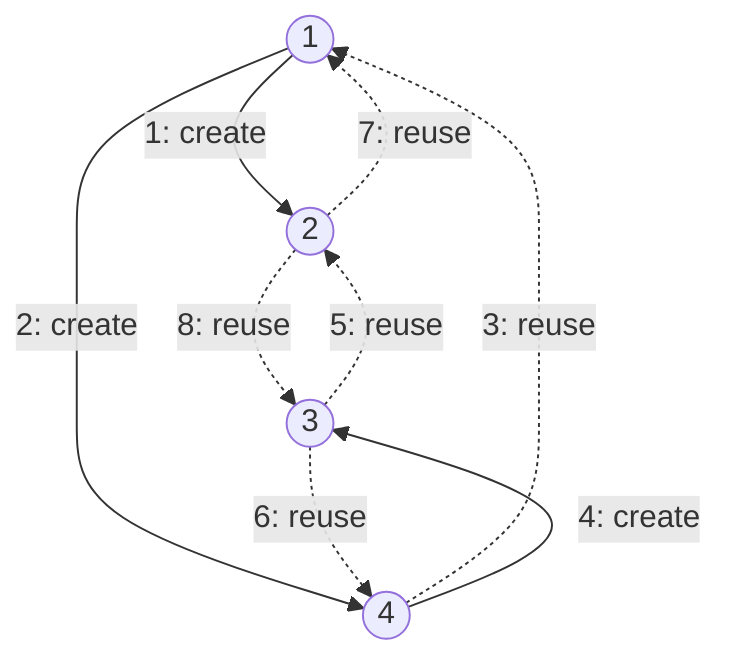

| | |
|---|---|
| **Solved on** | 2026-08-28 |
| **DSA Category** | Graphs |

## 1. Your Solution Assessment

### Correctness

The final version is correct. It handles every case from the constraints:

- `node == null` (empty graph) returns `null` immediately.
- A single node with no neighbors clones correctly (its `neighbors` list stays empty).
- Cycles and nodes reachable through multiple paths (square, triangle, star, pentagon, 100-node cycle) all clone correctly, because `cloneMap` guarantees exactly one clone object per original node — every reference to an already-seen node reuses `cloneMap.get(neighbor)` instead of allocating a new one.

The first version you wrote had a real bug worth remembering: it used a `Set<Integer> visited` (tracking *values*) purely to decide whether to enqueue a node, but it still called `new Node(neighbor.val)` unconditionally for every edge — including edges into nodes that were already cloned. That produced multiple distinct `Node` objects representing the same original node, most of which were never enqueued and so kept an empty `neighbors` list forever (dangling stubs). The fix — a `Map<Node, Node> cloneMap` consulted *before* creating anything — is exactly the right structural change: it separates "have I created a clone for this node" from "have I finished expanding it."

### Code quality

- Clear variable names (`cloneMap`, `currOriginal`, `currClone`) and a straightforward BFS shape.
- Two style nits, non-blocking:
  - `Node[] clonePair = { original, clone }` works, but a couple of parallel `Deque<Node>` queues (one for originals, one for clones) — or simply enqueuing only the original and looking up `cloneMap.get(currOriginal)` for the clone — would avoid the array-of-two indexing (`clonePair[0]`, `clonePair[1]`) and read a bit more directly.
  - The `levelSize`/inner-`for` level-batching is a leftover from the classic "level-order BFS" template. It's harmless here, but this problem never uses level boundaries — a plain `while (!queue.isEmpty())` loop with no level tracking would be equivalent and simpler.

### Complexity

- **Time: O(V + E)** — each node is dequeued and expanded exactly once (guaranteed by `cloneMap`), and each directed adjacency-list entry is examined exactly once across the whole run.
- **Space: O(V)** — `cloneMap` and the BFS queue each hold at most one entry per node. (The `O(E)` neighbor references stored in the output graph are part of the required result, not auxiliary space.)

### Algorithm trace

Input: `adjList = [[2,4],[1,3],[2,4],[1,3]]` (the 4-node square/cycle from Example 1).

Solid arrows = a new clone is created; dashed arrows = the neighbor was already cloned, so the existing clone is reused. Numbers show the order edges are processed.



BFS visits nodes in the order **1 → 2 → 4 → 3**, and every one of the 8 directed adjacency entries resolves to exactly 4 distinct clone objects, correctly cross-linked.

## 2. Optimal Approach

Recursive DFS with a `Map<Node, Node>` is the textbook clean version of the same idea: same asymptotic cost as the BFS above, but the recursion naturally expresses "clone this node, then clone its neighbors" without manually managing a queue.

- Check the map first: if `node` was already cloned, return that clone (this is what breaks cycles).
- Otherwise create the clone, store it in the map *before* recursing into neighbors (so a cycle back to this node finds it already mapped), then recurse into each neighbor and collect the results into the clone's neighbor list.

**Time: O(V + E)** — each node is visited once (memoized by the map) and each edge is traversed once. **Space: O(V)** for the map, plus O(V) recursion stack in the worst case (a graph that degenerates into a long chain).

```java
public Node cloneGraph(Node node) {
    if (node == null) return null;
    return dfs(node, new HashMap<>());
}

private Node dfs(Node node, Map<Node, Node> cloneMap) {
    if (cloneMap.containsKey(node)) {
        return cloneMap.get(node);
    }

    Node clone = new Node(node.val);
    cloneMap.put(node, clone);

    for (Node neighbor : node.neighbors) {
        clone.neighbors.add(dfs(neighbor, cloneMap));
    }

    return clone;
}
```

### Algorithm trace

Same input: `adjList = [[2,4],[1,3],[2,4],[1,3]]`.



The recursion plunges depth-first — **1 → 2 → 3 → 4** — before backtracking, in contrast to the BFS trace above which fans out level by level (**1 → 2, 4 → 3**). Both reach the same correctly cross-linked result.

## 3. Alternative Approaches

### a. Iterative DFS with an explicit stack

Same `Map<Node, Node>` memoization, but replace recursion with a manual `Deque<Node>` used as a stack. Useful when recursion depth is a concern (deep chains could risk a `StackOverflowError`), though with the constraint `[0, 100]` nodes that risk is negligible here.

**Time: O(V + E)**, same reasoning as above. **Space: O(V)** for the map and stack (no call-stack risk).

```java
public Node cloneGraph(Node node) {
    if (node == null) return null;

    Map<Node, Node> cloneMap = new HashMap<>();
    Deque<Node> stack = new ArrayDeque<>();
    cloneMap.put(node, new Node(node.val));
    stack.push(node);

    while (!stack.isEmpty()) {
        Node current = stack.pop();
        for (Node neighbor : current.neighbors) {
            if (!cloneMap.containsKey(neighbor)) {
                cloneMap.put(neighbor, new Node(neighbor.val));
                stack.push(neighbor);
            }
            cloneMap.get(current).neighbors.add(cloneMap.get(neighbor));
        }
    }

    return cloneMap.get(node);
}
```

**Trace** (same input, stack is LIFO so the visiting order differs from both BFS and recursive DFS):



Visiting order: **1 → 4 → 3 → 2** (the stack pops the most recently pushed node first, so it dives into `4` before `2`'s neighbors are expanded).

### b. Two-pass approach (collect nodes, then wire edges)

Separate "create every clone" from "connect every clone" into two distinct passes: pass 1 does any traversal (BFS or DFS) purely to populate `cloneMap` with `original → clone` (no edges yet); pass 2 iterates the map and, for each entry, builds the clone's `neighbors` list by looking up each original neighbor in the map. This trades a slightly higher constant factor (two full passes instead of one) for code that's easier to reason about, since node creation and edge wiring are never interleaved.

**Time: O(V + E)** — pass 1 is O(V + E) (still has to walk every edge to discover reachable nodes), pass 2 is O(V + E) (each entry's edges are copied once). **Space: O(V)** for the map.

```java
public Node cloneGraph(Node node) {
    if (node == null) return null;

    Map<Node, Node> cloneMap = new HashMap<>();
    collectNodes(node, cloneMap);

    for (Map.Entry<Node, Node> entry : cloneMap.entrySet()) {
        for (Node neighbor : entry.getKey().neighbors) {
            entry.getValue().neighbors.add(cloneMap.get(neighbor));
        }
    }

    return cloneMap.get(node);
}

private void collectNodes(Node node, Map<Node, Node> cloneMap) {
    if (cloneMap.containsKey(node)) return;

    cloneMap.put(node, new Node(node.val));
    for (Node neighbor : node.neighbors) {
        collectNodes(neighbor, cloneMap);
    }
}
```

**Trace** (same input):

| Pass | Node | Action | cloneMap keys after |
|---|---|---|---|
| 1 | 1 | create clone, no edges yet | {1} |
| 1 | 2 | create clone | {1, 2} |
| 1 | 3 | create clone | {1, 2, 3} |
| 1 | 4 | create clone | {1, 2, 3, 4} |
| 2 | 1 | wire neighbors [2,4] → `clone1.neighbors = [clone2, clone4]` | {1, 2, 3, 4} |
| 2 | 2 | wire neighbors [1,3] → `clone2.neighbors = [clone1, clone3]` | {1, 2, 3, 4} |
| 2 | 3 | wire neighbors [2,4] → `clone3.neighbors = [clone2, clone4]` | {1, 2, 3, 4} |
| 2 | 4 | wire neighbors [1,3] → `clone4.neighbors = [clone1, clone3]` | {1, 2, 3, 4} |

### c. Value-indexed array instead of a hash map

Because the constraints guarantee `1 <= Node.val <= 100` with unique values, you can replace `Map<Node, Node>` with a plain `Node[] clones = new Node[101]` indexed by `val`, avoiding hashing overhead entirely. Otherwise the control flow is identical to your BFS solution in section 1.

**Time: O(V + E)**, same as above but with O(1) array indexing instead of amortized-O(1) hash map operations — a lower constant factor, not a better asymptotic class. **Space: O(V)**, though technically the array is always sized 101 regardless of how many nodes actually exist. Only acceptable *because* this problem's constraints bound and guarantee uniqueness of `val`; it wouldn't generalize to a graph with arbitrary or unbounded node identifiers.

```java
public Node cloneGraph(Node node) {
    if (node == null) return null;

    Node[] clones = new Node[101];
    Deque<Node> queue = new ArrayDeque<>();
    clones[node.val] = new Node(node.val);
    queue.addLast(node);

    while (!queue.isEmpty()) {
        Node current = queue.removeFirst();
        for (Node neighbor : current.neighbors) {
            if (clones[neighbor.val] == null) {
                clones[neighbor.val] = new Node(neighbor.val);
                queue.addLast(neighbor);
            }
            clones[current.val].neighbors.add(clones[neighbor.val]);
        }
    }

    return clones[node.val];
}
```

**Trace** (same input; mirrors the BFS trace in section 1, just backed by array slots instead of hash map entries):

| Step | Node dequeued | Action | clones[1..4] after |
|---|---|---|---|
| 1 | 1 | create clones[2], clones[4]; `clones[1].neighbors = [clones[2], clones[4]]` | [c1, c2, -, c4] |
| 2 | 2 | clones[1] exists → reuse; create clones[3]; `clones[2].neighbors = [clones[1], clones[3]]` | [c1, c2, c3, c4] |
| 3 | 4 | clones[1], clones[3] exist → reuse both; `clones[4].neighbors = [clones[1], clones[3]]` | [c1, c2, c3, c4] |
| 4 | 3 | clones[2], clones[4] exist → reuse both; `clones[3].neighbors = [clones[2], clones[4]]` | [c1, c2, c3, c4] |
