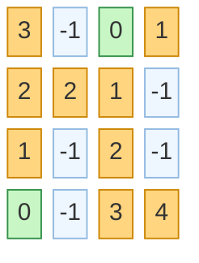
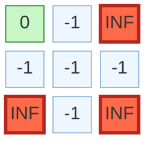

# Islands and Treasures

**Date added:** 2026-08-28

## Problem Description

You are given an `m x n` 2D grid initialized with these three possible values:

- `-1` - A water cell that can not be traversed.
- `0` - A treasure chest.
- `INF` - A land cell that can be traversed. We use the integer `2^31 - 1 = 2147483647` to represent `INF`.

Fill each land cell with the distance to its nearest treasure chest. If a land cell cannot reach a treasure chest then the value should remain `INF`.

Assume the grid can only be traversed up, down, left, or right.

Modify the grid in-place.

**Source:** https://neetcode.io/problems/islands-and-treasure

## Examples

Legend for the diagrams: cells show the **output** value of each grid cell. Blue squares are water (`-1`), green squares are treasure chests (`0`), orange squares are land cells filled with their distance to the nearest treasure, and red squares are land cells that cannot reach any treasure and remain `INF`.

**Example 1**
```
Input: grid = [
  [2147483647,-1,0,2147483647],
  [2147483647,2147483647,2147483647,-1],
  [2147483647,-1,2147483647,-1],
  [0,-1,2147483647,2147483647]
]
Output: [
  [3,-1,0,1],
  [2,2,1,-1],
  [1,-1,2,-1],
  [0,-1,3,4]
]
Explanation: Two treasure chests sit at (0,2) and (3,0). Every land cell is filled with the shortest distance to whichever chest is closer, and BFS spreads around the water cells that block direct paths.
```



**Example 2**
```
Input: grid = [
  [0,-1],
  [2147483647,2147483647]
]
Output: [
  [0,-1],
  [1,2]
]
Explanation: There is a single treasure at (0,0). Cell (1,0) is directly below it, distance 1. Cell (1,1) must detour through (1,0) since (0,1) is water, giving it distance 2.
```



```mermaid
block-beta
columns 2
    r0c0["0"] r0c1["-1"]
    r1c0["1"] r1c1["2"]
    classDef water fill:#eef6ff,stroke:#8fb8e0,color:#123
    classDef treasure fill:#c8f7c5,stroke:#2f8f46,color:#123
    classDef land fill:#ffd580,stroke:#cc8400,color:#402d00
    classDef unreachable fill:#ff6b4a,stroke:#b3261e,stroke-width:3px,color:#3a0000
    class r0c1 water
    class r0c0 treasure
    class r1c0,r1c1 land
```

**Example 3**
```
Input: grid = [[0]]
Output: [[0]]
Explanation: The grid is a single treasure chest cell. There is no land to fill, so the grid is unchanged. This exercises the minimum allowed grid size (m == n == 1).
```



```mermaid
block-beta
columns 1
    r0c0["0"]
    classDef water fill:#eef6ff,stroke:#8fb8e0,color:#123
    classDef treasure fill:#c8f7c5,stroke:#2f8f46,color:#123
    classDef land fill:#ffd580,stroke:#cc8400,color:#402d00
    classDef unreachable fill:#ff6b4a,stroke:#b3261e,stroke-width:3px,color:#3a0000
    class r0c0 treasure
```

**Example 4**
```
Input: grid = [[2147483647]]
Output: [[2147483647]]
Explanation: The grid is a single land cell and there is no treasure chest anywhere in the grid, so the cell can never reach one and remains INF. This shows that a grid is not guaranteed to contain a treasure.
```


**Example 5**
```
Input: grid = [
  [0,-1,2147483647],
  [-1,-1,-1],
  [2147483647,-1,2147483647]
]
Output: [
  [0,-1,2147483647],
  [-1,-1,-1],
  [2147483647,-1,2147483647]
]
Explanation: The treasure at (0,0) is walled in by a ring of water. The land cells (0,2), (2,0), and (2,2) are each fully surrounded by water and can never reach the treasure, so they all remain INF.
```



**Example 6**
```
Input: grid = [[2147483647,2147483647,0,2147483647,2147483647]]
Output: [[2,1,0,1,2]]
Explanation: A single-row grid (m == 1) with one treasure in the middle. Distances grow symmetrically to both sides with no water to block the path.
```



```mermaid
block-beta
columns 5
    r0c0["2"] r0c1["1"] r0c2["0"] r0c3["1"] r0c4["2"]
    classDef water fill:#eef6ff,stroke:#8fb8e0,color:#123
    classDef treasure fill:#c8f7c5,stroke:#2f8f46,color:#123
    classDef land fill:#ffd580,stroke:#cc8400,color:#402d00
    classDef unreachable fill:#ff6b4a,stroke:#b3261e,stroke-width:3px,color:#3a0000
    class r0c2 treasure
    class r0c0,r0c1,r0c3,r0c4 land
```

**Example 7**
```
Input: grid = [
  [2147483647,2147483647],
  [2147483647,2147483647]
]
Output: [
  [2147483647,2147483647],
  [2147483647,2147483647]
]
Explanation: The grid has no water and no treasure chest at all, only land. Since no treasure exists, every land cell remains INF.
```



```mermaid
block-beta
columns 2
    r0c0["INF"] r0c1["INF"]
    r1c0["INF"] r1c1["INF"]
    classDef water fill:#eef6ff,stroke:#8fb8e0,color:#123
    classDef treasure fill:#c8f7c5,stroke:#2f8f46,color:#123
    classDef land fill:#ffd580,stroke:#cc8400,color:#402d00
    classDef unreachable fill:#ff6b4a,stroke:#b3261e,stroke-width:3px,color:#3a0000
    class r0c0,r0c1,r1c0,r1c1 unreachable
```

## Constraints

- `m == grid.length`
- `n == grid[i].length`
- `1 <= m, n <= 100`
- `grid[i][j]` is one of `{-1, 0, 2147483647}`.

## Hints

1. Instead of searching outward from every land cell to find its nearest treasure (slow), think about searching outward from every treasure at once.
2. A multi-source breadth-first search starting from all treasure chests simultaneously will naturally reach every land cell in order of increasing distance.
3. Seed a queue with the coordinates of every `0` cell before starting the search, all at distance 0.
4. As you expand the BFS frontier, only move into land cells (`INF`) that haven't been visited yet, and skip water cells (`-1`) entirely.
5. Each time you step into a fresh land cell, its distance is exactly one more than the cell you came from — overwrite the `INF` in place and continue expanding from there.
