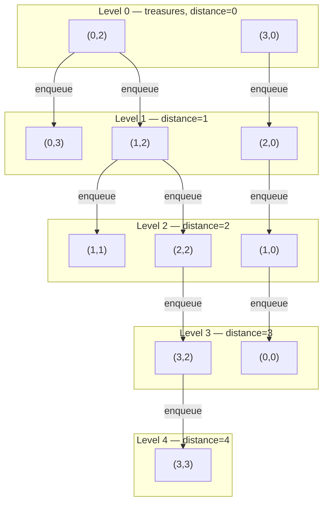
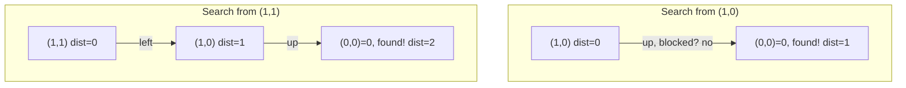
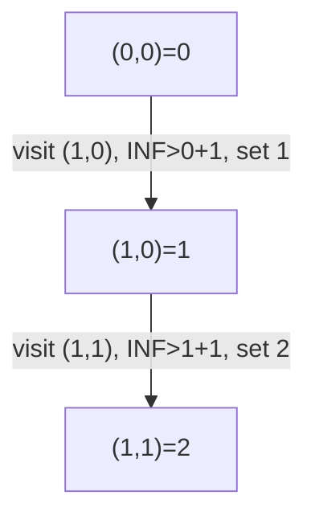
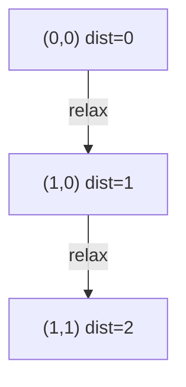

# Islands and Treasures — Review

| | |
|---|---|
| **Solved on** | 2026-08-30 |
| **DSA Category** | Graphs |

---

### 1. Your Solution Assessment

Your approach is a multi-source BFS: every treasure chest (`0`) is collected first and seeded into the queue as distance-0 sources, then the search expands outward level by level, overwriting each newly-discovered land cell's `INF` with the current distance.

A neat trick you used is reusing the `LAND` sentinel (`Integer.MAX_VALUE`) as a stand-in for "unvisited": in `getTreasureLocations`, every treasure cell is temporarily rewritten from `0` to `LAND` before being enqueued, so the very first BFS level can reuse the same `isVisitable` check that every later level uses (`grid[row][col] == LAND`) instead of a special case for the seed cells. The first iteration then immediately overwrites those cells back to `0` (`distance` starts at `0`), so the treasure cells end up correct.

The `if (!isVisitable(grid, row, col)) continue;` guard at the top of the inner loop is what keeps the BFS correct even though the same coordinate can be pushed onto the queue more than once in the same level (e.g., two already-frontier cells both bordering the same unvisited cell) — the second dequeue of that coordinate finds it's no longer `LAND` and skips it instead of overwriting a correct, smaller distance.

**Correctness:** Handles every case in the suite — the two-treasure example, single-cell grids (treasure-only and land-only), a single row and a single column, land cells fully walled off by water, a grid with no treasure at all, a grid with no land at all, and a cell equidistant from two treasures. All 11 tests pass.

**Code quality:** Clean and well-factored — `directions`, `outOfBounds`, and `getTreasureLocations` are each a single clear responsibility. The one thing worth reconsidering is `isVisitable` — it's a pure pass-through to `isLand` with no added logic, so it's an extra layer of indirection a reader has to jump through for no behavioral difference; inlining `isLand` directly (or dropping one of the two names) would remove that hop without losing anything.

**Time complexity — O(m·n):** every cell is enqueued a bounded number of times (at most once per neighboring direction that reaches it before it's marked visited, so ≤4 times), and each dequeue does O(1) work checking up to 4 neighbors, so total work is O(4 · m·n) = O(m·n).

**Space complexity — O(m·n):** in the worst case (e.g., treasures scattered so the whole grid becomes one expanding frontier) the queue holds up to O(m·n) coordinates at once, plus the `treasureLocations` list which holds at most O(m·n) entries.

**Algorithm trace** — Input: Example 1, `grid` with treasures at `(0,2)` and `(3,0)`, expected output `[[3,-1,0,1],[2,2,1,-1],[1,-1,2,-1],[0,-1,3,4]]`


→ every land cell is overwritten exactly once, the level it's reached in, matching the expected output.

---

### 2. Optimal Approach

Multi-source BFS is already the optimal approach — since every land cell needs the distance to its *nearest* treasure, starting a BFS from every treasure at once and expanding outward guarantees each land cell is first reached by the closest source, at exactly the right distance, in a single O(m·n) pass. Running BFS from each land cell individually (or from a single source) would either revisit work or fail to compare across multiple treasures for free.

The idea can be expressed slightly more compactly by marking a cell visited (setting its distance) at *enqueue* time instead of at dequeue time, which removes the need for the `isVisitable` guard on re-dequeue since a coordinate is never pushed onto the queue more than once:

```java
public void islandsAndTreasure(int[][] grid) {
    if (grid == null || grid.length == 0) return;

    int rows = grid.length;
    int cols = grid[0].length;
    int[][] directions = {{1, 0}, {-1, 0}, {0, 1}, {0, -1}};

    Queue<int[]> queue = new ArrayDeque<>();

    for (int r = 0; r < rows; r++) {
        for (int c = 0; c < cols; c++) {
            if (grid[r][c] == 0) queue.add(new int[]{r, c});
        }
    }

    while (!queue.isEmpty()) {
        int[] cell = queue.poll();
        int row = cell[0], col = cell[1];

        for (int[] dir : directions) {
            int newRow = row + dir[0];
            int newCol = col + dir[1];

            if (newRow < 0 || newRow >= rows || newCol < 0 || newCol >= cols) continue;
            if (grid[newRow][newCol] != Integer.MAX_VALUE) continue;

            grid[newRow][newCol] = grid[row][col] + 1;
            queue.add(new int[]{newRow, newCol});
        }
    }
}
```

**Time complexity — O(m·n):** every cell is enqueued and dequeued exactly once (marked visited the moment it's discovered), with O(1) work checking its 4 neighbors.

**Space complexity — O(m·n):** the queue can hold up to O(m·n) coordinates at once in the worst case (e.g., a wide frontier sweeping across an open grid).

**Algorithm trace** — same as above (Example 1): every land cell is overwritten exactly once, at the level it's reached, giving `[[3,-1,0,1],[2,2,1,-1],[1,-1,2,-1],[0,-1,3,4]]`.

---

### 3. Alternative Approaches

#### Brute force: BFS from every land cell

For each land cell independently, run a fresh BFS outward until a treasure chest is found, and record that distance.

**Time complexity — O((m·n)²):** in the worst case there are O(m·n) land cells, and each one's BFS can visit up to O(m·n) cells before finding a treasure.

**Space complexity — O(m·n)** per search, for that search's own queue and visited-tracking (not cumulative, since each search finishes before the next starts).

**When acceptable:** only for very small grids, or as a first correct-but-slow pass under interview time pressure before optimizing — it directly mirrors the problem statement ("distance to nearest treasure") without needing the multi-source insight, but it will not scale to the `100×100` constraint efficiently.

**Algorithm trace** — Input: Example 2, `grid = [[0,-1],[INF,INF]]`


→ each land cell runs its own independent search; `(1,0)` finds the treasure after 1 step, `(1,1)` after 2 — same answer as BFS, but every cell repeats work that multi-source BFS shares.

#### DFS with distance relaxation

From each treasure, DFS outward, and whenever a land cell's current value is greater than the path length reached so far, overwrite it and keep exploring from there (similar in spirit to Bellman-Ford's edge relaxation).

**Time complexity — O((m·n)²)** in the worst case: without the level-by-level guarantee of BFS, a cell's value can be relaxed and re-explored many times before settling on its true minimum.

**Space complexity — O(m·n)** for the recursion stack in the worst case (e.g., a long, winding, single-width path).

**When acceptable:** rarely a good choice here — it's more error-prone to get the relaxation condition exactly right than to seed a BFS queue, and it's asymptotically worse. It's mainly useful as a bridge for understanding *why* BFS's level-order guarantee is valuable in the first place.

**Algorithm trace** — Input: Example 2, `grid = [[0,-1],[INF,INF]]`


→ same final distances as BFS, reached via a single DFS descent since no shorter path is later discovered to trigger a relaxation.

#### Dijkstra's algorithm (priority queue)

Treat the grid as a weighted graph where every edge has weight 1, and run a multi-source Dijkstra with a `PriorityQueue` ordered by distance-so-far instead of a plain FIFO queue.

**Time complexity — O(m·n · log(m·n)):** each of the m·n cells can be pushed onto the heap multiple times (once per discovering neighbor), and each heap operation costs O(log(m·n)).

**Space complexity — O(m·n)** for the heap in the worst case.

**When acceptable:** never really beneficial here — since every move costs exactly 1, Dijkstra's degenerates into BFS but pays an extra `log(m·n)` factor for no benefit. It would only earn its keep if move costs later became non-uniform.

**Algorithm trace** — Input: Example 2, `grid = [[0,-1],[INF,INF]]`


→ pop `(1,1)` off the heap with `dist=2` → same answer as BFS, more overhead (heap operations) to get there.
