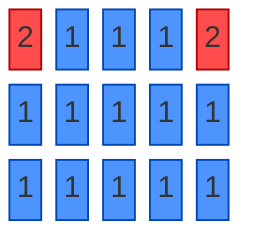

# Rotting Oranges

**Date added:** 2026-08-30

## Problem Description

You are given an `m x n` grid where each cell can have one of three values: `0` representing an empty cell, `1` representing a fresh orange, or `2` representing a rotten orange. Every minute, any fresh orange that is 4-directionally adjacent to a rotten orange becomes rotten. Return the minimum number of minutes that must elapse until no cell has a fresh orange. If this is impossible, return `-1`.

**Source:** https://leetcode.com/problems/rotting-oranges

## Examples

Legend for the diagrams: white squares are empty cells (`0`), blue squares are fresh oranges (`1`), and red squares are rotten oranges (`2`).

**Example 1**
```
Input: grid = [[2,1,1],[1,1,0],[0,1,1]]
Output: 4
Explanation: The rot spreads outward from the initial rotten orange one layer per minute, taking 4 minutes to reach every fresh orange.
```



```mermaid
block-beta
columns 3
    r0c0["2"] r0c1["1"] r0c2["1"]
    r1c0["1"] r1c1["1"] r1c2["0"]
    r2c0["0"] r2c1["1"] r2c2["1"]
    classDef empty fill:#ffffff,stroke:#999999,color:#000000
    classDef fresh fill:#4d94ff,stroke:#0047b3,color:#ffffff
    classDef rotten fill:#ff4d4d,stroke:#b30000,color:#ffffff
    class r1c2,r2c0 empty
    class r0c1,r0c2,r1c0,r1c1,r2c1,r2c2 fresh
    class r0c0 rotten
```

**Example 2**
```
Input: grid = [[2,1,1],[0,1,1],[1,0,1]]
Output: -1
Explanation: The orange in the bottom left corner (row 2, column 0) is never rotten, because rotting only happens 4-directionally and it is walled off by empty cells.
```



```mermaid
block-beta
columns 3
    r0c0["2"] r0c1["1"] r0c2["1"]
    r1c0["0"] r1c1["1"] r1c2["1"]
    r2c0["1"] r2c1["0"] r2c2["1"]
    classDef empty fill:#ffffff,stroke:#999999,color:#000000
    classDef fresh fill:#4d94ff,stroke:#0047b3,color:#ffffff
    classDef rotten fill:#ff4d4d,stroke:#b30000,color:#ffffff
    class r1c0,r2c1 empty
    class r0c1,r0c2,r1c1,r1c2,r2c0,r2c2 fresh
    class r0c0 rotten
```

**Example 3**
```
Input: grid = [[0,2]]
Output: 0
Explanation: Since there are already no fresh oranges at minute 0, the answer is just 0.
```



```mermaid
block-beta
columns 2
    r0c0["0"] r0c1["2"]
    classDef empty fill:#ffffff,stroke:#999999,color:#000000
    classDef fresh fill:#4d94ff,stroke:#0047b3,color:#ffffff
    classDef rotten fill:#ff4d4d,stroke:#b30000,color:#ffffff
    class r0c0 empty
    class r0c1 rotten
```

**Example 4**
```
Input: grid = [[1]]
Output: -1
Explanation: There is one fresh orange but no rotten orange to spread rot, so it can never rot.
```


**Example 5**
```
Input: grid = [[2,1,1,1,2],[1,1,1,1,1],[1,1,1,1,1]]
Output: 4
Explanation: Two rotten oranges spread in parallel from both top corners, but the bottom-center cell (2,2) is equally far (Manhattan distance 4) from each source, so it is still the last cell to rot and the total time stays 4 minutes.
```



**Example 6**
```
Input: grid = [[2,0,1],[0,0,0],[1,0,1]]
Output: -1
Explanation: A ring of empty cells walls off every fresh orange from the rotten one, so none of them can ever rot.
```



```mermaid
block-beta
columns 3
    r0c0["2"] r0c1["0"] r0c2["1"]
    r1c0["0"] r1c1["0"] r1c2["0"]
    r2c0["1"] r2c1["0"] r2c2["1"]
    classDef empty fill:#ffffff,stroke:#999999,color:#000000
    classDef fresh fill:#4d94ff,stroke:#0047b3,color:#ffffff
    classDef rotten fill:#ff4d4d,stroke:#b30000,color:#ffffff
    class r0c1,r1c0,r1c1,r1c2,r2c1 empty
    class r0c2,r2c0,r2c2 fresh
    class r0c0 rotten
```

**Example 7**
```
Input: grid = [[2,2],[2,2]]
Output: 0
Explanation: Every orange is already rotten, so no fresh orange ever needs to wait for rot to spread.
```



```mermaid
block-beta
columns 2
    r0c0["2"] r0c1["2"]
    r1c0["2"] r1c1["2"]
    classDef empty fill:#ffffff,stroke:#999999,color:#000000
    classDef fresh fill:#4d94ff,stroke:#0047b3,color:#ffffff
    classDef rotten fill:#ff4d4d,stroke:#b30000,color:#ffffff
    class r0c0,r0c1,r1c0,r1c1 rotten
```

## Constraints

- `m == grid.length`
- `n == grid[i].length`
- `1 <= m, n <= 10`
- `grid[i][j] is 0, 1, or 2`

## Hints

1. Think about which cells rot first and how the rot spreads outward minute by minute — does this pattern remind you of a graph traversal?
2. A breadth-first search naturally processes nodes in "layers," which matches how rot spreads simultaneously from all rotten oranges each minute.
3. Start by collecting every initially rotten orange into a queue, and count how many fresh oranges exist in total.
4. Process the queue level by level (all oranges rotten in the current minute before moving to the next), incrementing a minute counter after each full level.
5. After the BFS finishes, compare how many oranges actually rotted against the initial fresh count — if any are left unrotted, return `-1`; otherwise return the minute counter.
