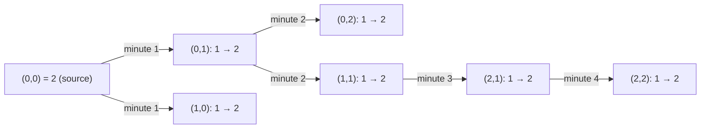
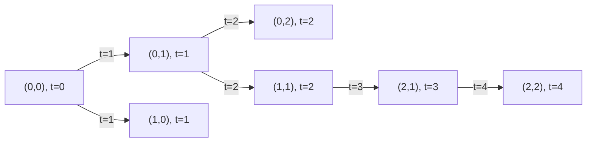

| | |
|---|---|
| **Created on** | 2026-09-05 |
| **DSA Category** | Graphs |

## Approach 1 — Multi-source BFS (optimal)

Treat every initially rotten orange as a BFS source and run a single, simultaneous breadth-first search from all of them at once. Push every rotten cell's coordinates into a queue up front, then process the queue level by level: each level represents exactly one elapsed minute. For every cell popped, look at its 4 neighbors — any fresh one gets marked rotten and pushed onto the queue **immediately**, before it can be rediscovered by another neighbor in the same level. Only increment the minute counter for a level that actually still has fresh oranges left to convert, so the trivial "level" containing just the original rotten sources doesn't itself cost a minute. Once the queue drains, if any fresh oranges remain uncounted, they were unreachable — return `-1`; otherwise return the minute counter.

**Time complexity:** O(m × n) — every cell is enqueued and processed at most once.
**Space complexity:** O(m × n) — the queue can hold up to every cell in the grid in the worst case (e.g., a grid that starts fully rotten).

```java
public int orangesRotting(int[][] grid) {
    int rows = grid.length, cols = grid[0].length;
    Deque<int[]> queue = new ArrayDeque<>();
    int freshRemaining = 0;

    for (int r = 0; r < rows; r++) {
        for (int c = 0; c < cols; c++) {
            if (grid[r][c] == 2) queue.addLast(new int[] { r, c });
            if (grid[r][c] == 1) freshRemaining++;
        }
    }

    int[][] directions = { {0, 1}, {0, -1}, {1, 0}, {-1, 0} };
    int minutes = 0;

    while (!queue.isEmpty() && freshRemaining > 0) {
        minutes++;
        int levelSize = queue.size();

        for (int i = 0; i < levelSize; i++) {
            int[] cell = queue.removeFirst();

            for (int[] d : directions) {
                int nr = cell[0] + d[0], nc = cell[1] + d[1];

                if (nr < 0 || nr >= rows || nc < 0 || nc >= cols || grid[nr][nc] != 1) continue;

                grid[nr][nc] = 2;
                freshRemaining--;
                queue.addLast(new int[] { nr, nc });
            }
        }
    }

    return freshRemaining == 0 ? minutes : -1;
}
```

**Trace** — `grid = [[2,1,1],[1,1,0],[0,1,1]]` (expected output: `4`):



`(1,2)` and `(2,0)` are `0` (empty) and never enter the graph. After minute 4, `freshRemaining` reaches `0` with the queue still holding `(2,2)`'s neighbors to check, but since nothing fresh is left the loop condition stops it from costing a 5th minute. Result: `4`.

## Approach 2 — BFS with elapsed-time stored per node

Functionally identical BFS, but instead of processing the queue in level-sized batches, store the discovery time alongside each queued coordinate as `[row, col, time]`. When a fresh neighbor is discovered from a cell at time `t`, it's pushed as `[nr, nc, t + 1]`. The answer becomes the maximum `time` value seen across all discovered cells (or `0` if no cell was ever discovered). This avoids the `levelSize` bookkeeping at the cost of carrying an extra integer through the queue — a matter of taste, not efficiency.

**Time complexity:** O(m × n) — same traversal, same work per cell.
**Space complexity:** O(m × n) — same queue bound, plus one extra `int` per queued entry (still O(m × n) overall).

```java
public int orangesRotting(int[][] grid) {
    int rows = grid.length, cols = grid[0].length;
    Deque<int[]> queue = new ArrayDeque<>();
    int freshRemaining = 0;
    int maxTime = 0;

    for (int r = 0; r < rows; r++) {
        for (int c = 0; c < cols; c++) {
            if (grid[r][c] == 2) queue.addLast(new int[] { r, c, 0 });
            if (grid[r][c] == 1) freshRemaining++;
        }
    }

    int[][] directions = { {0, 1}, {0, -1}, {1, 0}, {-1, 0} };

    while (!queue.isEmpty()) {
        int[] cell = queue.removeFirst();

        for (int[] d : directions) {
            int nr = cell[0] + d[0], nc = cell[1] + d[1];

            if (nr < 0 || nr >= rows || nc < 0 || nc >= cols || grid[nr][nc] != 1) continue;

            grid[nr][nc] = 2;
            freshRemaining--;
            int time = cell[2] + 1;
            maxTime = Math.max(maxTime, time);
            queue.addLast(new int[] { nr, nc, time });
        }
    }

    return freshRemaining == 0 ? maxTime : -1;
}
```

**Trace** — same grid, same source `(0,0)` at time `0`:



The largest `time` recorded across every discovered node is `4`, at `(2,2)` — matching Approach 1's minute count exactly, without ever tracking level sizes.

## Approach 3 — Brute-force repeated full-grid simulation

Repeatedly scan the entire grid minute by minute: on each pass, find every fresh orange adjacent to a rotten one and mark it (in a separate buffer, not in place — otherwise a freshly-rotted cell could keep cascading within the same pass, understating how many minutes real spread would take) then apply all the marks after the scan finishes. Stop as soon as a full pass produces no new rot, and take the number of passes that did produce a change as the answer. This is acceptable under interview time pressure or on very small grids where clarity matters more than asymptotic efficiency, but it repeats a lot of redundant scanning compared to BFS.

**Time complexity:** O((m × n)²) — in the worst case (e.g., a single row of fresh oranges rotting one cell at a time), the algorithm needs O(m × n) full passes, each costing O(m × n) to scan.
**Space complexity:** O(m × n) — the per-pass buffer of cells to rot.

```java
public int orangesRotting(int[][] grid) {
    int rows = grid.length, cols = grid[0].length;
    int[][] directions = { {0, 1}, {0, -1}, {1, 0}, {-1, 0} };
    int minutes = 0;

    while (true) {
        List<int[]> toRot = new ArrayList<>();

        for (int r = 0; r < rows; r++) {
            for (int c = 0; c < cols; c++) {
                if (grid[r][c] != 2) continue;

                for (int[] d : directions) {
                    int nr = r + d[0], nc = c + d[1];

                    if (nr < 0 || nr >= rows || nc < 0 || nc >= cols || grid[nr][nc] != 1) continue;

                    toRot.add(new int[] { nr, nc });
                }
            }
        }

        if (toRot.isEmpty()) break;

        for (int[] cell : toRot) grid[cell[0]][cell[1]] = 2;
        minutes++;
    }

    for (int r = 0; r < rows; r++) {
        for (int c = 0; c < cols; c++) {
            if (grid[r][c] == 1) return -1;
        }
    }

    return minutes;
}
```

**Trace** — same grid, one row per pass (`/` separates grid rows):

| Pass | Grid state | Fresh remaining | Changed? |
|---|---|---|---|
| start | `2 1 1 / 1 1 0 / 0 1 1` | 6 | — |
| 1 | `2 2 1 / 2 1 0 / 0 1 1` | 4 | Yes |
| 2 | `2 2 2 / 2 2 0 / 0 1 1` | 2 | Yes |
| 3 | `2 2 2 / 2 2 0 / 0 2 1` | 1 | Yes |
| 4 | `2 2 2 / 2 2 0 / 0 2 2` | 0 | Yes |
| 5 | `2 2 2 / 2 2 0 / 0 2 2` | 0 | No → stop |

Four passes produced a change, so `minutes = 4` — matching the BFS approaches, just at O((m × n)²) cost instead of O(m × n).
