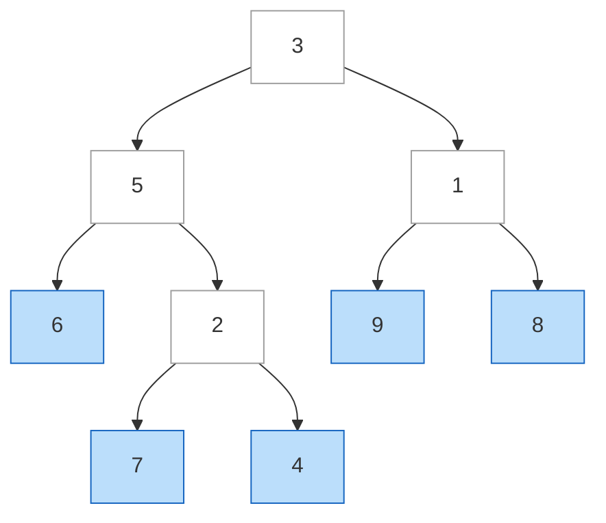
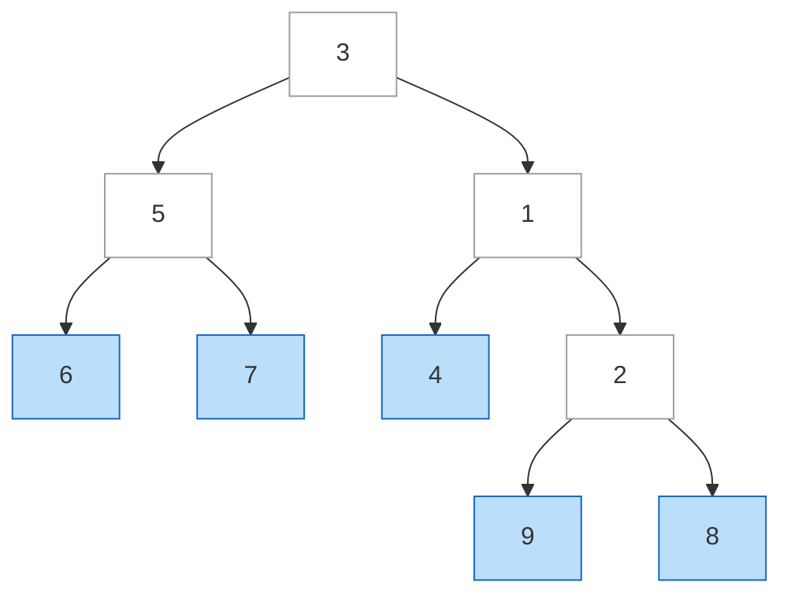
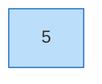
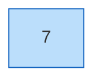
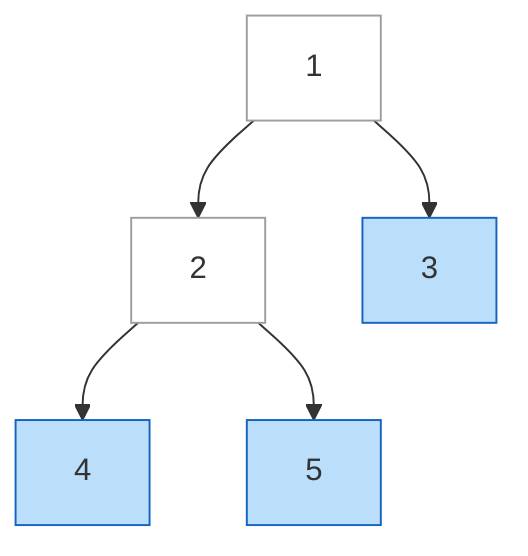
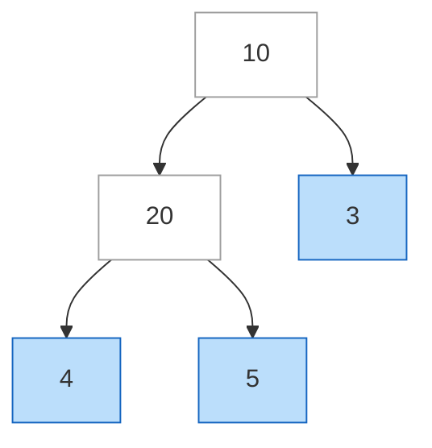
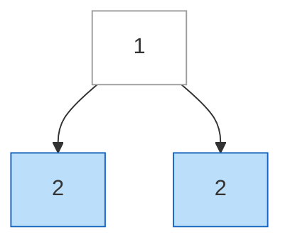
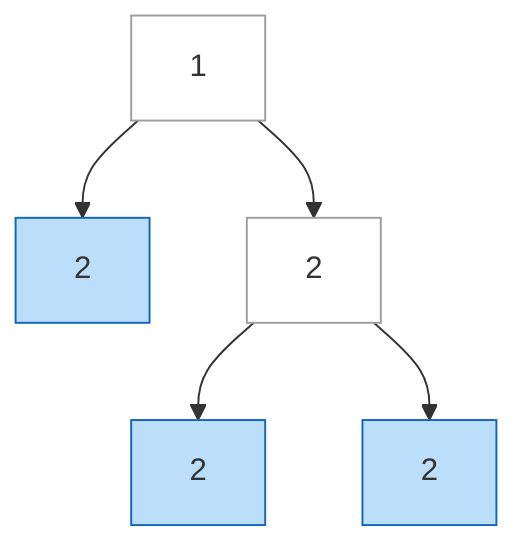
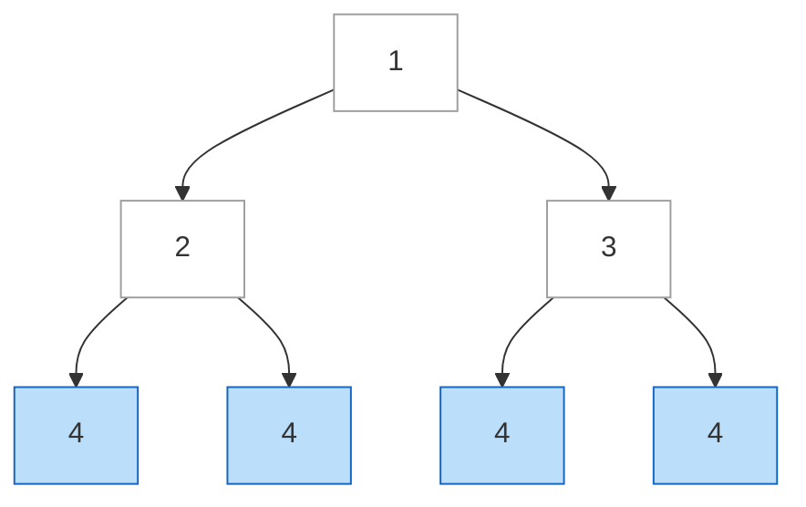
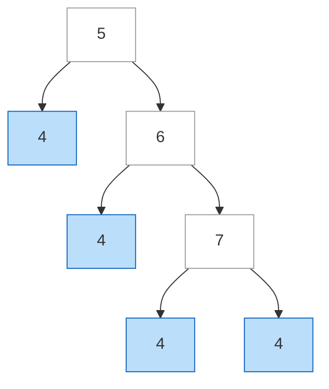

# Leaf-Similar Trees

**Date added:** 2026-09-08

## Problem Description

Consider all the leaves of a binary tree, from left to right order, the values of those leaves form a leaf value sequence.

For example, in a tree with root 3, left child 5 (with left leaf 6 and right child 2, which has leaves 7 and 4), and right child 1 (with leaves 9 and 8), the leaf value sequence is (6, 7, 4, 9, 8).

Two binary trees are considered leaf-similar if their leaf value sequence is the same.

Return `true` if and only if the two given trees with head nodes `root1` and `root2` are leaf-similar.

**Source:** https://leetcode.com/problems/leaf-similar-trees/

## Examples

**Example 1**
```
Input: root1 = [3,5,1,6,2,9,8,null,null,7,4], root2 = [3,5,1,6,7,4,2,null,null,null,null,null,null,9,8]
Output: true
Explanation: Both trees have the same leaf value sequence: (6, 7, 4, 9, 8).
```



**Example 2**
```
Input: root1 = [1,2,3], root2 = [1,3,2]
Output: false
Explanation: root1's leaf sequence is (2, 3); root2's leaf sequence is (3, 2). Same values, different order.
```


**Example 3**
```
Input: root1 = [5], root2 = [5]
Output: true
Explanation: Both trees are a single node. A single node is itself a leaf, so both leaf sequences are (5).
```



**Example 4**
```
Input: root1 = [3], root2 = [7]
Output: false
Explanation: root1's leaf sequence is (3); root2's leaf sequence is (7). Different single values.
```



**Example 5**
```
Input: root1 = [1,2,3,4,5], root2 = [10,20,3,4,5]
Output: true
Explanation: root1's leaf sequence is (4, 5, 3) and root2's leaf sequence is (4, 5, 3) as well. The trees have very different shapes and internal values, but the leaves read the same left to right.
```



**Example 6**
```
Input: root1 = [1,2,2], root2 = [1,2,2,null,null,2,2]
Output: false
Explanation: root1's leaf sequence is (2, 2). root2's right child (2) is not a leaf — it has two children of its own — so root2's leaf sequence is (2, 2, 2), a different length.
```



**Example 7**
```
Input: root1 = [1,2,3,4,4,4,4], root2 = [5,4,6,null,null,4,7,4,4]
Output: true
Explanation: root1's leaf sequence is (4, 4, 4, 4). root2 is a much deeper, unbalanced tree, but its leaf sequence, read left to right, is also (4, 4, 4, 4).
```



## Constraints

- The number of nodes in each tree will be in the range `[1, 200]`.
- Both of the given trees will have values in the range `[0, 200]`.

## Hints

1. What does it mean for a node to be a leaf? How would you check that condition on a `TreeNode`?
2. Think about a traversal order that naturally visits leaves from left to right — which classic tree traversal does that?
3. As you traverse, collect leaf values into a list instead of processing them immediately.
4. Do this for both trees independently, then compare the two resulting lists.
5. Two lists are equal only if they have the same length and the same values in the same positions — no need for anything fancier than that comparison.
