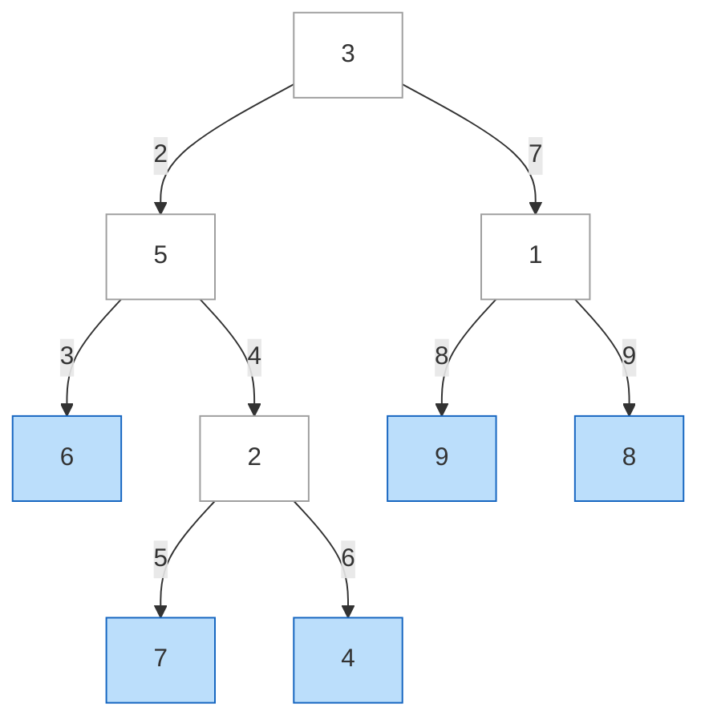
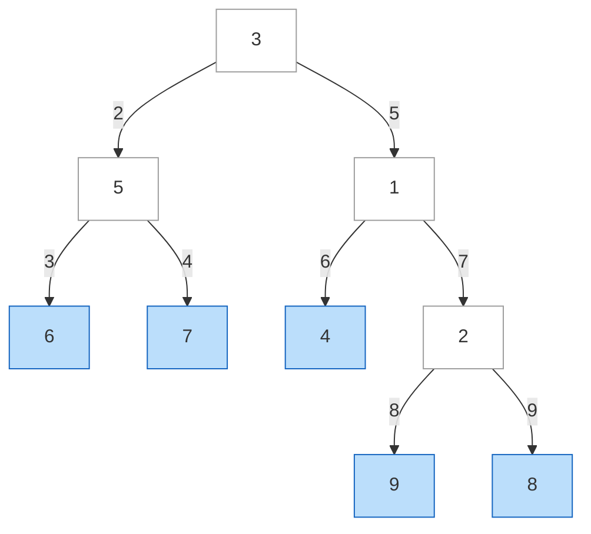
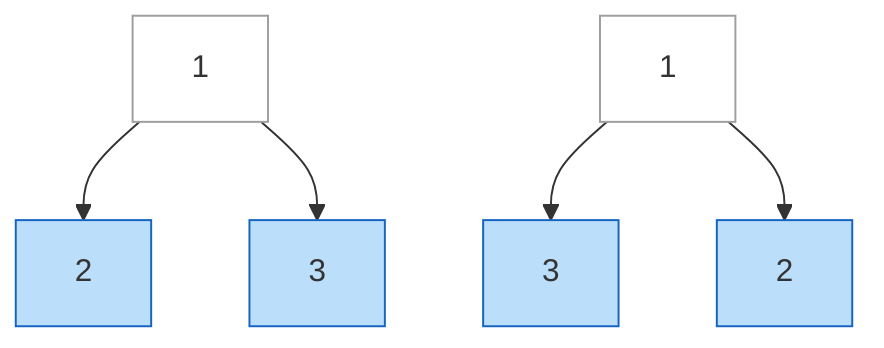
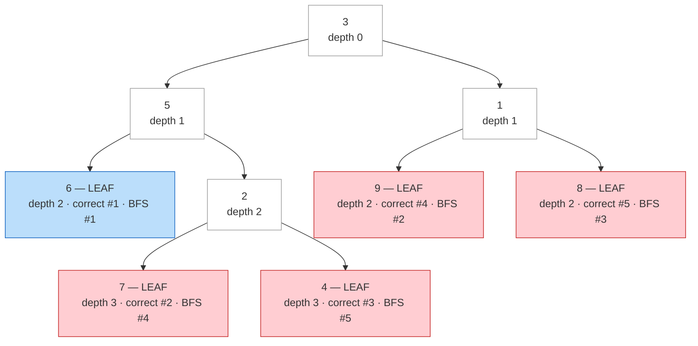

| | |
|---|---|
| **Solved on** | 2026-09-08 |
| **DSA Category** | Trees |

## 1. Your Solution Assessment

**Correctness:** The implementation is correct. `leafSimilar` runs `traverseDFS` on both trees and compares the resulting lists. `traverseDFS` recurses into `left` before `right`, so leaves are appended in true left-to-right structural order regardless of depth — which is exactly the invariant this problem needs. `isLeaf` correctly identifies a node with no children, including the single-node case. All 13 tests pass, covering the LeetCode examples, mismatched-length sequences, duplicate leaf values across uneven depths, and the `0`/`200` value boundaries.

**Code quality:** Naming is clear (`leafSimilar`, `traverseDFS`, `isLeaf`) and the recursion mirrors the problem statement closely. One thing worth cleaning up: `traverseBFS` is still in the file, unused, left over from the earlier attempt. It's fine to keep as a documented cautionary example (see Section 4 below), but if you keep it, a comment noting *why* it's wrong (not just "cannot structurally determine the depth") would help future-you — see Section 4 for the precise reason.

**Time complexity:** O(n1 + n2) — each tree is visited exactly once, with O(1) work per node.

**Space complexity:** O(h1 + h2 + L1 + L2) — recursion stack depth bounded by each tree's height, plus the two output lists sized by each tree's leaf count. Worst case O(n1 + n2) for skewed trees where most nodes are leaves or height ≈ n.

**Algorithm trace** (Mermaid graph, DFS visit order) — `root1 = [3,5,1,6,2,9,8,null,null,7,4]`:



Visit order: `A(1) → B(2) → D(3, leaf, coll=[6]) → E(4) → H(5, leaf, coll=[6,7]) → I(6, leaf, coll=[6,7,4]) → C(7) → F(8, leaf, coll=[6,7,4,9]) → G(9, leaf, coll=[6,7,4,9,8])`.

→ `coll = [6, 7, 4, 9, 8]`, matching `root2`'s leaf sequence → `leafSimilar` returns `true`.

## 2. Optimal Approach

This problem is already solved optimally by exactly the strategy implemented: a DFS that fully explores a node's left subtree before its right subtree, appending a value to the output list only when a leaf is reached. Because DFS commits to finishing one child's entire subtree before starting the sibling's, it naturally preserves left-to-right reading order across leaves at *any* mix of depths — which is the one property this problem actually depends on. Compare the two leaf lists at the end (or short-circuit early, see 3.2).

```java
public boolean leafSimilar(TreeNode root1, TreeNode root2) {
    List<Integer> leaves1 = new ArrayList<>();
    List<Integer> leaves2 = new ArrayList<>();

    collectLeaves(root1, leaves1);
    collectLeaves(root2, leaves2);

    return leaves1.equals(leaves2);
}

private void collectLeaves(TreeNode node, List<Integer> leaves) {
    if (node == null) return;

    if (node.left == null && node.right == null) {
        leaves.add(node.val);
        return;
    }

    collectLeaves(node.left, leaves);
    collectLeaves(node.right, leaves);
}
```

**Time complexity:** O(n1 + n2) — every node in both trees is visited once.

**Space complexity:** O(h1 + h2 + L1 + L2) — same reasoning as Section 1; this is the same algorithm.

**Algorithm trace** (Mermaid graph, DFS visit order) — `root2 = [3,5,1,6,7,4,2,null,null,null,null,null,null,9,8]`:



Visit order: `A2(1) → B2(2) → D2(3, leaf, coll=[6]) → E2(4, leaf, coll=[6,7]) → C2(5) → F2(6, leaf, coll=[6,7,4]) → G2(7) → H2(8, leaf, coll=[6,7,4,9]) → I2(9, leaf, coll=[6,7,4,9,8])`.

→ `coll = [6, 7, 4, 9, 8]` — same sequence as `root1` despite a completely different shape → `true`.

## 3. Alternative Approaches

### 3.1 Iterative DFS with an explicit stack

Identical traversal order to the recursive version, but push nodes onto a `Deque` used as a LIFO stack instead of relying on the call stack — push `right` before `left` so `left` pops (and is processed) first.

**Time complexity:** O(n1 + n2) — same traversal, just iterative.

**Space complexity:** O(h1 + h2 + L1 + L2) — an explicit stack bounded by tree height instead of the call stack, same asymptotic bound.

**When acceptable:** Preferred when recursion depth is a concern (deeply skewed trees). Not a real issue here given the `≤ 200` node constraint, but it's the standard way to keep DFS's left-to-right guarantee without recursion.

**Algorithm trace** (Mermaid graph, stack-pop visit order) — `root1 = [3,5,1,6,2,9,8,null,null,7,4]`:


Stack starts `[A]`. Pop `A` → push `C` then `B` (so `B` pops first) → stack `[C,B]`. Pop `B` → push `E` then `D` → stack `[C,E,D]`. Pop `D` (leaf, coll=[6]). Pop `E` → push `I` then `H` → stack `[C,I,H]`. Pop `H` (leaf, coll=[6,7]). Pop `I` (leaf, coll=[6,7,4]). Pop `C` → push `G` then `F` → stack `[G,F]`. Pop `F` (leaf, coll=[6,7,4,9]). Pop `G` (leaf, coll=[6,7,4,9,8]). Same result as recursive DFS.

### 3.2 Lazy comparison with an early exit

Instead of fully materializing both leaf lists before comparing, drive two independent iterative-DFS "cursors" (each with its own explicit stack) one leaf at a time, comparing values as soon as both cursors produce one, and returning `false` the moment two leaves disagree — without ever finishing either traversal.

**Time complexity:** O(k) in the best/average case, where `k` is the position of the first mismatching leaf (or `min(L1, L2)` if one sequence is a prefix of the other); O(n1 + n2) worst case when the trees are leaf-similar (both traversals must run to completion to confirm equality).

**Space complexity:** O(h1 + h2) — only the two stacks are kept live; no full leaf lists are ever stored.

**When acceptable:** Worthwhile when trees are large and expected to differ early (e.g., comparing many candidate trees against one reference tree) since it avoids the wasted work of collecting leaves that are never compared. Given the `≤ 200` node constraint here, the optimal approach's simplicity wins in practice — this is a "know it exists" optimization, not a necessary one for this input size.

**Algorithm trace** (Mermaid graph, cursor visit order until first mismatch) — `root1 = [1,2,3]` vs `root2 = [1,3,2]`:



Cursor 1 advances to its first leaf: `2`. Cursor 2 advances to its first leaf: `3`. Compare `2 != 3` → return `false` immediately — neither cursor ever needs to visit its second leaf.

## 4. Why a BFS / Level-Order Traversal Doesn't Work

The instinct to reach for BFS here comes from a reasonable-sounding assumption: "leaves are the last layer of the tree." That's true only for **complete or perfect trees**, where every leaf sits at the same depth. In a general binary tree — like `root1` in this problem — leaves can appear at several different depths simultaneously, and BFS's ordering guarantee (*all of depth d before any of depth d+1*) actively conflicts with the left-to-right *structural* order the problem needs.

### Graphical scenario

`root1 = [3,5,1,6,2,9,8,null,null,7,4]` has leaves at two different depths: `6`, `9`, `8` are at depth 2, while `7`, `4` are at depth 3 — even though `7` and `4` sit *between* `6` and `9` when reading the tree left to right.



Only `6` (blue) lands in the same position under both orderings — every other leaf (red) is reported in the wrong slot: `9` and `8` get pulled in *before* `7` and `4`, purely because they happen to live one level shallower in a different subtree.

### Step-by-step tracking

Tracing `traverseBFS(root1, coll)` with the level-size-snapshot loop (`queue.addLast` / `queue.removeFirst`):

| Level | Queue before dequeue | Dequeued | Leaf? | Action | `coll` after |
|---|---|---|---|---|---|
| 1 | `[3]` | `3` | No | enqueue `5`, `1` | `[]` |
| 2 | `[5, 1]` | `5` | No | enqueue `6`, `2` | `[]` |
| 2 | `[1, 6, 2]` | `1` | No | enqueue `9`, `8` | `[]` |
| 3 | `[6, 2, 9, 8]` | `6` | **Yes** | append | `[6]` |
| 3 | `[2, 9, 8]` | `2` | No | enqueue `7`, `4` | `[6]` |
| 3 | `[9, 8, 7, 4]` | `9` | **Yes** | append | `[6, 9]` |
| 3 | `[8, 7, 4]` | `8` | **Yes** | append | `[6, 9, 8]` |
| 4 | `[7, 4]` | `7` | **Yes** | append | `[6, 9, 8, 7]` |
| 4 | `[4]` | `4` | **Yes** | append | `[6, 9, 8, 7, 4]` |

Final BFS output: `[6, 9, 8, 7, 4]`. Correct (DFS) leaf sequence: `[6, 7, 4, 9, 8]`. They diverge starting at index 1.

### Why this is unfixable within BFS itself

The root cause isn't a loop-boundary or off-by-one bug — it's that BFS's fundamental visitation contract ("shallower before deeper") is orthogonal to the contract this problem needs ("left before right, independent of depth"). Node `2` (the parent of leaves `7` and `4`) is one level deeper than its sibling subtree rooted at `1` (parent of leaves `9`, `8`), so BFS finishes *all* of depth 2 — including `9` and `8`, which live in a completely different branch — before it ever reaches depth 3 to discover `7` and `4`. Fixing this within BFS would require first computing each leaf's structural left-to-right rank and sorting the output by that rank afterward — but computing that rank *is* the DFS traversal. At that point you're not really doing BFS anymore; you're doing DFS with extra steps.
