# Leaf-Concatenated Tree Equality (Hard-style variant)

**Date added:** 2026-09-08

## Problem Description

You are given the roots of two binary trees, `root1` and `root2`. Each leaf node contains either a lowercase string value or no value (empty).

Consider the sequence of leaf values obtained by an in-order traversal of each tree, restricted to leaf nodes only (values from non-leaf/internal nodes are ignored regardless of whether they hold a value). Concatenate these leaf values, in traversal order, into a single string for each tree.

Two trees are considered leaf-concatenation equal if the resulting concatenated strings are identical — even if the trees differ in shape, size, or how the characters are distributed among individual leaves.

Return `true` if `root1` and `root2` are leaf-concatenation equal, or `false` otherwise.

**Source:** Asked in a real Google interview.

## Examples

**Example 1**
```
Tree 1: root -> left "ab", right "c"
Tree 2: root -> left "a", right "bc"
Output: true
Explanation: Tree 1's leaves concatenate to "ab" + "c" = "abc". Tree 2's leaves concatenate to "a" + "bc" = "abc". Same final string, different partitioning of the characters among leaves — still equal.
```
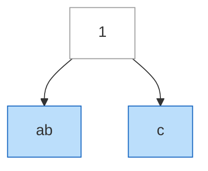
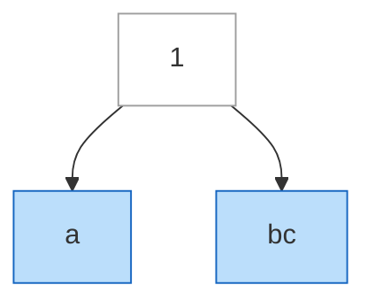

**Example 2**
```
Tree 1: root -> left "abc", right (empty)
Tree 2: root -> left "ab", right "d"
Output: false
Explanation: Tree 1 concatenates to "abc" + "" = "abc". Tree 2 concatenates to "ab" + "d" = "abd". "abc" != "abd".
```
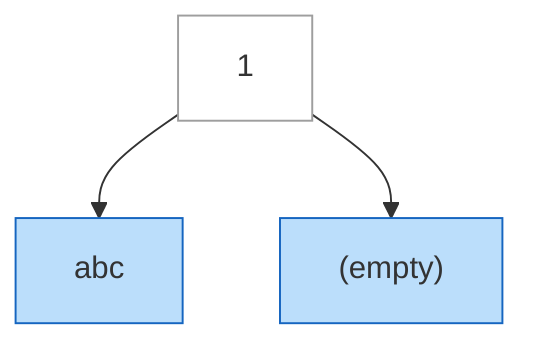
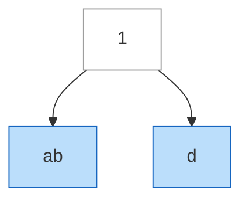

**Example 3**
```
Tree 1: a single node "x" (the root is itself a leaf, no children)
Tree 2: root -> left "x", right (empty)
Output: true
Explanation: Tree 1 has exactly one leaf, "x", so its concatenation is "x". Tree 2 concatenates to "x" + "" = "x". Different shapes and sizes (one node vs. three), same concatenated leaf string.
```
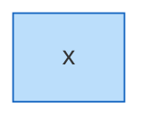
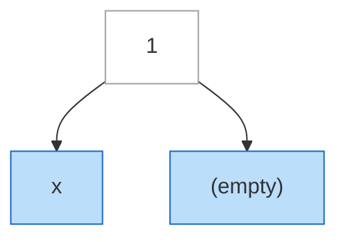

**Example 4**
```
Tree 1: root -> left "ca", right subtree(left "t", right (empty))
Tree 2: root -> left subtree(left "c", right "a"), right "t"
Output: true
Explanation: Tree 1 concatenates to "ca" + "t" + "" = "cat". Tree 2 concatenates to "c" + "a" + "t" = "cat". Both trees are imperfect/incomplete and shaped very differently, but their leaf concatenations match.
```
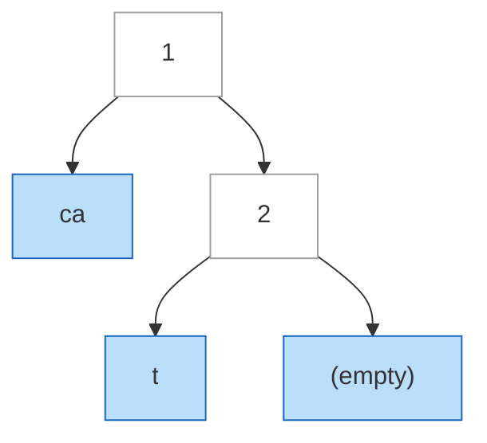
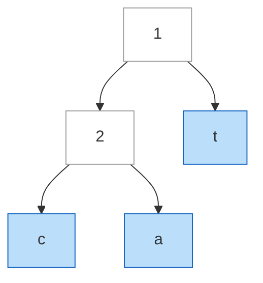

**Example 5**
```
Tree 1: root -> left "ab", right "cd"
Tree 2: root -> left "cd", right "ab"
Output: false
Explanation: Both trees use the exact same two leaf strings, but Tree 1 concatenates to "abcd" while Tree 2 concatenates to "cdab" — same characters, wrong order.
```
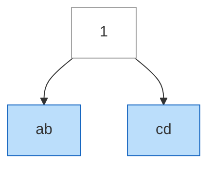
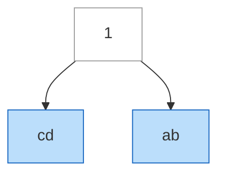

**Example 6**
```
Tree 1: root -> left "hel", right "lo"
Tree 2: root -> left "hel", right "l"
Output: false
Explanation: Tree 1 concatenates to "hello" (length 5). Tree 2 concatenates to "hell" (length 4). The strings share the same 4-character prefix "hell" but differ in length, so they aren't equal.
```
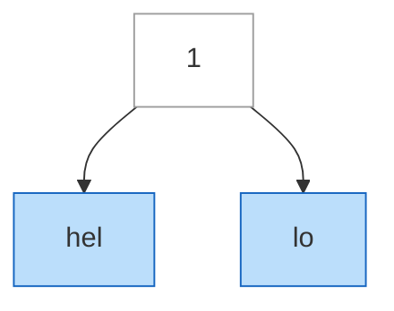
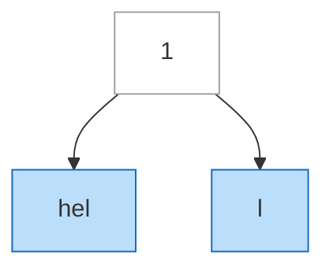

**Example 7**
```
Tree 1: a perfect 3-level tree with 8 single-character leaves "a" through "h"
Tree 2: root -> left "abcd", right "efgh"
Output: true
Explanation: Tree 1 (perfect, 8 leaves) concatenates to "a"+"b"+"c"+"d"+"e"+"f"+"g"+"h" = "abcdefgh". Tree 2 (a shallow, incomplete tree with just 2 leaves) concatenates to "abcd" + "efgh" = "abcdefgh". Same string, radically different shapes and leaf counts.
```
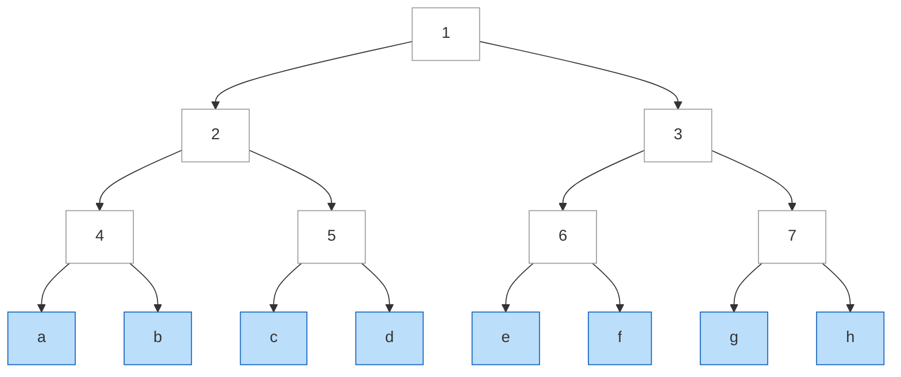
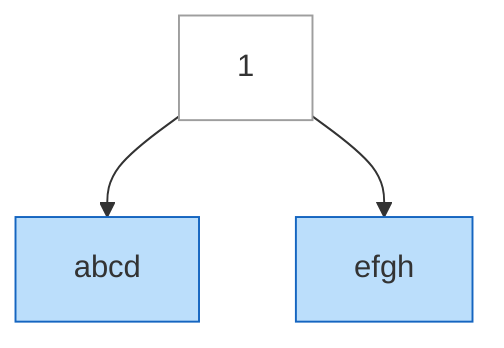

## Constraints

- The number of nodes in each tree is in the range `[1, 200]`.
- Leaf values, when present, consist of lowercase English letters, `1 <= len(value) <= 100`.
- Non-leaf nodes may or may not have a value; it is never counted.
- Total length of all leaf strings across both trees does not exceed `10^4`.
- Follow-up: can you solve it using O(h1 + h2) extra space, where h1 and h2 are the heights of the two trees — i.e., without materializing either tree's full concatenated string?

## Hints

1. Only leaves matter — non-leaf values, regardless of whether they're set, must never contribute to the result. What makes a node a leaf?
2. The traversal order that matters is "left subtree's leaves, then right subtree's leaves," recursively — the fact that it's technically in-order doesn't change anything here, since internal nodes are skipped entirely.
3. A straightforward solution builds one big string per tree (e.g. with a `StringBuilder`) and then compares the two strings directly.
4. For the follow-up, think about what it would take to compare the two trees' leaf characters one at a time without ever building the full string for either side — what data structure lets you pause a DFS traversal partway through a leaf's string and resume later?
5. An explicit stack-based in-order traversal (rather than recursion) lets you track "which leaf, and which character offset within that leaf" as your traversal state, so you can advance one character at a time and bail out the moment two characters disagree.
