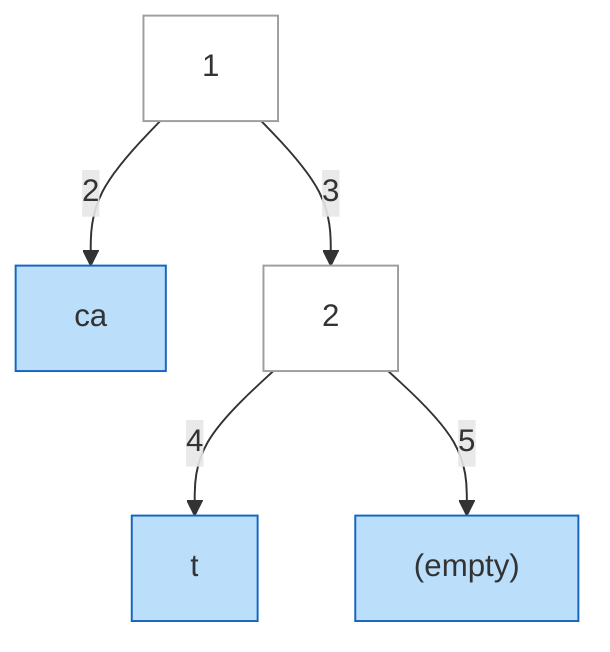
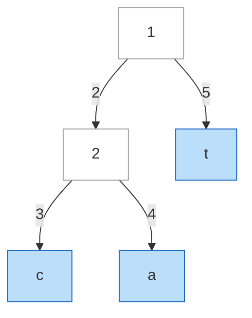
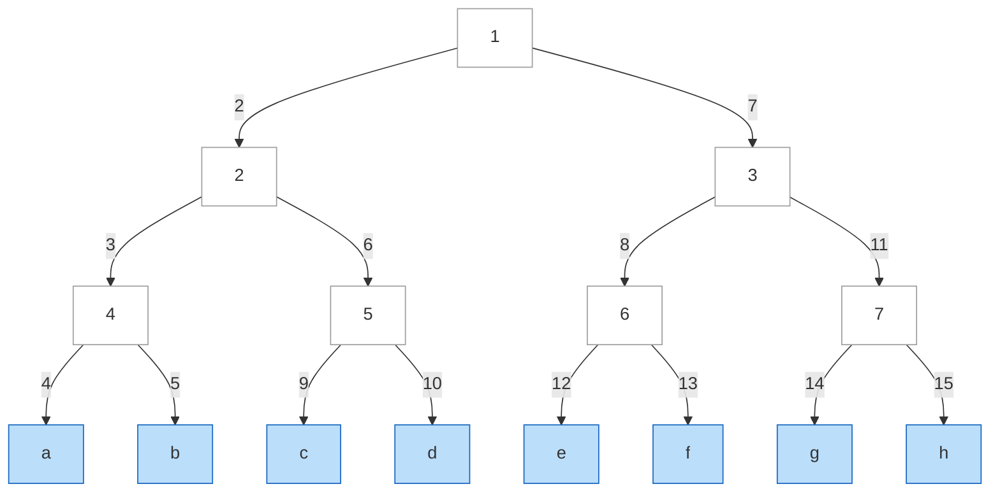

| | |
|---|---|
| **Solved on** | 2026-09-08 |
| **DSA Category** | Trees |

## 1. Your Solution Assessment

**Correctness:** The implementation is correct. `traverse` recurses into `left` before `right` and only appends a value when it lands on a leaf (`isLeaf(node)`), so non-leaf values are always ignored regardless of whether they're set — matching the problem's requirement exactly. The null-guard now lives *inside* the leaf branch (`if (node.val != null) coll.append(node.val)`), so a valueless leaf correctly contributes nothing without cutting off traversal into an internal node's children, which was the bug from the earlier version. Comparing via `collQ.toString().equals(collP.toString())` also fixes the earlier reference-equality bug (`StringBuilder` doesn't override `equals`). All 16 tests pass, covering every README example plus edge cases (all-empty leaves, interspersed empties, ignored non-leaf values, length mismatches, skewed-vs-balanced shapes) and the boundary leaf lengths (1 and 100 characters).

**Code quality:** Clean and minimal — `traverse` and `isLeaf` read naturally, and the two-`StringBuilder`-then-compare structure mirrors the problem statement closely (concatenate each tree's leaves, then compare).

**Time complexity:** O(n1 + n2 + L1 + L2) — every node in both trees is visited once (n1 + n2), and every leaf character is appended once (L1 + L2, bounded by the `≤ 10^4` total-length constraint).

**Space complexity:** O(h1 + h2 + L1 + L2) — recursion stack depth bounded by each tree's height, plus the two fully-materialized output strings. This does **not** meet the follow-up's O(h1 + h2) bound, since both complete strings are built and held in memory before comparison — see Section 2 for the approach that does.

**Algorithm trace** (Mermaid graph, DFS visit order) — `root1 = ["1" -> "ca", ["2" -> "t", (empty)]]`, `root2 = ["1" -> ["2" -> "c", "a"], "t"]` (README Example 4):



Visit order: `A(1) → B(2, leaf, coll="ca") → C(3) → D(4, leaf, coll="cat") → E(5, leaf, val=null, skipped, coll="cat")`.



Visit order: `A2(1) → F2(2) → G2(3, leaf, coll="c") → H2(4, leaf, coll="ca") → I2(5, leaf, coll="cat")`.

→ `"cat" == "cat"` → `leafConcatenationEqual` returns `true`.

## 2. Optimal Approach

The follow-up asks for O(h1 + h2) extra space — i.e., never materializing either tree's full concatenated string. The key idea: treat each tree's leaves as a lazily-advancing character stream, driven by an **iterative, stack-based traversal** (not recursion, and not a fully-built string). Each stream exposes `hasNext()` / `next()` like a real iterator: internally it holds an explicit `Deque<TreeNode>` (bounded by tree height, since the standard "pop node, push right then left" iterative traversal only ever holds one pending sibling per ancestor on the current root-to-node path) plus the current leaf's string and an index into it. Compare the two streams one character at a time and stop the instant they disagree — or the instant one runs out before the other.

```java
public boolean leafConcatenationEqual(TreeNode root1, TreeNode root2) {
    LeafCharIterator it1 = new LeafCharIterator(root1);
    LeafCharIterator it2 = new LeafCharIterator(root2);

    while (it1.hasNext() && it2.hasNext()) {
        if (it1.next() != it2.next()) return false;
    }

    return !it1.hasNext() && !it2.hasNext();
}

private static final class LeafCharIterator {
    private final Deque<TreeNode> stack = new ArrayDeque<>();
    private String currentVal = "";
    private int currentIdx = 0;

    LeafCharIterator(TreeNode root) {
        if (root != null) stack.push(root);
        advance();
    }

    boolean hasNext() {
        return currentIdx < currentVal.length();
    }

    char next() {
        char c = currentVal.charAt(currentIdx++);
        if (currentIdx == currentVal.length()) advance();
        return c;
    }

    private void advance() {
        currentVal = "";
        currentIdx = 0;

        while (!stack.isEmpty()) {
            TreeNode node = stack.pop();

            if (node.left == null && node.right == null) {
                if (node.val != null && !node.val.isEmpty()) {
                    currentVal = node.val;
                    return;
                }
                continue;
            }

            if (node.right != null) stack.push(node.right);
            if (node.left != null) stack.push(node.left);
        }
    }
}
```

**Time complexity:** O(n1 + n2 + L1 + L2) worst case (when the trees are leaf-concatenation equal, both streams must be fully drained to confirm it) — same order as the materializing version. The win isn't asymptotic time, it's that a mismatch is detected the instant it's found, without ever paying to build or scan the remainder of either string.

**Space complexity:** O(h1 + h2) — each `LeafCharIterator`'s stack holds at most one pending sibling per level of its tree's height; no full string is ever stored, satisfying the follow-up exactly.

**Algorithm trace** (Annotated array, dual character stream) — `root1` leaves `["ab", "c"]` vs `root2` leaves `["a", "bc"]` (README Example 1), `|` marks a leaf boundary:

```
Stream1: [ a  b | c ]      Stream2: [ a | b  c ]
           ^                          ^
compare 'a' == 'a' ✓ → advance both

Stream1: [ a  b | c ]      Stream2: [ a | b  c ]
              ^                          ^
compare 'b' == 'b' ✓ → advance both (Stream1 crosses its leaf boundary into "c";
                                       Stream2 crosses its leaf boundary into "bc")

Stream1: [ a  b | c ]      Stream2: [ a | b  c ]
                 ^                          ^
compare 'c' == 'c' ✓ → advance both

Stream1 exhausted (hasNext() = false)      Stream2 exhausted (hasNext() = false)
→ both streams empty → return true
```

Note how the comparison walks straight through each stream's internal leaf boundaries (`"ab"|"c"` vs `"a"|"bc"`) without ever caring where one leaf's string ends and the next begins — exactly the property that makes different partitionings of the same characters compare equal.

## 3. Alternative Approaches

### 3.1 Full materialization via recursion (the submitted solution)

Recursively concatenate each tree's leaves into a `StringBuilder`, then compare the two resulting strings. This is simple, easy to reason about, and fine given the `≤ 10^4` total-length constraint — but it doesn't satisfy the O(h1 + h2) follow-up, since it holds both complete strings (and the recursion stack) in memory at once.

**Time complexity:** O(n1 + n2 + L1 + L2) — same as the optimal approach.

**Space complexity:** O(h1 + h2 + L1 + L2) — recursion stack plus both fully-built strings.

**When acceptable:** The default choice absent a follow-up — clearest to write and debug, and well within the given constraints. Reach for the streaming version in Section 2 only when the follow-up's space bound is explicitly asked for.

**Algorithm trace** (Mermaid graph, DFS visit order) — see Section 1's trace above; this alternative *is* the submitted solution.

### 3.2 Full materialization via an explicit stack (no recursion)

Same idea as 3.1, but drive the traversal with an explicit `Deque<TreeNode>` used as a stack instead of the call stack, appending to each `StringBuilder` as leaves are popped. This removes recursion-depth risk on deeply skewed trees, but — unlike the Section 2 approach — it still builds the *entire* string for both trees before comparing, so it doesn't reach the O(h1 + h2) bound either.

**Time complexity:** O(n1 + n2 + L1 + L2) — identical traversal, just iterative.

**Space complexity:** O(h1 + h2 + L1 + L2) — an explicit stack (bounded by height) instead of the call stack, plus both fully-built strings.

**When acceptable:** Same use case as 3.1, but preferred when recursion depth is a concern and you don't need the follow-up's stricter space bound (e.g., stack-safety matters, but early-exit-without-buffering doesn't).

**Algorithm trace** (Mermaid graph, stack-pop visit order) — `root2 = ["1" -> "abcd", "efgh"]` vs an 8-leaf perfect tree `root1` (README Example 7):



Stack starts `[A]`. Pop `A` → push `R1` then `L1` (so `L1` pops first). Pop `L1` → push `L2b` then `L2a`. Pop `L2a` → push `Lb` then `La`. Pop `La` (leaf, coll="a"). Pop `Lb` (leaf, coll="ab"). Pop `L2b` → push `Ld` then `Lc`. Pop `Lc` (coll="abc"). Pop `Ld` (coll="abcd"). Pop `R1` → push `L2d` then `L2c`. Pop `L2c` → push `Lf` then `Le`. Pop `Le` (coll="abcde"). Pop `Lf` (coll="abcdef"). Pop `L2d` → push `Lh` then `Lg`. Pop `Lg` (coll="abcdefg"). Pop `Lh` (coll="abcdefgh"). Meanwhile `root2`'s stack-driven traversal produces `"abcd" + "efgh" = "abcdefgh"` in two pops. Both equal `"abcdefgh"` → `true`.
