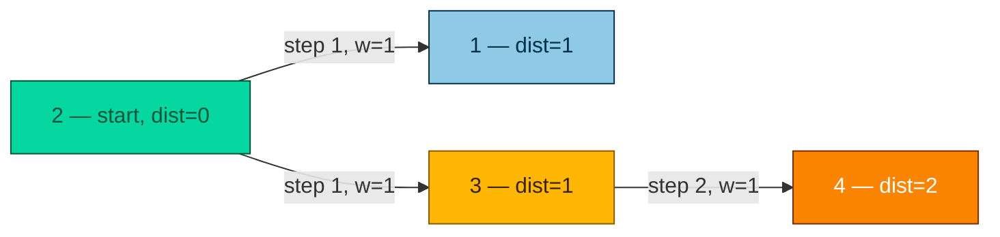

# Network Delay Time — Solution

| | |
|---|---|
| **Created on** | 2026-09-15 |
| **DSA Category** | Graphs |

## Approach 1: Dijkstra's Algorithm with a Min-Heap (Optimal)

This is a single-source shortest path problem on a directed, weighted graph with non-negative weights — exactly what Dijkstra's algorithm is built for.

Build an adjacency list from `times`. Keep a `dist[]` array initialized to infinity, except `dist[k] = 0`. Use a min-heap keyed on accumulated distance, seeded with `(k, 0)`. Repeatedly pop the closest unvisited node, mark it visited, and relax its outgoing edges — pushing any neighbor whose distance improves back onto the heap. Once the heap is empty, the answer is the maximum value in `dist[1..n]`; if any node is still unreached (infinity), return `-1`.

**Time complexity:** O((V + E) log V) — each edge can trigger one heap push (`E log V`), and each node is popped once (`V log V`), where V = n and E = times.length.
**Space complexity:** O(V + E) — the adjacency list stores every edge once, plus `dist[]` and the heap hold at most O(V) and O(E) entries respectively.

```java
import java.util.ArrayList;
import java.util.Arrays;
import java.util.Collections;
import java.util.HashMap;
import java.util.List;
import java.util.Map;
import java.util.PriorityQueue;

public class Solution {
    public int networkDelayTime(int[][] times, int n, int k) {
        // Step 1: build an adjacency list so we can quickly answer "where can I go from node X,
        // and how long does each hop take?"
        Map<Integer, List<int[]>> graph = new HashMap<>();
        for (int[] t : times) {
            graph.computeIfAbsent(t[0], x -> new ArrayList<>()).add(new int[]{t[1], t[2]});
        }

        // Step 2: dist[node] = shortest known time to reach that node from k.
        // Every node starts "infinitely far away" except the source itself, which is 0.
        int[] dist = new int[n + 1];
        Arrays.fill(dist, Integer.MAX_VALUE);
        dist[k] = 0;

        // Step 3: the min-heap always hands us the unvisited node that is currently closest
        // to k. Each entry is {node, distanceFromK}.
        PriorityQueue<int[]> pq = new PriorityQueue<>((a, b) -> a[1] - b[1]);
        pq.offer(new int[]{k, 0});
        boolean[] visited = new boolean[n + 1];

        // Step 4: this is Dijkstra's greedy core — always finalize the closest unvisited
        // node next, since nothing shorter to it can still be found later.
        while (!pq.isEmpty()) {
            int[] cur = pq.poll();
            int node = cur[0];
            int d = cur[1];

            // The same node can be pushed onto the heap multiple times with different
            // distances (before we knew its true shortest one). Skip stale duplicates.
            if (visited[node]) {
                continue;
            }
            visited[node] = true;

            // Step 5: "relax" every outgoing edge from this node — if hopping through it
            // gives a shorter path to a neighbor than what we knew before, update and
            // re-queue that neighbor so it can be expanded with its new, better distance.
            for (int[] neighbor : graph.getOrDefault(node, Collections.emptyList())) {
                int next = neighbor[0];
                int weight = neighbor[1];
                if (d + weight < dist[next]) {
                    dist[next] = d + weight;
                    pq.offer(new int[]{next, dist[next]});
                }
            }
        }

        // Step 6: the signal reaches every node at a different time — the answer is how
        // long the SLOWEST node takes, i.e. the maximum shortest distance. If any node is
        // still at "infinity", it was never reached, so the signal can't reach everyone.
        int maxDist = 0;
        for (int i = 1; i <= n; i++) {
            if (dist[i] == Integer.MAX_VALUE) {
                return -1;
            }
            maxDist = Math.max(maxDist, dist[i]);
        }
        return maxDist;
    }
}
```

### Algorithm trace (Mermaid graph)

Input: `times = [[2,1,1],[2,3,1],[3,4,1]]`, `n = 4`, `k = 2`

Visit order: `2` (dist=0, start) → `1` (dist=1) → `3` (dist=1) → `4` (dist=2).



Final distances: `dist = [_, 1, 0, 1, 2]` (index 0 unused) → `max(1, 0, 1, 2) = 2` → return `2`.

---

## Approach 2: Bellman-Ford (Edge Relaxation)

Initialize `dist[k] = 0` and every other node to infinity. Relax every edge in `times` up to `n - 1` times — on each full pass, for every edge `(u, v, w)`, if `dist[u] + w < dist[v]`, update `dist[v]`. After `n - 1` passes, the shortest paths are guaranteed to have converged (a shortest simple path visits at most `n - 1` edges). The answer is the max of `dist[1..n]`, or `-1` if any is still infinity.

This doesn't need a heap and handles negative weights (not required here, but a natural talking point), at the cost of doing much more redundant work than Dijkstra since it blindly repeats full edge passes instead of always expanding the closest node first.

**Time complexity:** O(V · E) — `n - 1` passes, each scanning all `times.length` edges.
**Space complexity:** O(V) for the `dist[]` array (plus O(E) if you store `times` as an adjacency list, though it isn't required).

```java
import java.util.Arrays;

public class Solution {
    public int networkDelayTime(int[][] times, int n, int k) {
        // dist[node] = shortest known time to reach that node from k.
        // Everything starts "infinitely far away" except the source itself.
        int[] dist = new int[n + 1];
        Arrays.fill(dist, Integer.MAX_VALUE);
        dist[k] = 0;

        // A shortest simple path can cross at most n - 1 edges, so repeating a full pass
        // over every edge n - 1 times is guaranteed to let every distance fully converge.
        for (int pass = 0; pass < n - 1; pass++) {
            for (int[] t : times) {
                int u = t[0];
                int v = t[1];
                int w = t[2];

                // "Relax" this edge: if we can reach u, and hopping from u to v is shorter
                // than the best route to v found so far, record the improvement.
                if (dist[u] != Integer.MAX_VALUE && dist[u] + w < dist[v]) {
                    dist[v] = dist[u] + w;
                }
            }
        }

        // The answer is how long the slowest node takes to receive the signal;
        // anything still "infinitely far away" means it was never reached.
        int maxDist = 0;
        for (int i = 1; i <= n; i++) {
            if (dist[i] == Integer.MAX_VALUE) {
                return -1;
            }
            maxDist = Math.max(maxDist, dist[i]);
        }
        return maxDist;
    }
}
```

### Algorithm trace (Step table)

Input: `times = [[2,1,1],[2,3,1],[3,4,1]]`, `n = 4`, `k = 2`
Initial: `dist = [_, ∞, 0, ∞, ∞]`

| Pass | Edge examined | Relaxed? | dist after edge |
|---|---|---|---|
| 1 | (2,1,1) | dist[2]+1=1 < ∞ → Yes | dist[1]=1 |
| 1 | (2,3,1) | dist[2]+1=1 < ∞ → Yes | dist[3]=1 |
| 1 | (3,4,1) | dist[3]+1=2 < ∞ → Yes | dist[4]=2 |
| 2 | (2,1,1) | dist[2]+1=1, not < 1 → No | unchanged |
| 2 | (2,3,1) | dist[2]+1=1, not < 1 → No | unchanged |
| 2 | (3,4,1) | dist[3]+1=2, not < 2 → No | unchanged |
| 3 | (2,1,1) / (2,3,1) / (3,4,1) | No further improvements | unchanged |

Final: `dist = [_, 1, 0, 1, 2]` → `max(1, 0, 1, 2) = 2` → return `2`.

**When acceptable:** reasonable under interview time pressure if Dijkstra's heap mechanics slip your mind — it's a simpler mental model ("just relax every edge repeatedly") and is easy to code correctly from scratch, at the cost of a slower runtime.

---

## Approach 3: Floyd-Warshall (All-Pairs Shortest Path)

Build an `n x n` distance matrix `dist[i][j]`, initialized to `0` when `i == j`, the edge weight when a direct edge `(i, j)` exists, and infinity otherwise. Then for every intermediate node `mid` from `1` to `n`, and every pair `(i, j)`, check if routing through `mid` is shorter: `dist[i][j] = min(dist[i][j], dist[i][mid] + dist[mid][j])`. This computes shortest paths between *every* pair of nodes, not just from `k` — far more than the problem asks for. Once done, read off row `k` and take the max (or `-1` if any entry is still infinity).

Given the problem's small constraints (`n <= 100`), this is computationally feasible, but it solves a strictly more general problem than needed, wasting both time and space.

**Time complexity:** O(V^3) — three nested loops over all nodes.
**Space complexity:** O(V^2) — the full pairwise distance matrix.

```java
public class Solution {
    public int networkDelayTime(int[][] times, int n, int k) {
        // dist[i][j] = shortest known time from node i to node j.
        // Start everything "unreachable" except staying put (dist[i][i] = 0) and the
        // direct edges we were given. (Dividing MAX_VALUE by 2 avoids overflow when
        // two "infinities" get added together below.)
        int[][] dist = new int[n + 1][n + 1];
        for (int[] row : dist) {
            java.util.Arrays.fill(row, Integer.MAX_VALUE / 2);
        }
        for (int i = 1; i <= n; i++) {
            dist[i][i] = 0;
        }
        for (int[] t : times) {
            dist[t[0]][t[1]] = t[2];
        }

        // For every possible "stopover" node mid, check whether routing i -> mid -> j is
        // shorter than the best i -> j route found so far. Trying every mid as a potential
        // stopover for every pair (i, j) eventually finds the true shortest path between
        // every pair of nodes in the graph.
        for (int mid = 1; mid <= n; mid++) {
            for (int i = 1; i <= n; i++) {
                for (int j = 1; j <= n; j++) {
                    if (dist[i][mid] + dist[mid][j] < dist[i][j]) {
                        dist[i][j] = dist[i][mid] + dist[mid][j];
                    }
                }
            }
        }

        // We only care about paths starting at k, so read off row k and take the max —
        // the slowest node to receive the signal. Still "unreachable" means impossible.
        int maxDist = 0;
        for (int i = 1; i <= n; i++) {
            if (dist[k][i] >= Integer.MAX_VALUE / 2) {
                return -1;
            }
            maxDist = Math.max(maxDist, dist[k][i]);
        }
        return maxDist;
    }
}
```

### Algorithm trace (Step table)

Input: `times = [[2,1,1],[2,3,1],[3,4,1]]`, `n = 4`, `k = 2`
Initial row for source `2`: `dist[2] = [_, 1, 0, 1, ∞]`

| mid | dist[2][1] | dist[2][2] | dist[2][3] | dist[2][4] | changed? |
|---|---|---|---|---|---|
| start | 1 | 0 | 1 | ∞ | — |
| 1 | 1 | 0 | 1 | ∞ | No (node 1 has no outgoing edges) |
| 2 | 1 | 0 | 1 | ∞ | No (dist[2][2]+dist[2][j] never improves) |
| 3 | 1 | 0 | 1 | dist[2][3]+dist[3][4]=1+1=2 < ∞ → **Yes** | dist[2][4]=2 |
| 4 | 1 | 0 | 1 | 2 | No |

Final row: `dist[2] = [_, 1, 0, 1, 2]` → `max(1, 0, 1, 2) = 2` → return `2`.

**When acceptable:** only worth mentioning if the interviewer asks for shortest paths from *every* node, not just `k` — otherwise it's strictly worse here and shouldn't be your first answer. 
