# Rotate Image

**Date added:** 2026-09-11

## Problem Description

You are given an `n x n` 2D matrix representing an image, rotate the image by 90 degrees (clockwise).

You have to rotate the image in-place, which means you have to modify the input 2D matrix directly. Do not allocate another 2D matrix and do the rotation.

**Source:** https://leetcode.com/problems/rotate-image/

## Examples

Legend for the diagrams: each color marks a full row of the **input** matrix. In the **output** diagram that same color reappears as a full column, read top-to-bottom in the same left-to-right order the row originally had. That is exactly what a 90-degree clockwise rotation does — every row becomes a column, and the row that used to be at the bottom becomes the leftmost column.

**Example 1**
```
Input: matrix = [[5]]
Output: [[5]]
Explanation: A single-cell matrix (n == 1), the minimum allowed size. Rotating a 1x1 matrix leaves it unchanged.
```

Before rotation:
```mermaid
block-beta
columns 1
    r0c0["5"]
    classDef rowA fill:#ffadad,stroke:#d64550,color:#4a0000
    class r0c0 rowA
```

After rotation:


**Example 2**
```
Input: matrix = [[1,2],[3,4]]
Output: [[3,1],[4,2]]
Explanation: The smallest non-trivial case (n == 2). Row 0 ([1,2]) becomes the rightmost column, and row 1 ([3,4]) becomes the leftmost column.
```

Before rotation:
```mermaid
block-beta
columns 2
    r0c0["1"] r0c1["2"]
    r1c0["3"] r1c1["4"]
    classDef rowA fill:#ffadad,stroke:#d64550,color:#4a0000
    classDef rowB fill:#ffd6a5,stroke:#d97b1f,color:#4a2600
    class r0c0,r0c1 rowA
    class r1c0,r1c1 rowB
```

After rotation:
```mermaid
block-beta
columns 2
    r0c0["3"] r0c1["1"]
    r1c0["4"] r1c1["2"]
    classDef rowA fill:#ffadad,stroke:#d64550,color:#4a0000
    classDef rowB fill:#ffd6a5,stroke:#d97b1f,color:#4a2600
    class r0c1,r1c1 rowA
    class r0c0,r1c0 rowB
```

**Example 3**
```
Input: matrix = [[1,2,3],[4,5,6],[7,8,9]]
Output: [[7,4,1],[8,5,2],[9,6,3]]
Explanation: The classic 3x3 case. Row 2 ([7,8,9]) becomes column 0, row 1 ([4,5,6]) becomes column 1, and row 0 ([1,2,3]) becomes column 2.
```

Before rotation:
```mermaid
block-beta
columns 3
    r0c0["1"] r0c1["2"] r0c2["3"]
    r1c0["4"] r1c1["5"] r1c2["6"]
    r2c0["7"] r2c1["8"] r2c2["9"]
    classDef rowA fill:#ffadad,stroke:#d64550,color:#4a0000
    classDef rowB fill:#ffd6a5,stroke:#d97b1f,color:#4a2600
    classDef rowC fill:#fdffb6,stroke:#c9cc00,color:#3a3a00
    class r0c0,r0c1,r0c2 rowA
    class r1c0,r1c1,r1c2 rowB
    class r2c0,r2c1,r2c2 rowC
```

After rotation:
```mermaid
block-beta
columns 3
    r0c0["7"] r0c1["4"] r0c2["1"]
    r1c0["8"] r1c1["5"] r1c2["2"]
    r2c0["9"] r2c1["6"] r2c2["3"]
    classDef rowA fill:#ffadad,stroke:#d64550,color:#4a0000
    classDef rowB fill:#ffd6a5,stroke:#d97b1f,color:#4a2600
    classDef rowC fill:#fdffb6,stroke:#c9cc00,color:#3a3a00
    class r0c2,r1c2,r2c2 rowA
    class r0c1,r1c1,r2c1 rowB
    class r0c0,r1c0,r2c0 rowC
```

**Example 4**
```
Input: matrix = [[5,1,9,11],[2,4,8,10],[13,3,6,7],[15,14,12,16]]
Output: [[15,13,2,5],[14,3,4,1],[12,6,8,9],[16,7,10,11]]
Explanation: A 4x4 matrix. Each of the four rows lands in its own column of the output, bottom row first, in the same top-to-bottom / left-to-right rotation pattern.
```

Before rotation:
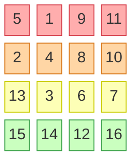

After rotation:
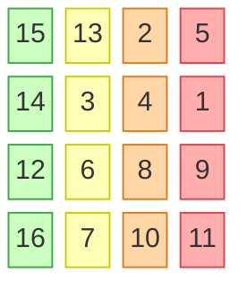

**Example 5**
```
Input: matrix = [[-1,-2,-3],[-4,-5,-6],[-7,-8,-9]]
Output: [[-7,-4,-1],[-8,-5,-2],[-9,-6,-3]]
Explanation: Negative values exercise the full range from the constraints. The rotation logic only rearranges positions, so the sign of every value is preserved.
```

Before rotation:
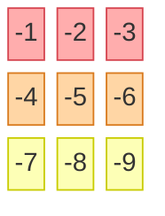

After rotation:
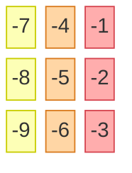

**Example 6**
```
Input: matrix = [[1,1,1],[2,2,2],[3,3,3]]
Output: [[3,2,1],[3,2,1],[3,2,1]]
Explanation: Every row is made of duplicate values. This confirms the rotation is purely positional — it does not rely on values being distinct, unlike problems that use values as identifiers.
```

Before rotation:
```mermaid
block-beta
columns 3
    r0c0["1"] r0c1["1"] r0c2["1"]
    r1c0["2"] r1c1["2"] r1c2["2"]
    r2c0["3"] r2c1["3"] r2c2["3"]
    classDef rowA fill:#ffadad,stroke:#d64550,color:#4a0000
    classDef rowB fill:#ffd6a5,stroke:#d97b1f,color:#4a2600
    classDef rowC fill:#fdffb6,stroke:#c9cc00,color:#3a3a00
    class r0c0,r0c1,r0c2 rowA
    class r1c0,r1c1,r1c2 rowB
    class r2c0,r2c1,r2c2 rowC
```

After rotation:
```mermaid
block-beta
columns 3
    r0c0["3"] r0c1["2"] r0c2["1"]
    r1c0["3"] r1c1["2"] r1c2["1"]
    r2c0["3"] r2c1["2"] r2c2["1"]
    classDef rowA fill:#ffadad,stroke:#d64550,color:#4a0000
    classDef rowB fill:#ffd6a5,stroke:#d97b1f,color:#4a2600
    classDef rowC fill:#fdffb6,stroke:#c9cc00,color:#3a3a00
    class r0c2,r1c2,r2c2 rowA
    class r0c1,r1c1,r2c1 rowB
    class r0c0,r1c0,r2c0 rowC
```

**Example 7**
```
Input: matrix = [[1,2,3,4,5],[6,7,8,9,10],[11,12,13,14,15],[16,17,18,19,20],[21,22,23,24,25]]
Output: [[21,16,11,6,1],[22,17,12,7,2],[23,18,13,8,3],[24,19,14,9,4],[25,20,15,10,5]]
Explanation: A larger 5x5 matrix. It shows the same row-to-column pattern scales cleanly beyond the 3x3/4x4 examples: row 4 (bottom) becomes column 0 (leftmost), row 3 becomes column 1, and so on up to row 0 becoming column 4 (rightmost).
```

Before rotation:
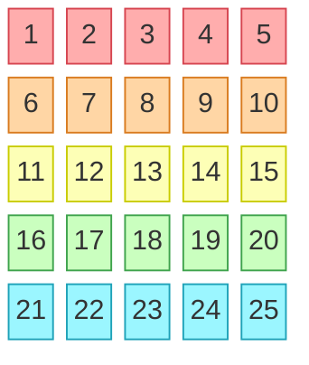

After rotation:
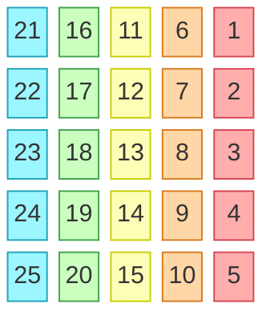

## Constraints

- `n == matrix.length == matrix[i].length`
- `1 <= n <= 20`
- `-1000 <= matrix[i][j] <= 1000`

## Hints

1. Rotating in-place without a second matrix means you need a way to express the rotation as a sequence of swaps within the same array.
2. A 90-degree rotation can be decomposed into two simpler, well-known in-place operations performed one after the other.
3. Try transposing the matrix first (swap `matrix[i][j]` with `matrix[j][i]`) — what shape do you get, and how close is it to the answer?
4. After transposing, look at what happens if you reverse each row individually.
5. Alternatively, you can rotate directly by swapping four cells at a time in concentric square "layers," moving from the outermost layer inward.
