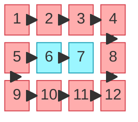
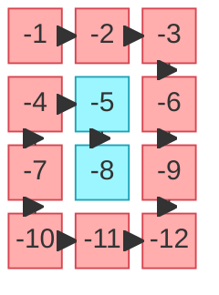

# Spiral Matrix

**Date added:** 2026-09-11

## Problem Description

Given an `m x n` matrix, return all elements of the matrix in spiral order — starting at the top-left cell, moving right across the top row, then down the right column, then left across the bottom row, then up the left column, and repeating with the next inner layer until every cell has been visited.

**Source:** https://leetcode.com/problems/spiral-matrix/description/

## Examples

Legend for the diagrams: arrows follow the exact order cells are visited. Cells on the outer boundary of the current matrix are colored red (`outer`); cells left over once that boundary has been fully consumed — the next layer in — are colored blue (`inner`). For matrices with only one ring (a single row, a single column, or a 2x2 square), every cell is `outer` since there is no inner layer left to peel.

**Example 1**
```
Input: matrix = [[7]]
Output: [7]
Explanation: A single-cell matrix (m == n == 1), the minimum allowed size. There is nowhere to spiral to, so the answer is just that one value.
```



```mermaid
block-beta
columns 1
    r0c0["7"]
    classDef outer fill:#ffadad,stroke:#d64550,color:#4a0000
    class r0c0 outer
```

**Example 2**
```
Input: matrix = [[1,2,3,4,5]]
Output: [1,2,3,4,5]
Explanation: A single row (m == 1). With only one row, the spiral never turns downward — it is a straight left-to-right sweep.
```



```mermaid
block-beta
columns 5
    r0c0["1"] r0c1["2"] r0c2["3"] r0c3["4"] r0c4["5"]
    r0c0 --> r0c1
    r0c1 --> r0c2
    r0c2 --> r0c3
    r0c3 --> r0c4
    classDef outer fill:#ffadad,stroke:#d64550,color:#4a0000
    class r0c0,r0c1,r0c2,r0c3,r0c4 outer
```

**Example 3**
```
Input: matrix = [[1],[2],[3],[4],[5]]
Output: [1,2,3,4,5]
Explanation: A single column (n == 1). With only one column, the spiral never turns sideways — it is a straight top-to-bottom sweep.
```



```mermaid
block-beta
columns 1
    r0c0["1"]
    r1c0["2"]
    r2c0["3"]
    r3c0["4"]
    r4c0["5"]
    r0c0 --> r1c0
    r1c0 --> r2c0
    r2c0 --> r3c0
    r3c0 --> r4c0
    classDef outer fill:#ffadad,stroke:#d64550,color:#4a0000
    class r0c0,r1c0,r2c0,r3c0,r4c0 outer
```

**Example 4**
```
Input: matrix = [[1,2],[3,4]]
Output: [1,2,4,3]
Explanation: The smallest non-trivial square (n == 2). After the top row (1, 2), the spiral drops down the right column (4) then finishes along the bottom row (3) — there is no room left for an upward or inner leg.
```



```mermaid
block-beta
columns 2
    r0c0["1"] r0c1["2"]
    r1c0["3"] r1c1["4"]
    r0c0 --> r0c1
    r0c1 --> r1c1
    r1c1 --> r1c0
    classDef outer fill:#ffadad,stroke:#d64550,color:#4a0000
    class r0c0,r0c1,r1c0,r1c1 outer
```

**Example 5**
```
Input: matrix = [[1,2,3],[4,5,6],[7,8,9]]
Output: [1,2,3,6,9,8,7,4,5]
Explanation: The classic 3x3 case from the problem statement. The outer ring is traversed clockwise (1,2,3,6,9,8,7,4), and the single leftover center cell (5) forms its own one-cell inner layer.
```



```mermaid
block-beta
columns 3
    r0c0["1"] r0c1["2"] r0c2["3"]
    r1c0["4"] r1c1["5"] r1c2["6"]
    r2c0["7"] r2c1["8"] r2c2["9"]
    r0c0 --> r0c1
    r0c1 --> r0c2
    r0c2 --> r1c2
    r1c2 --> r2c2
    r2c2 --> r2c1
    r2c1 --> r2c0
    r2c0 --> r1c0
    r1c0 --> r1c1
    classDef outer fill:#ffadad,stroke:#d64550,color:#4a0000
    classDef inner fill:#9bf6ff,stroke:#1fa2b8,color:#00343d
    class r0c0,r0c1,r0c2,r1c2,r2c2,r2c1,r2c0,r1c0 outer
    class r1c1 inner
```

**Example 6**
```
Input: matrix = [[1,2,3,4],[5,6,7,8],[9,10,11,12]]
Output: [1,2,3,4,8,12,11,10,9,5,6,7]
Explanation: A wide rectangle (m < n), matching the problem statement's second example. The outer ring wraps all the way around the border; the leftover middle-row cells (6, 7) form a flat, two-cell inner layer traversed left to right.
```



**Example 7**
```
Input: matrix = [[-1,-2,-3],[-4,-5,-6],[-7,-8,-9],[-10,-11,-12]]
Output: [-1,-2,-3,-6,-9,-12,-11,-10,-7,-4,-5,-8]
Explanation: A tall rectangle (m > n) with negative values exercising the full range from the constraints. The spiral logic only rearranges positions, so the sign of every value is preserved. The leftover middle-column cells (-5, -8) form a flat, two-cell inner layer traversed top to bottom.
```



## Constraints

- `m == matrix.length`
- `n == matrix[i].length`
- `1 <= m, n <= 10`
- `-100 <= matrix[i][j] <= 100`

## Hints

1. Think about the boundaries of the matrix you're allowed to visit — top, bottom, left, right — and how they must shrink as you consume each edge.
2. Try simulating the four directions (right, down, left, up) as separate loops that run one after another, each sweeping one edge of the current boundary.
3. After finishing an edge, move the corresponding boundary inward (e.g., after sweeping the top row, increment the top boundary) so those cells are never revisited.
4. Watch out for degenerate cases: a single row or single column would get swept twice if you're not careful — guard the third and fourth loops with a check that the boundary hasn't already crossed (e.g., only sweep the bottom row if `top <= bottom`).
5. Repeat the four-direction sweep with the updated boundaries until they cross; that crossing is your loop's terminating condition (e.g., `while (top <= bottom && left <= right)`).
