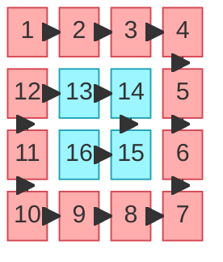
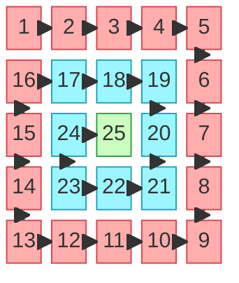
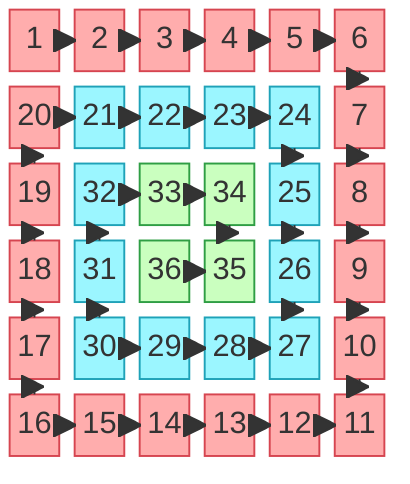
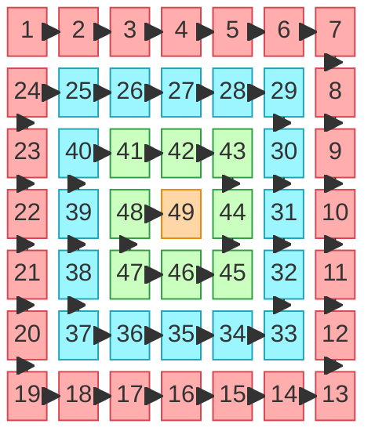

# Spiral Matrix II

**Date added:** 2026-09-11

## Problem Description

Given a positive integer `n`, generate an `n x n` matrix filled with elements from 1 to n^2 in spiral order — starting at the top-left cell, placing 1 there, then moving right across the top row, then down the right column, then left across the bottom row, then up the left column, and repeating with the next inner layer until every cell has been filled.

**Source:** https://leetcode.com/problems/spiral-matrix-ii/description/

## Examples

Legend for the diagrams: node labels are the value written into that cell, and arrows follow the order values are placed (1 → 2 → 3 → ...). Cells belong to a "ring" — the outermost ring is red (`outer`), the next ring in is cyan (`mid`), the ring after that is green (`inner`), and — for matrices deep enough to have a lone center cell — that cell is gold (`center`). Smaller matrices simply run out of rings before using every color.

**Example 1**
```
Input: n = 1
Output: [[1]]
Explanation: A single-cell matrix, the minimum allowed size. There is nowhere to spiral to, so 1 is placed and the matrix is done.
```



```mermaid
block-beta
columns 1
    r0c0["1"]
    classDef outer fill:#ffadad,stroke:#d64550,color:#4a0000
    class r0c0 outer
```

**Example 2**
```
Input: n = 2
Output: [[1,2],[4,3]]
Explanation: The smallest square with an actual turn. After the top row (1, 2), the spiral drops down the right column (3) then finishes along the bottom row (4) — there is no room left for an inner ring.
```



```mermaid
block-beta
columns 2
    r0c0["1"] r0c1["2"]
    r1c0["4"] r1c1["3"]
    r0c0 --> r0c1
    r0c1 --> r1c1
    r1c1 --> r1c0
    classDef outer fill:#ffadad,stroke:#d64550,color:#4a0000
    class r0c0,r0c1,r1c0,r1c1 outer
```

**Example 3**
```
Input: n = 3
Output: [[1,2,3],[8,9,4],[7,6,5]]
Explanation: The classic case from the problem statement. The outer ring is filled clockwise (1,2,3,4,5,6,7,8), and the single leftover center cell is filled last with 9.
```



```mermaid
block-beta
columns 3
    r0c0["1"] r0c1["2"] r0c2["3"]
    r1c0["8"] r1c1["9"] r1c2["4"]
    r2c0["7"] r2c1["6"] r2c2["5"]
    r0c0 --> r0c1
    r0c1 --> r0c2
    r0c2 --> r1c2
    r1c2 --> r2c2
    r2c2 --> r2c1
    r2c1 --> r2c0
    r2c0 --> r1c0
    r1c0 --> r1c1
    classDef outer fill:#ffadad,stroke:#d64550,color:#4a0000
    classDef inner fill:#9bf6ff,stroke:#1fa2b8,color:#00343d
    class r0c0,r0c1,r0c2,r1c2,r2c2,r2c1,r2c0,r1c0 outer
    class r1c1 inner
```

**Example 4**
```
Input: n = 4
Output: [[1,2,3,4],[12,13,14,5],[11,16,15,6],[10,9,8,7]]
Explanation: An even-sized matrix (n == 4). The outer ring (1 through 12) wraps the whole border; the leftover inner 2x2 block (13, 14, 15, 16) forms its own complete ring with no single center cell, since an even-sized square never leaves exactly one cell behind.
```



**Example 5**
```
Input: n = 5
Output: [[1,2,3,4,5],[16,17,18,19,6],[15,24,25,20,7],[14,23,22,21,8],[13,12,11,10,9]]
Explanation: An odd-sized matrix with three full rings: the outer ring (1-16), a middle ring (17-24), and a single leftover center cell (25) — the same nesting pattern as the n = 3 case, one layer deeper.
```



**Example 6**
```
Input: n = 6
Output: [[1,2,3,4,5,6],[20,21,22,23,24,7],[19,32,33,34,25,8],[18,31,36,35,26,9],[17,30,29,28,27,10],[16,15,14,13,12,11]]
Explanation: An even-sized matrix one step past example 4, with three full rings and — since n is even — no leftover center cell. The outer ring (1-20), middle ring (21-32), and innermost 2x2 ring (33-36) each close on themselves.
```



**Example 7**
```
Input: n = 7
Output: [[1,2,3,4,5,6,7],[24,25,26,27,28,29,8],[23,40,41,42,43,30,9],[22,39,48,49,44,31,10],[21,38,47,46,45,32,11],[20,37,36,35,34,33,12],[19,18,17,16,15,14,13]]
Explanation: The deepest example here, with four full rings: outer (1-24), a second ring (25-40), a third ring (41-48), and a single leftover center cell (49) — the same odd-sized nesting as n = 3 and n = 5, now three layers deep.
```



## Constraints

- `1 <= n <= 20`

## Hints

1. Think about generating the matrix the same way you'd traverse an already-filled matrix in spiral order — except instead of reading a value, you're writing the next one into that cell.
2. Track four shrinking boundaries — `top`, `bottom`, `left`, `right` — the same technique used to walk an existing matrix in spiral order.
3. Sweep each boundary in turn (left→right along the top row, top→bottom along the right column, right→left along the bottom row, bottom→top along the left column), incrementing a running counter each time you place a value.
4. After finishing a sweep along one edge, move that boundary inward so its cells are never revisited.
5. Since `n` is always a positive integer and the matrix is always square, there's no ragged-edge case to guard against — just repeat the four sweeps until the boundaries cross, e.g. `while (top <= bottom && left <= right)`.
