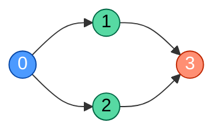
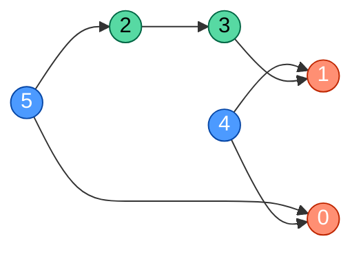
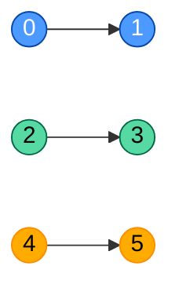
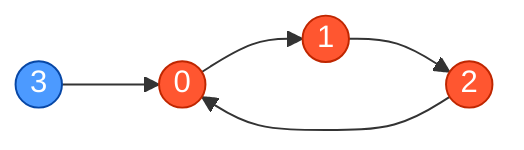

# Topological Sort (Kahn's Algorithm)

**Date added:** 2026-09-13

## Problem Description

You are given an integer `n` representing the number of nodes in a directed graph, labeled from `0` to `n - 1`, and a list `edges` where `edges[i] = [u, v]` indicates a directed edge from node `u` to node `v`, meaning `u` must appear before `v` in the ordering.

Return any valid topological ordering of all `n` nodes as an array. If no valid ordering exists because the graph contains a cycle, return an empty array.

Implement this using **Kahn's algorithm**: compute the in-degree of every node, seed a queue with all nodes that currently have in-degree 0, then repeatedly pop a node, append it to the result, and decrement the in-degree of its neighbors — pushing any neighbor whose in-degree drops to 0. If the result doesn't end up containing all `n` nodes, the graph has a cycle.

## Examples

**Example 1 — diamond DAG**
```
Input: n = 4, edges = [[0,1],[0,2],[1,3],[2,3]]
Output: [0,1,2,3]
Explanation: Node 0 has no incoming edges, so it comes first. After removing 0, nodes 1 and 2 both reach in-degree 0. Either order between them is valid since node 3 depends on both. [0,2,1,3] is also a valid answer.
```


**Example 2 — two-node cycle**
```
Input: n = 2, edges = [[0,1],[1,0]]
Output: []
Explanation: 0 must come before 1, and 1 must come before 0 — this is a cycle, so no valid ordering exists.
```


**Example 3 — single isolated node**
```
Input: n = 1, edges = []
Output: [0]
Explanation: A single node with no edges has a trivial topological order containing just itself.
```


```mermaid
flowchart LR
    n0((0))
    style n0 fill:#B3BAC5,stroke:#42526E,color:#000
```

**Example 4 — multiple independent roots**
```
Input: n = 6, edges = [[5,2],[5,0],[4,0],[4,1],[2,3],[3,1]]
Output: [4,5,2,3,1,0]
Explanation: Nodes 4 and 5 have no incoming edges, so they can start in either order. Removing them frees node 2 (needs only 5) and eventually 0, 3, and 1 as their dependencies are satisfied.
```


**Example 5 — no edges at all**
```
Input: n = 3, edges = []
Output: [0,1,2]
Explanation: With no edges at all, every permutation of the nodes is a valid topological order.
```


**Example 6 — disconnected components**
```
Input: n = 6, edges = [[0,1],[2,3],[4,5]]
Output: [0,2,4,1,3,5]
Explanation: The graph has three unrelated chains: 0→1, 2→3, and 4→5. Since no edges cross between them, they can be interleaved in the result in any relative order as long as each pair keeps its own internal direction.
```


**Example 7 — cycle hidden inside a larger graph**
```
Input: n = 4, edges = [[0,1],[1,2],[2,0],[3,0]]
Output: []
Explanation: Nodes 0, 1, and 2 form a cycle (0→1→2→0). Even though node 3 has no incoming edges and points cleanly into the cycle, the presence of any cycle anywhere in the graph means no valid ordering of all n nodes exists.
```


## Constraints

- `1 <= n <= 10^4`
- `0 <= edges.length <= min(n * (n - 1), 10^5)`
- `edges[i].length == 2`
- `0 <= edges[i][0], edges[i][1] < n`
- `edges[i][0] != edges[i][1]` (no self-loops)
- The graph may contain a cycle, in which case no valid ordering exists.

## Hints

1. Start by computing the in-degree (number of incoming edges) for every node from 0 to n - 1.
2. Any node with an in-degree of 0 has no unmet dependencies, so it's safe to place it next in the ordering — seed a queue with all such nodes.
3. When you remove a node from the queue and add it to the result, "remove" its outgoing edges too by decrementing the in-degree of each neighbor it points to.
4. Whenever decrementing a neighbor's in-degree brings it down to 0, that neighbor has no more unmet dependencies — push it onto the queue.
5. Keep a count of how many nodes you've placed into the result. If it ends up less than n once the queue empties, some nodes were never reachable with in-degree 0, which means a cycle exists — return an empty array in that case.
