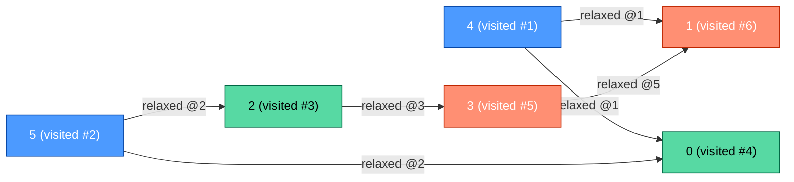
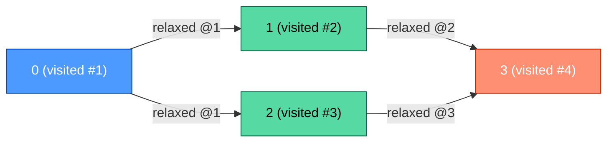

| | |
|---|---|
| **Solved on** | 2026-09-13 |
| **DSA Category** | Topological Sort |

## 1. Your Solution Assessment

**Correctness:** Correct. It handles every case exercised by the tests: multi-root DAGs, a graph with no edges at all (every node still appears, per the vacuous-truth discussion above), a graph with a single node, disconnected components, duplicate edges, and both full-graph and partial-subset cycles. The two bugs found during review — the premature `edges.length == 0` early return and the `graph.get(current)` NPE risk for sink/isolated nodes — are both fixed (`Solution.java:23`, `Solution.java:46`).

**Code quality:** Clean decomposition into `buildGraph`, `getInDegrees`, and `toArray` keeps `topoSortKahn` readable as a straight translation of the five Kahn's-algorithm steps, and the step comments track that structure well. Variable names (`inDegrees`, `queue`, `order`) are self-explanatory. `graph.getOrDefault(current, List.of())` is the right fix for nodes with no outgoing edges — no wasted allocation, no null risk.

**Time complexity:** O(n + m), where n = `nodes` and m = `edges.length`. `getInDegrees` and `buildGraph` are each one pass over `edges` (O(m)). The BFS loop dequeues each node exactly once (O(n)) and, across all iterations, walks each adjacency-list entry exactly once (O(m) total, since the sum of adjacency-list lengths equals the edge count). `toArray` is O(n).

**Space complexity:** O(n + m). The adjacency map holds one entry per edge (O(m)), `inDegrees` and `order`/the queue are each O(n).

**Algorithm trace** — BFS traversal order and the step at which each edge was relaxed, on `n = 6, edges = [[5,2],[5,0],[4,0],[4,1],[2,3],[3,1]]`:



Queue seeding scans vertices `0..5` for in-degree 0, finding `4` then `5`, so the queue starts as `[4, 5]`. Dequeuing `4` relaxes `0` and `1` (in-degrees 2→1, 2→1 — neither hits 0 yet). Dequeuing `5` relaxes `2` (1→0, enqueued) and `0` (1→0, enqueued). Dequeuing `2` relaxes `3` (1→0, enqueued). Dequeuing `0` has no outgoing edges. Dequeuing `3` relaxes `1` (1→0, enqueued). Dequeuing `1` has no outgoing edges. Final order: `[4, 5, 2, 0, 3, 1]` — a different (but equally valid) permutation than the one shown in the README example, since node `0` and node `3` had no ordering constraint between them.

## 2. Optimal Approach

Kahn's algorithm *is* the optimal approach here — there's no asymptotically better way to produce a topological order, since you must at minimum look at every node and every edge once. The plain-language idea: a node can only be placed in the output once all the nodes that must come before it have already been placed. Track that readiness with an in-degree counter per node; a counter reaching 0 means "ready." Process ready nodes with a FIFO queue so each node is finalized exactly once, and propagate readiness to its neighbors as it's removed.

**Time complexity:** O(n + m) — same reasoning as above: one pass to compute in-degrees/adjacency, one pass through the queue that touches every node once and every edge once.

**Space complexity:** O(n + m) — adjacency list plus the in-degree array, queue, and output array.

```java
public int[] topoSortKahn(int n, int[][] edges) {
    List<List<Integer>> graph = new ArrayList<>();
    int[] inDegree = new int[n];

    for (int i = 0; i < n; i++) {
        graph.add(new ArrayList<>());
    }

    for (int[] edge : edges) {
        graph.get(edge[0]).add(edge[1]);
        inDegree[edge[1]]++;
    }

    Deque<Integer> queue = new ArrayDeque<>();
    for (int node = 0; node < n; node++) {
        if (inDegree[node] == 0) queue.offer(node);
    }

    int[] order = new int[n];
    int filled = 0;

    while (!queue.isEmpty()) {
        int current = queue.poll();
        order[filled++] = current;

        for (int neighbor : graph.get(current)) {
            if (--inDegree[neighbor] == 0) queue.offer(neighbor);
        }
    }

    return filled == n ? order : new int[0];
}
```

This differs from your version mainly in using a pre-sized `List<List<Integer>>` indexed by node id instead of a `HashMap`, which avoids hashing overhead and the need for `getOrDefault`, and writing directly into a pre-sized `int[]` instead of an `ArrayList<Integer>` followed by a conversion pass — a constant-factor cleanup, not an asymptotic one.

**Algorithm trace** on `n = 4, edges = [[0,1],[0,2],[1,3],[2,3]]`:



Queue starts as `[0]` (only node with in-degree 0). Dequeuing `0` relaxes `1` (1→0, enqueued) and `2` (1→0, enqueued), giving queue `[1, 2]`. Dequeuing `1` relaxes `3` (2→1 — not ready yet). Dequeuing `2` relaxes `3` (1→0, enqueued). Dequeuing `3` has no outgoing edges. Final order: `[0, 1, 2, 3]`, matching the README example exactly since this graph has only one valid ordering up to the 1/2 swap, and the queue happened to prefer 1 before 2.

## 3. Alternative Approaches

### DFS-based topological sort (post-order + reverse)

Run a DFS from every unvisited node; when a node's entire subtree has been explored, push it onto a stack. Reversing the stack at the end yields a valid topological order, because a node is only pushed after everything reachable from it has already been pushed (so it ends up positioned before its dependents once reversed). Cycle detection requires tracking an "in the current recursion path" marker (a 3-color scheme) and failing if DFS revisits a node still on that path.

**Time complexity:** O(n + m) — each node is visited once, each edge is traversed once.
**Space complexity:** O(n + m) — adjacency list plus the recursion stack and the output stack, both O(n) in the worst case (a degenerate chain).

**When to reach for it:** when you're more comfortable reasoning recursively than iteratively, or the interviewer specifically wants to see DFS-based ordering (e.g. as a stepping stone to Tarjan's SCC algorithm, which reuses the same recursion-stack idea).

```java
public int[] topoSortDfs(int n, int[][] edges) {
    List<List<Integer>> graph = new ArrayList<>();
    for (int i = 0; i < n; i++) graph.add(new ArrayList<>());
    for (int[] edge : edges) graph.get(edge[0]).add(edge[1]);

    int[] state = new int[n]; // 0 = unvisited, 1 = in progress, 2 = finished
    Deque<Integer> stack = new ArrayDeque<>();
    boolean[] hasCycle = {false};

    for (int node = 0; node < n && !hasCycle[0]; node++) {
        if (state[node] == 0) dfs(node, graph, state, stack, hasCycle);
    }

    if (hasCycle[0]) return new int[0];

    int[] order = new int[n];
    for (int i = 0; i < n; i++) order[i] = stack.pop();
    return order;
}

private void dfs(int node, List<List<Integer>> graph, int[] state, Deque<Integer> stack, boolean[] hasCycle) {
    state[node] = 1;

    for (int neighbor : graph.get(node)) {
        if (state[neighbor] == 1) {
            hasCycle[0] = true;
            return;
        }
        if (state[neighbor] == 0) dfs(neighbor, graph, state, stack, hasCycle);
    }

    state[node] = 2;
    stack.push(node);
}
```

**Algorithm trace** on `n = 4, edges = [[0,1],[0,2],[1,3],[2,3]]`:

| Depth | Call | Returns |
|---|---|---|
| 0 | dfs(0) | explores 1, then 2 → push 0 |
| 1 | dfs(1) | explores 3 → push 1 |
| 2 | dfs(3) | no unvisited neighbors → push 3 |
| 1 | dfs(2) | 3 already finished (skip) → push 2 |

→ push sequence = `[3, 1, 2, 0]` → pop (reverse) order = `[0, 2, 1, 3]`

### Brute-force repeated scan (no queue)

Same in-degree idea as Kahn's algorithm, but instead of a queue, repeatedly scan the full node list on every iteration looking for *any* unprocessed node with in-degree 0, remove it, and decrement its neighbors' in-degrees. Functionally identical output to Kahn's algorithm, just without the O(1) queue lookup.

**Time complexity:** O(n² + m) — the outer loop runs n times, and each iteration does an O(n) scan to find a ready node, plus the same O(m) total edge relaxations as Kahn's.
**Space complexity:** O(n + m) — same storage as Kahn's, no queue needed.

**When to reach for it:** only under interview time pressure when you can't recall queue-based Kahn's but do remember the in-degree idea — it's correct and easy to reason about, just asymptotically worse for large n. Not worth using once you know Kahn's algorithm.

**Algorithm trace** (step table) on `n = 4, edges = [[0,1],[0,2],[1,3],[2,3]]`:

| Iteration | in-degree snapshot [0,1,2,3] | node picked (first found, left to right) | order after |
|---|---|---|---|
| 1 | [0,1,1,2] | 0 | [0] |
| 2 | [-,0,0,2] | 1 | [0,1] |
| 3 | [-,-,0,1] | 2 | [0,1,2] |
| 4 | [-,-,-,0] | 3 | [0,1,2,3] |

→ return `[0,1,2,3]`
