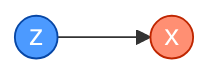
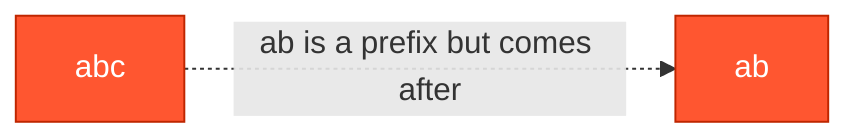
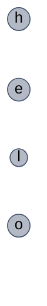
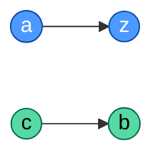
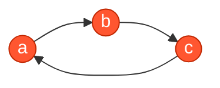

# Alien Dictionary

**Date added:** 2026-09-13

## Problem Description

There is a new alien language that uses the English alphabet, but possibly in a different order. You are given a list of strings `words` from the alien language's dictionary, where the strings in `words` are sorted lexicographically according to the rules of this new language.

Derive the order of letters in this language. Return a string containing the unique letters that appear in `words`, arranged in a valid alphabetical order for this alien language. If there is no valid ordering that satisfies the constraints implied by `words`, return an empty string `""`.

If multiple valid orderings exist, any one of them is an acceptable answer.

Two situations make the input invalid:
1. Comparing two adjacent words produces conflicting constraints elsewhere in the list, forming a cycle (e.g. `x` must come before `z`, but also `z` before `x`).
2. A word appears immediately after another word of which it is a strict prefix (e.g. `"abc"` followed by `"ab"`) — that can never happen in a validly sorted dictionary, since the shorter word would have to come first.

**Source:** https://leetcode.com/problems/alien-dictionary/

## Examples

**Example 1 — classic multi-letter chain**
```
Input: words = ["wrt","wrf","er","ett","rftt"]
Output: "wertf"
Explanation: Comparing adjacent words gives: wrt/wrf → t before f; wrf/er → w before e; er/ett → r before t; ett/rftt → e before r. Chaining these constraints (w→e→r→t→f) fully determines the order of all 5 letters.
```


**Example 2 — two single-letter words**
```
Input: words = ["z","x"]
Output: "zx"
Explanation: Comparing "z" and "x" at index 0 immediately shows z before x. With only two letters and one constraint, "zx" is the only valid order.
```


**Example 3 — direct two-letter cycle**
```
Input: words = ["z","x","z"]
Output: ""
Explanation: "z" before "x" implies z before x, but "x" before "z" implies x before z. These two constraints contradict each other, so no valid ordering exists.
```


**Example 4 — invalid prefix order**
```
Input: words = ["abc","ab"]
Output: ""
Explanation: "ab" is a strict prefix of "abc", yet it appears after "abc" in the list. In any correctly sorted dictionary, the shorter prefix must come first, so this input can never be valid — regardless of what the alien alphabet order is.
```


**Example 5 — single word, no constraints**
```
Input: words = ["hello"]
Output: "hleo"
Explanation: With only one word, there are no adjacent pairs to compare, so no ordering constraints exist between the unique letters h, e, l, o. Any permutation of these 4 letters is a valid answer.
```


**Example 6 — independent constraint groups**
```
Input: words = ["ac","ab","zc","zb"]
Output: "aczb"
Explanation: ac/ab → c before b. ab/zc → a before z. zc/zb → c before b (already known). The constraints a→z and c→b are unrelated to each other, so any interleaving that respects both individually is valid, e.g. "aczb" or "aczb" reordered as "acbz".
```


**Example 7 — hidden cycle across a larger set**
```
Input: words = ["a","b","c","a"]
Output: ""
Explanation: a/b → a before b. b/c → b before c. c/a → c before a. Chaining these gives a before b before c before a — a cycle spanning all three letters, so no valid ordering exists.
```


## Constraints

- `1 <= words.length <= 100`
- `1 <= words[i].length <= 100`
- `words[i]` consists of only lowercase English letters.

## Hints

1. Look at each pair of **adjacent** words and compare them character by character until you find the first position where they differ — that single difference gives you one ordering constraint between two letters.
2. What does it mean if you compare two adjacent words and never find a difference before one of them runs out of characters? If the *longer* word came first, the input is invalid — return `""` right away.
3. Model every constraint you extract as a directed edge in a graph, where an edge `u → v` means letter `u` must come before letter `v` in the alien alphabet.
4. Once the graph is built, what algorithm produces a linear ordering of nodes that respects every directed edge? (see [[Topological Sort]] if you've solved that problem already)
5. If your ordering ends up with fewer letters than the number of unique letters across all of `words`, the graph contains a cycle — return `""` in that case.
