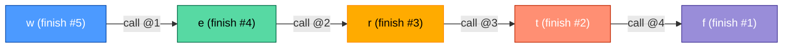

| | |
|---|---|
| **Solved on** | 2026-09-14 |
| **DSA Category** | Graphs |

## 1. Your Solution Assessment

**Correctness:** Correct. All 10 tests pass, covering the classic multi-letter chain, direct and hidden cycles, the invalid-prefix rule, a single word with no constraints, independent/branching constraint groups, repeated identical words, and the full 26-letter alphabet chain. Two earlier bugs were caught and fixed during review: comparing characters past the first difference between adjacent words (fabricating edges that don't belong, e.g. treating `"ab"` vs `"zc"` as also implying `b` before `c`), and incrementing a letter's in-degree even when the edge already existed in the graph (double-counting a constraint derived from two different word pairs, which permanently stranded that letter above in-degree 0). Both are now fixed with the `break` after the first difference (`Solution.java:49`) and the `graph.get(...).add(...)` guard before incrementing in-degree (`Solution.java:44`). The final cycle check (`Solution.java:81`) correctly compares the result length against the number of unique letters.

**Code quality:** The single-method structure reads clearly thanks to the `// Step 1/2/3` comments tracking the three phases (initialize, build graph, run Kahn's). Naming is mostly self-explanatory (`inDegrees`, `differenceExists`, `alphabet`), though `c` for the character index is a bit terser than the rest. Two small nitpicks: `import java.util.*;` is a wildcard import where the rest of the repo (e.g. `p081_topologicalsort`) uses explicit imports, and the `words == null` guard is dead code under this problem's constraints (`words.length >= 1` is guaranteed) — harmless, just unnecessary defensiveness.

**Time complexity:** O(C), where C is the total number of characters across all words. Step 1 is one pass over every character (O(C)). Step 2 compares each adjacent pair only up to (and including) their first difference before breaking, so across all pairs it's still bounded by O(C). Step 3's BFS is O(U + E), where U ≤ 26 unique letters and E ≤ 26·25/2 possible edges — a bounded constant dwarfed by C for any realistic input.

**Space complexity:** O(U + E) for `graph`, `inDegrees`, and the queue — bounded by the 26-letter alphabet regardless of how many words are given.

**Algorithm trace** — BFS visit order on `words = ["wrt","wrf","er","ett","rftt"]`:

Edges derived: `w→e`, `e→r`, `r→t`, `t→f`. Only `w` starts with in-degree 0, so exactly one new letter unlocks per step.


→ return `"wertf"`

## 2. Optimal Approach

This is exactly what you implemented: **Kahn's algorithm (BFS topological sort)**. Compare every pair of adjacent words to find the first index where they differ — that gives a "comes-before" edge between two letters. If no difference is found before the shorter word runs out and the first word is the longer one, the dictionary is invalid. Once the graph is built, seed a queue with every letter that has in-degree 0, repeatedly pop a letter into the result, and decrement its neighbors' in-degree, enqueueing any that reach 0. If the result doesn't include every unique letter, the graph has a cycle.

**Time complexity:** O(C) — dominated by building the graph, since the BFS itself is bounded by the 26-letter alphabet.

**Space complexity:** O(U + E) — bounded by the alphabet size regardless of input size.

```java
public String alienOrder(String[] words) {
    Map<Character, Set<Character>> graph = new HashMap<>();
    Map<Character, Integer> inDegrees = new HashMap<>();

    for (String word : words) {
        for (char letter : word.toCharArray()) {
            graph.putIfAbsent(letter, new HashSet<>());
            inDegrees.putIfAbsent(letter, 0);
        }
    }

    for (int i = 0; i < words.length - 1; i++) {
        String first = words[i];
        String second = words[i + 1];
        int minLength = Math.min(first.length(), second.length());
        boolean foundDifference = false;

        for (int j = 0; j < minLength; j++) {
            char before = first.charAt(j);
            char after = second.charAt(j);

            if (before != after) {
                if (graph.get(before).add(after)) {
                    inDegrees.put(after, inDegrees.get(after) + 1);
                }
                foundDifference = true;
                break;
            }
        }

        if (!foundDifference && first.length() > second.length()) return "";
    }

    Deque<Character> queue = new ArrayDeque<>();
    for (Map.Entry<Character, Integer> entry : inDegrees.entrySet()) {
        if (entry.getValue() == 0) queue.offer(entry.getKey());
    }

    StringBuilder order = new StringBuilder();
    while (!queue.isEmpty()) {
        char current = queue.poll();
        order.append(current);

        for (char neighbor : graph.get(current)) {
            inDegrees.put(neighbor, inDegrees.get(neighbor) - 1);
            if (inDegrees.get(neighbor) == 0) queue.offer(neighbor);
        }
    }

    return order.length() == inDegrees.size() ? order.toString() : "";
}
```

**Algorithm trace:** identical to the one above — your implementation already matches this trace exactly.

## 3. Alternative Approaches

### DFS Topological Sort (Post-order Reversal)

Build the same letter-precedence graph, then run DFS from every unvisited letter using 3-state marking (unvisited / visiting / visited). If DFS revisits a letter that's still "visiting" (on the current recursion path), a cycle exists. When a letter's DFS call finishes exploring all its neighbors, push it onto a stack — popping the stack at the end yields a valid order, since a letter is only pushed after everything it points to has already finished.

**Time complexity:** O(C), same reasoning as the BFS approach.
**Space complexity:** O(U + E) for the graph and state map, plus O(U) recursion depth in the worst case (a single 26-letter chain).
**When to use:** Equally optimal — pick this over BFS if you're more comfortable reasoning about topological sort via DFS finish-times, or if the interviewer specifically asks for a DFS-based approach.

```java
private boolean dfs(char node, Map<Character, Set<Character>> graph, Map<Character, Integer> state, Deque<Character> postOrder) {
    state.put(node, 1); // visiting

    for (char neighbor : graph.get(node)) {
        int neighborState = state.getOrDefault(neighbor, 0);

        if (neighborState == 1) return false; // back edge -> cycle
        if (neighborState == 0 && !dfs(neighbor, graph, state, postOrder)) return false;
    }

    state.put(node, 2); // visited
    postOrder.push(node);

    return true;
}
```

**Algorithm trace** — DFS call/finish order on the same input, starting at `w`:


Stack bottom to top after all calls finish: `f, t, r, e, w`. Popping gives `"wertf"`.

### Brute Force — Try Every Permutation

Collect the unique letters, generate every permutation, and check each one against every adjacent word pair (the letter at their first differing position must appear earlier in the permutation). Return the first permutation that satisfies all pairs.

**Time complexity:** O(U! · C) — factorial in the number of unique letters (≤ 26), only tractable for a handful of distinct letters.
**Space complexity:** O(U) per permutation being built/checked.
**When acceptable:** Only under interview time pressure with very few unique letters, and only after acknowledging it doesn't scale — mainly useful to demonstrate you understand what "valid order" means before reaching for the graph-based approach.

**Algorithm trace** — permutations tried for `words = ["z","x"]` (unique letters `{x, z}`):

| Attempt | Permutation tried | Constraint check (`z` before `x`?) | Valid? |
|---|---|---|---|
| 1 | `"xz"` | position(z)=1, position(x)=0 → z is **not** before x | No |
| 2 | `"zx"` | position(z)=0, position(x)=1 → z before x ✓ | **Yes** → return `"zx"` |
