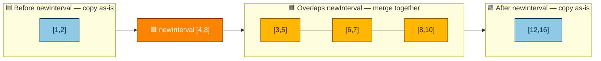
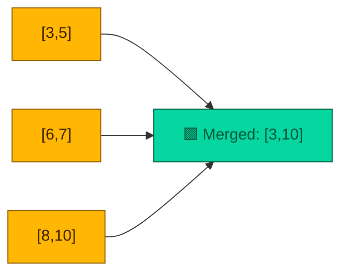

# Insert Interval

**Date added:** 2026-09-15

## Problem Description

You are given an array of non-overlapping intervals `intervals` where `intervals[i] = [starti, endi]` represent the start and the end of the `i`th interval and `intervals` is sorted in ascending order by `starti`. You are also given an interval `newInterval = [start, end]` that represents the start and end of another interval.

Two intervals are considered overlapping if they share at least one point.

Insert `newInterval` into `intervals` such that `intervals` is still sorted in ascending order by `starti` and `intervals` still does not have any overlapping intervals (merge overlapping intervals if necessary).

Return `intervals` after the insertion.

Note that you don't need to modify `intervals` in-place. You can make a new array and return it.

**Source:** https://leetcode.com/problems/insert-interval

## Diagram: Algorithm Phases

Every solution walks through three phases relative to `newInterval`: intervals ending strictly before it, intervals overlapping it, and intervals starting strictly after it.



## Diagram: Merge Result

The three overlapping intervals `[3,5]`, `[6,7]`, `[8,10]` collapse into a single merged interval `[3,10]` (Example 2).



## Examples

**Example 1**
```
Input: intervals = [[1,3],[6,9]], newInterval = [2,5]
Output: [[1,5],[6,9]]
Explanation: [2,5] overlaps [1,3] (they share the point 2 and beyond), so they merge into [1,5]. [6,9] does not overlap [2,5], so it stays as-is.
```

**Example 2**
```
Input: intervals = [[1,2],[3,5],[6,7],[8,10],[12,16]], newInterval = [4,8]
Output: [[1,2],[3,10],[12,16]]
Explanation: [4,8] overlaps [3,5], [6,7], and [8,10], so all four intervals merge into one: [3,10]. [1,2] and [12,16] don't touch [4,8], so they stay unchanged.
```

**Example 3**
```
Input: intervals = [], newInterval = [5,7]
Output: [[5,7]]
Explanation: The intervals array is empty, so newInterval is simply inserted as the only interval.
```

**Example 4**
```
Input: intervals = [[1,5]], newInterval = [6,8]
Output: [[1,5],[6,8]]
Explanation: newInterval starts right after [1,5] ends, but since 6 and 5 don't share a point, there is no overlap. Both intervals are kept separate, in order.
```

**Example 5**
```
Input: intervals = [[1,5]], newInterval = [2,3]
Output: [[1,5]]
Explanation: newInterval [2,3] is fully contained within [1,5]. Merging them produces the same bounds as [1,5], so the result is unchanged.
```

**Example 6**
```
Input: intervals = [[1,5]], newInterval = [0,0]
Output: [[0,0],[1,5]]
Explanation: newInterval [0,0] is a single point that ends before [1,5] starts (0 and 1 don't share a point), so it is inserted before the existing interval without merging.
```

**Example 7**
```
Input: intervals = [[3,5],[12,15]], newInterval = [6,6]
Output: [[3,5],[6,6],[12,15]]
Explanation: newInterval [6,6] is a single point that doesn't touch [3,5] (ends at 5) or [12,15] (starts at 12), so it is inserted in its sorted position as its own interval.
```

## Constraints

- `0 <= intervals.length <= 10^4`
- `intervals[i].length == 2`
- `0 <= starti <= endi <= 10^5`
- `intervals` is sorted by `starti` in ascending order.
- `newInterval.length == 2`
- `0 <= start <= end <= 10^5`

## Hints

1. Think about the three groups of intervals relative to `newInterval`: those that end entirely before it starts, those that overlap it, and those that start entirely after it ends.
2. The intervals that come before and after `newInterval` don't need any modification — they can be copied straight into the result.
3. For the overlapping group, what are the smallest start and largest end across all of them, including `newInterval` itself?
4. You can solve this in a single linear pass through `intervals`, since the array is already sorted by `starti`.
5. Keep expanding a running "current merged interval" (starting as `newInterval`) while the next interval in the array overlaps it, then push it to the result once no more intervals overlap.
