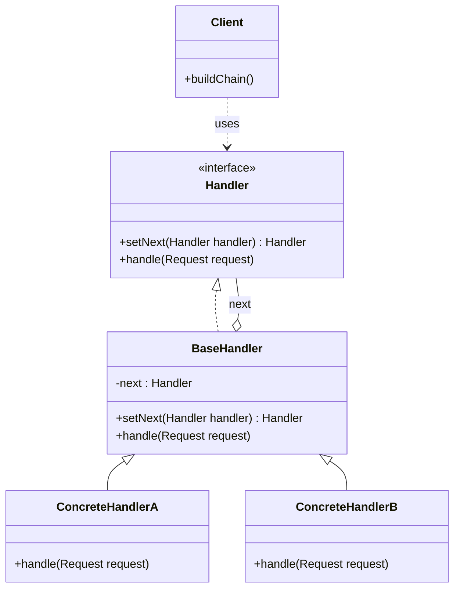

# Chain of Responsibility

## Intent

Pass a request along a **chain of handlers**. Each handler decides to process the request or pass it to the next handler in the chain.

---

## Structure



---

## Pseudocode

```java
// Request object
public record AuthRequest(String user, String resource, String role) {}

// Handler interface
public interface AuthHandler {
    AuthHandler setNext(AuthHandler next);
    boolean handle(AuthRequest request);
}

// Base handler — stores next, provides default pass-through
public abstract class BaseAuthHandler implements AuthHandler {
    private AuthHandler next;

    public AuthHandler setNext(AuthHandler next) {
        this.next = next;
        return next;  // return next so chains can be set up fluently
    }

    public boolean handle(AuthRequest request) {
        if (next != null) return next.handle(request);
        return false;  // no handler processed the request
    }
}

// Concrete handlers
public class AuthenticationHandler extends BaseAuthHandler {
    private static final Set<String> VALID_USERS = Set.of("alice", "bob");

    @Override
    public boolean handle(AuthRequest request) {
        if (!VALID_USERS.contains(request.user())) {
            System.out.println("Authentication failed for: " + request.user());
            return false;
        }
        System.out.println("Authenticated: " + request.user());
        return super.handle(request);  // pass to next
    }
}

public class AuthorizationHandler extends BaseAuthHandler {
    @Override
    public boolean handle(AuthRequest request) {
        if (!"admin".equals(request.role())) {
            System.out.println("Unauthorized role: " + request.role());
            return false;
        }
        System.out.println("Authorized: " + request.user());
        return super.handle(request);
    }
}

public class RateLimitHandler extends BaseAuthHandler {
    @Override
    public boolean handle(AuthRequest request) {
        System.out.println("Rate limit OK for: " + request.user());
        return super.handle(request);
    }
}

// Client — builds the chain
AuthHandler handler = new AuthenticationHandler();
handler.setNext(new AuthorizationHandler())
       .setNext(new RateLimitHandler());

handler.handle(new AuthRequest("alice", "/admin", "admin"));
```

---

## Template

```java
// 1. Handler interface
public interface Handler {
    Handler setNext(Handler next);
    void handle(Object request);
}

// 2. Base handler — manages the next reference and provides default delegation
public abstract class BaseHandler implements Handler {
    private Handler next;

    public Handler setNext(Handler next) {
        this.next = next;
        return next;
    }

    public void handle(Object request) {
        if (next != null) next.handle(request);
    }
}

// 3. Concrete handlers — decide to process or pass along
public class ConcreteHandlerA extends BaseHandler {
    @Override
    public void handle(Object request) {
        if (/* can handle */) {
            // process request
        } else {
            super.handle(request);  // pass to next
        }
    }
}
```

---

## Applicability

Use Chain of Responsibility when:

- More than one object may handle a request and the handler isn't known a priori.
- You want to issue a request to one of several objects without specifying the receiver explicitly.
- The set of handlers should be configurable dynamically (middleware pipelines, filter chains, event bubbling).
- You want to decouple the sender of a request from its receivers.

---

## How to Implement

1. **Declare a Handler interface** with a `handle(request)` method and a `setNext(handler)` method that returns the next handler (enables fluent chaining).
2. **Create a BaseHandler** that stores the `next` reference and implements `handle()` to delegate to `next` if set — this is the default pass-through behavior.
3. **Create ConcreteHandler subclasses** that extend BaseHandler and override `handle()`: process the request if applicable, otherwise call `super.handle(request)` to forward it.
4. **Build the chain** in the client by calling `setNext()` in sequence — the first handler in the chain is the entry point.
5. **Send the request** to the first handler in the chain; it propagates automatically.
