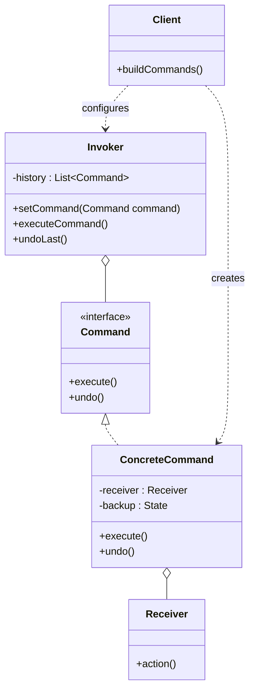

# Command

## Intent

Encapsulate a request as an object, thereby allowing you to **parameterize clients with requests**, queue or log requests, and support **undoable operations**.

---

## Structure



---

## Pseudocode

```java
// Receiver — the object that knows how to perform the work
public class TextEditor {
    private final StringBuilder content = new StringBuilder();

    public void insertText(String text, int position) {
        content.insert(position, text);
        System.out.println("Content: " + content);
    }

    public void deleteText(int position, int length) {
        content.delete(position, position + length);
        System.out.println("Content: " + content);
    }

    public String getContent() { return content.toString(); }
}

// Command interface
public interface Command {
    void execute();
    void undo();
}

// Concrete command
public class InsertCommand implements Command {
    private final TextEditor editor;
    private final String text;
    private final int position;

    public InsertCommand(TextEditor editor, String text, int position) {
        this.editor = editor;
        this.text = text;
        this.position = position;
    }

    public void execute() {
        editor.insertText(text, position);
    }

    public void undo() {
        editor.deleteText(position, text.length());
    }
}

// Invoker — executes and tracks commands for undo
public class CommandHistory {
    private final Deque<Command> history = new ArrayDeque<>();

    public void execute(Command command) {
        command.execute();
        history.push(command);
    }

    public void undo() {
        if (!history.isEmpty()) {
            history.pop().undo();
        }
    }
}

// Client
TextEditor editor = new TextEditor();
CommandHistory history = new CommandHistory();

history.execute(new InsertCommand(editor, "Hello", 0));
history.execute(new InsertCommand(editor, " World", 5));
history.undo();  // removes " World"
```

---

## Template

```java
// 1. Command interface
public interface Command {
    void execute();
    void undo();  // omit if undo is not needed
}

// 2. Receiver — performs the actual work
public class Receiver {
    public void action() { /* ... */ }
    public void reverseAction() { /* ... */ }
}

// 3. Concrete command — binds an action to a receiver
public class ConcreteCommand implements Command {
    private final Receiver receiver;
    // Store state needed for undo
    private Object backup;

    public ConcreteCommand(Receiver receiver) {
        this.receiver = receiver;
    }

    public void execute() {
        backup = /* save state */;
        receiver.action();
    }

    public void undo() {
        receiver.reverseAction(/* restore backup */);
    }
}

// 4. Invoker — doesn't know about concrete commands or receivers
public class Invoker {
    private final Deque<Command> history = new ArrayDeque<>();

    public void execute(Command command) {
        command.execute();
        history.push(command);
    }

    public void undo() {
        if (!history.isEmpty()) history.pop().undo();
    }
}
```

---

## Applicability

Use Command when:

- You need **undoable/redoable** operations.
- You want to **queue, schedule, or log** operations.
- You want to **parameterize** objects with an action (e.g., buttons, menu items, macros).
- You need to implement **transactional behavior** — execute a batch and roll back on failure.

---

## How to Implement

1. **Declare a Command interface** with `execute()` and optionally `undo()`.
2. **Identify the Receiver** — the class that knows how to actually perform the work.
3. **Create ConcreteCommand classes** — each holds a reference to a Receiver and any parameters needed to perform (and reverse) the action. Save state for `undo()` inside `execute()`.
4. **Create an Invoker** that holds a command reference and calls `execute()`. Add a history stack if undo/redo support is needed.
5. **In the client**, create Receivers, create ConcreteCommands with those Receivers, and hand them to the Invoker — the Invoker never touches Receiver directly.
