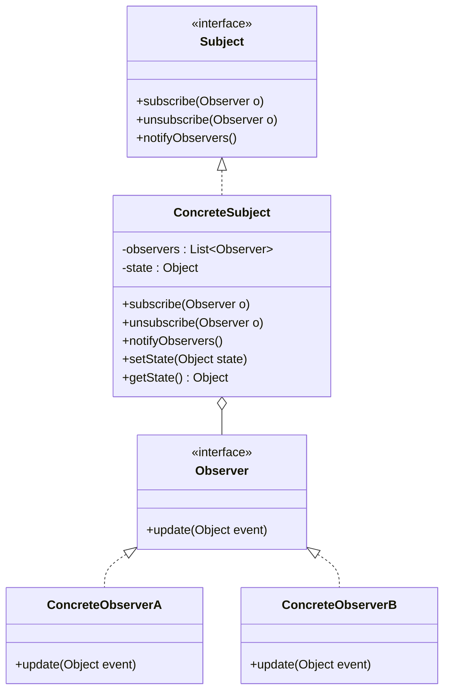

# Observer

## Intent

Define a **one-to-many dependency** between objects so that when one object (the Subject) changes state, all its dependents (Observers) are **notified and updated automatically**.

---

## Structure



---

## Pseudocode

```java
// Observer interface
public interface StockObserver {
    void update(String symbol, double price);
}

// Subject interface
public interface StockMarket {
    void subscribe(StockObserver observer);
    void unsubscribe(StockObserver observer);
    void notifyObservers(String symbol, double price);
}

// Concrete subject
public class StockExchange implements StockMarket {
    private final List<StockObserver> observers = new ArrayList<>();

    public void subscribe(StockObserver observer) {
        observers.add(observer);
    }

    public void unsubscribe(StockObserver observer) {
        observers.remove(observer);
    }

    public void notifyObservers(String symbol, double price) {
        for (StockObserver o : observers) {
            o.update(symbol, price);
        }
    }

    // Business event that triggers notification
    public void updatePrice(String symbol, double price) {
        System.out.println("Price updated: " + symbol + " = " + price);
        notifyObservers(symbol, price);
    }
}

// Concrete observers
public class MobileAlertObserver implements StockObserver {
    public void update(String symbol, double price) {
        System.out.println("[Mobile] " + symbol + " is now $" + price);
    }
}

public class EmailAlertObserver implements StockObserver {
    public void update(String symbol, double price) {
        System.out.println("[Email] Alert: " + symbol + " = $" + price);
    }
}

// Client
StockExchange exchange = new StockExchange();
exchange.subscribe(new MobileAlertObserver());
exchange.subscribe(new EmailAlertObserver());

exchange.updatePrice("AAPL", 189.50);
```

---

## Template

```java
// 1. Observer interface
public interface Observer {
    void update(Object event);
}

// 2. Subject interface
public interface Subject {
    void subscribe(Observer o);
    void unsubscribe(Observer o);
    void notifyObservers();
}

// 3. Concrete subject — holds state and manages observer list
public class ConcreteSubject implements Subject {
    private final List<Observer> observers = new ArrayList<>();
    private Object state;

    public void subscribe(Observer o) { observers.add(o); }
    public void unsubscribe(Observer o) { observers.remove(o); }

    public void notifyObservers() {
        for (Observer o : observers) {
            o.update(state);
        }
    }

    public void setState(Object state) {
        this.state = state;
        notifyObservers();  // trigger on every state change
    }
}

// 4. Concrete observers — react to the notification
public class ConcreteObserver implements Observer {
    public void update(Object event) {
        // react to the change
    }
}
```

> **Java built-in note:** Java has `java.util.Observable` and `java.util.Observer`, but they are **deprecated since Java 9**. Implement the pattern manually as shown above or use `java.beans.PropertyChangeSupport`.

---

## Applicability

Use Observer when:

- A change in one object requires updating others, and you don't know how many objects need to change.
- Objects should be able to notify other objects without making assumptions about who those objects are.
- You need a publish/subscribe event system (UI events, domain events, messaging).

---

## How to Implement

1. **Declare an Observer interface** with an `update()` method that receives event data.
2. **Declare a Subject interface** with `subscribe()`, `unsubscribe()`, and `notifyObservers()`.
3. **Implement ConcreteSubject** — maintain a `List<Observer>`, implement the subscription methods, and call `notifyObservers()` whenever state changes.
4. **Implement ConcreteObserver classes** — each reacts differently to `update()`.
5. **In the client**, create the subject, create observers, subscribe them, and let state changes propagate automatically.
